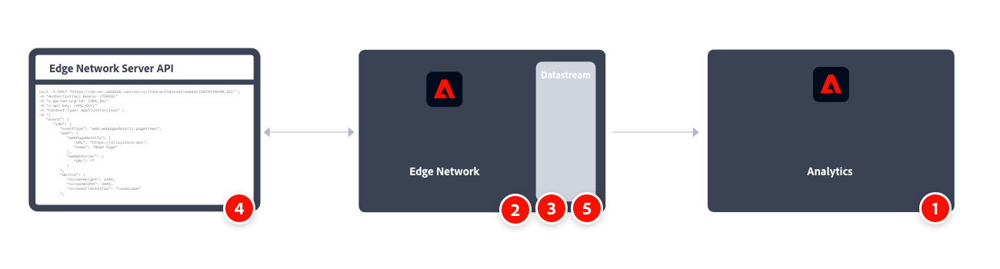

# Implementare Adobe Analytics utilizzando l’API Edge Network di Adobe Experience Platform

In genere si utilizza l’API di Experience Platform Edge Network per raccogliere i dati lato server anziché lato client e durante la raccolta di dati da dispositivi quali dispositivi IoT, set-top box e applicazioni desktop. Poi invii i dati alla rete Edge e a servizi come Adobe Analytics.

Considera anche l’API di Edge Network quando hai bisogno che i dati sensibili vengano raccolti in modo sicuro e autenticati in tutta la rete. Per ulteriori informazioni, vedere [Autenticazione](https://experienceleague.adobe.com/docs/experience-platform/edge-network-server-api/authentication.html).

Panoramica ad alto livello dei compiti di implementazione:

<table style="width:100%">

<tr>
<th style="width:5%"></th><th style="width:60%"><b>Attività</b></th><th style="width:35%"><b>Ulteriori informazioni</b></th>
</tr>

<tr>
<td>1</td>
<td>Assicurati di aver <b>definito una suite di rapporti</b>.</td>
<td><a href="../../../admin/tools/manage-rs/report-suites-admin.md">Report Suite Manager</a></td>
</tr>

<tr>
<td>2</td>
<td><b>Imposta schemi</b>. Per standardizzare la raccolta dati da utilizzare nelle applicazioni che sfruttano Adobe Experience Platform, Adobe ha creato lo standard aperto e pubblicamente documentato Experience Data Model (XDM).</td>
<td><a href="https://experienceleague.adobe.com/docs/experience-platform/xdm/ui/overview.html?lang=it">Panoramica dell’interfaccia utente degli schemi</a></td>
</tr>

<tr>
<td>3</td>
<td><b>Configura uno stream di dati</b>. Uno stream di dati rappresenta la configurazione lato server quando si utilizzano le API dall’API Edge Network di Adobe Experience Platform.</td>
<td><a href="https://experienceleague.adobe.com/docs/experience-platform/datastreams/configure.html?lang=it">Configurare uno stream di dati<a></td> 
</tr>

<tr>
<td>4</td>
<td><b>Implementare e testare la raccolta dati</b> utilizzando le API di raccolta dati evento singolo e evento batch.</td>
<td><a href="https://experienceleague.adobe.com/docs/experience-platform/edge-network-server-api/data-collection/interactive-data-collection.html?lang=it">Raccolta dati evento singolo</a> <a href="https://experienceleague.adobe.com/docs/experience-platform/edge-network-server-api/data-collection/non-interactive-data-collection.html">Raccolta dati evento batch</a>
</tr>

<td>5</td>
<td><b>Aggiungi un servizio Adobe Analytics</b> allo stream di dati. Tale servizio controlla se e come i dati vengono inviati ad Adobe Analytics.</td>
<td><a href="https://experienceleague.adobe.com/docs/experience-platform/edge-network-server-api/interacting-other-adobe-solutions/interacting-adobe-analytics.html?lang=it">Interazione con Adobe Analytics</a></td>
</tr>

</table>

Per ulteriori informazioni, consulta la [documentazione API di Edge Network](https://experienceleague.adobe.com/docs/experience-platform/edge-network-server-api/overview.html?lang=it).

