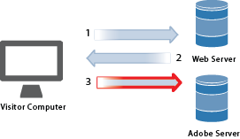
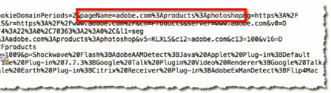
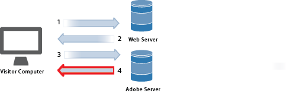
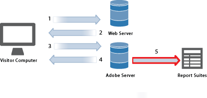
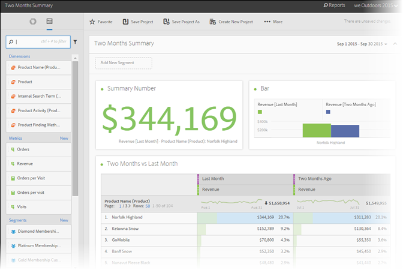

# Raccolta dati

Scopri come le visite al tuo sito Web diventano un rapporto in Adobe Analytics.

La raccolta dei dati di Analytics viene realizzata effettuando una richiesta speciale di immagine ai server di raccolta dati Adobe. Nella maggior parte delle implementazioni, il codice JavaScript viene inserito nelle pagine Web monitorate. Quando una pagina Web con tag viene caricata nel browser di un visitatore, il browser esegue il codice JavaScript, eseguendo logica per acquisire correttamente le informazioni sui visitatori e compilare correttamente i tag. L'ultimo passaggio dell'elaborazione JavaScript è una richiesta di immagine a un server di raccolta dati di Analytics che raccoglie i dati in corso di invio e restituisce una piccola immagine trasparente al browser del visitatore.

Poiché l’elaborazione del browser rappresenta un ostacolo tipico per il tempo necessario per scaricare gli elementi di pagina (immagini, ecc.) dai server Web, il tempo necessario per l’esecuzione del codice JavaScript da parte del browser è trascurabile. Tuttavia, l'ultimo passaggio in cui il browser del visitatore richiede un'immagine dal server di raccolta dati Adobe non comporta l'aggiunta del tempo totale di download delle pagine. L’effetto complessivo sul tempo di download della pagina dipende dalla vicinanza del visitatore del sito Web (generalmente nel negozio Internet, non nella distanza geografica) ai server di raccolta dati Adobe.

Adobe ha creato diverse soluzioni per inviare dati in Analytics. Questi metodi includono informazioni di tracciamento in tempo reale da:

* Applicazioni che possono accedere a Internet
* Campagne
* Applicazioni client-server
* E-mail
* Dispositivi mobili
* Chioschi basati sul Web
* Siti Web

<!-- 

Need to reconcile with Data Collection topics in the user guide, in this guide, and in reference. 

 -->

1. Quando un visitatore accede al sito, viene inviata una richiesta al server Web.

   

1. Il server Web del sito invia le informazioni sul codice della pagina e la pagina viene visualizzata nel browser.

   

1. Viene caricata la pagina e viene eseguito il codice JavaScript di Analytics.

   

   Il codice JavaScript invia una richiesta di immagine al server Adobe, trasmettendo le variabili, le metriche e i dati di pagina definiti nell’implementazione.

   **** Esempio di codice JavaScript: Il codice JavaScript viene inserito all'interno dei tag body di una pagina Web:

   

   **** Esempio di richiesta immagine: Un frammento di una richiesta di immagine con il nome della pagina indicato di seguito:

   

   >[!NOTE]
   >
   >Ogni richiesta di immagine contiene una stringa numerica casuale per impedire il caching del browser e garantire che le successive richieste di immagini vengano effettuate dal browser.

1. Adobe restituisce un’immagine in pixel trasparente.

   

   Il codice raccoglie automaticamente dettagli aggiuntivi (ad esempio sistema operativo, tipo di browser, altezza e larghezza del browser, indirizzo IP e lingua del browser).

1. I server Adobe memorizzano i dati di analisi Web nel *`report suites`* (repository dei dati).

   

   Una [suite di rapporti](https://marketing.adobe.com/resources/help/en_US/reference/report_suites_admin.html) definisce il reporting indipendente e completo su un sito Web scelto, su un insieme di siti Web o su un sottoinsieme di pagine Web.

1. I dati della suite di rapporti popolano i rapporti a cui puoi accedere in un browser Web.

   

   **Esempio di rapporto:**

   

   L'esecuzione del codice JavaScript avviene rapidamente e non influisce in modo rilevante sui tempi di caricamento delle pagine. Questo approccio consente di contare le pagine visualizzate quando un visitatore fa clic **[!UICONTROL Reload]** o **[!UICONTROL Back]** per raggiungere una pagina, perché JavaScript viene eseguito anche quando la pagina viene recuperata dalla cache.

Per ulteriori dettagli consulta:

* [Raccolta dati](../../implement/js-implementation/data-collection/query-parameters.md)
* [Creare un elemento dati](../../implement/c-implement-with-dtm/t-data-element.md#task_962EF08CE2AE49B3B739295F6E4792C2)
* [Data Warehouse](https://marketing.adobe.com/resources/help/en_US/reference/data_warehouse.html)
* [Ad Hoc Analysis](https://marketing.adobe.com/resources/help/en_US/dsc/c_getting_started.html)
* [Origini dati](https://marketing.adobe.com/resources/help/en_US/whitepapers/ftp/ftp_datasources.html)
* [Data Connectors](https://marketing.adobe.com/resources/help/en_US/whitepapers/ftp/ftp_genesis.html)
* [Feed dati di Analytics](/help/export/analytics-data-feed/c-getstarted/data-feed-overview.md)

>[!MORE_LIKE_THIS]
>       
>* [Experience Cloud Debugger](/help/implement/impl-testing/debugger.md)

