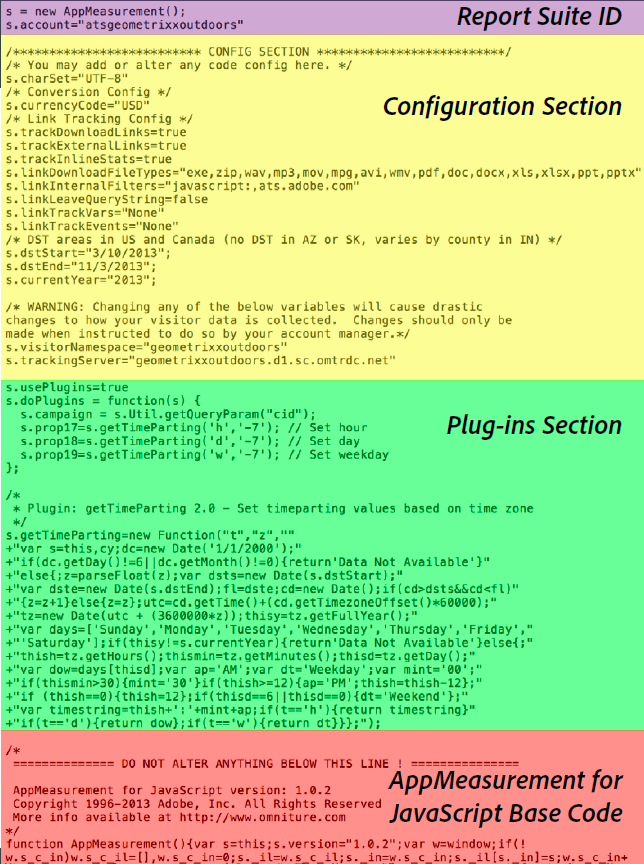

# Codice di Analytics

I dati vengono inviati a una suite per report per poter essere visualizzati sotto forma di report. Il modo più immediato e comune per inviare dati ad Analytics è utilizzare l'implementazione di Gestione dinamica dei tag. Potete anche immettere il codice con l'implementazione javascript.

For information about using [!UICONTROL Dynamic Tag Management] to create the header and footer code for you, see [Add Header and Footer Code](../../implement/c-implement-with-dtm/c-headers-footers/t-header-footer-code.md#task_43C8DD699A514638B0620775C06423E5).

Here is an example of [!DNL AppMeasurement] JavaScript file, showing the code parts:

