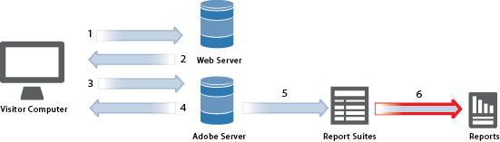

# Report e suite per report

Una suite di rapporti definisce il reporting indipendente e completo su un sito Web scelto, su un insieme di siti Web o su un sottoinsieme di pagine Web. Solitamente, una suite di rapporti è un sito Web, ma può essere un segmento globale in cui hai combinato diversi numeri di siti per ottenere un totale. Quando effettui l’accesso ai rapporti marketing, alle analisi ad hoc e al generatore di report, selezioni una suite di rapporti da utilizzare (eccetto quando utilizzi roll-up, in cui sono combinate più suite di rapporti).

I rapporti forniscono informazioni sui dati raccolti da Analytics, basati su parametri specifici.

Puoi eseguire un *report di Analytics* dopo l'implementazione di Adobe Analytics. La generazione di rapporti fornisce informazioni sui tuoi canali tradizionali basati sul Web, oltre che sui canali in continua evoluzione come dispositivi mobili, video e social network. Alcuni esempi di rapporti di marketing includono:

* Quante persone visitano il sito
* Quanti visitatori sono visitatori unici (conteggiati una sola volta)
* Modalità di accesso al sito (ad esempio se hanno seguito un collegamento o sono arrivati direttamente)
* Quali parole chiave hanno utilizzato i visitatori per eseguire ricerche nel contenuto del sito
* Tempo di permanenza dei visitatori su una determinata pagina o sull'intero sito
* Quali collegamenti hanno fatto clic sui visitatori e quando hanno lasciato il sito
* Quali canali di marketing sono più efficaci nella generazione di ricavi o eventi di conversione
* Tempo trascorso guardando un video
* Browser e dispositivi utilizzati per visitare il sito

I tipi di report di alto livello includono:

* [Traffico](https://marketing.adobe.com/resources/help/en_US/reference/reports_traffic.html): Offre informazioni approfondite sul modo in cui i visitatori interagiscono con il tuo sito Web e sulle tue statistiche sul traffico personalizzate.
* [Conversione](https://marketing.adobe.com/resources/help/en_US/reference/reports_conversion.html): Visualizza informazioni sugli indicatori di successo definiti dall'utente.
* [Percorsi](https://marketing.adobe.com/resources/help/en_US/reference/reports_paths.html): Consente di tenere traccia e registrare tutti i percorsi di navigazione dei visitatori.

You can use [Analysis Workspace](https://marketing.adobe.com/resources/help/en_US/analytics/analysis-workspace/) to remove the typical limitations of a single Analytics report. Offre un’area di lavoro solida e flessibile su cui realizzare analisi di progetti personalizzati. Trascina su un progetto un numero qualsiasi di tabelle di dati, visualizzazioni e componenti (dimensioni, metriche, segmenti e granularità temporali). Crea all’istante suddivisioni e segmenti, coorti per analisi, avvisi e segmenti, e cura rapporti da condividere con i tuoi colleghi.

 <b>Consulta anche</b> 

* [Aiuto di Analysis Workspace](/help/analyze/analysis-workspace/analysis-workspace-features.md)
* [Reporting e analisi](/help/analyze/reports-analytics/overview/report-overview.md)
* [Report in tempo reale](https://marketing.adobe.com/resources/help/en_US/reference/realtime.html)
* [Guida di Adobe Report Builder](https://marketing.adobe.com/resources/help/en_US/arb/)
* [Estratti di dati](https://marketing.adobe.com/resources/help/en_US/sc/user/data_extract.html)
* [Activity Map](https://marketing.adobe.com/resources/help/en_US/analytics/activitymap/)
* [Report Suite Manager](https://marketing.adobe.com/resources/help/en_US/reference/report_suites_admin.html)
* [Requisiti e confronto dei prodotti Analytics](https://marketing.adobe.com/resources/help/en_US/reference/analytics-product-comparison.html)
* [Descrizioni rapporti](https://marketing.adobe.com/resources/help/en_US/reference/reports_descriptions.html)
* [Dashboard e reportlet](https://marketing.adobe.com/resources/help/en_US/sc/user/dashboard.html)
* [Segnalibri](/help/analyze/reports-analytics/bookmarks.md)
* [Suite di rapporti virtuali](/help/components/vrs/vrs-about.md)
* [Rilevazione delle anomalie](/help/analyze/analysis-workspace/virtual-analyst/c-anomaly-detection/anomaly-detection.md)
* [Analisi di contributo](/help/analyze/analysis-workspace/virtual-analyst/contribution-analysis/ca-tokens.md)

