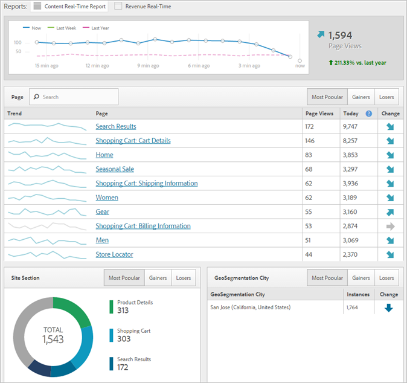

# Modalità modale semplificata

Scopri la nuova esperienza cliente per implementare l'implementazione di Adobe Analytics.

<!-- 

https://activation.adobedtm.com/index.php?redirected=1 

 -->

New users can quickly create your first [!DNL Analytics] report suite (data repository) using this *`Getting Started with Adobe Analytics`* setup modal. Then, you can deploy [!DNL Analytics] code using [!DNL Dynamic Tag Management].

[!DNL Dynamic Tag Management] consente di gestire l'implementazione di Adobe Analytics senza necessità di apportare ogni volta modifiche al sito. Se stai implementando un app Mobile, puoi ottenere la SDK di cui hai bisogno per iniziare a raccogliere dati importanti dalle tue app.

Questa procedura ti consente di:

* Creare rapidamente la tua prima [suite per report](https://marketing.adobe.com/resources/help/en_US/analytics/getting-started/report-suites.html).
* Deploy [!DNL Analytics] and the [Identity Service](https://marketing.adobe.com/resources/help/en_US/mcvid/).

* Eseguire report sui dati di base a livello di pagina.

>[!NOTE]
>
>Before you begin, verify that Analytics is [enabled in the Adobe Experience Cloud](https://marketing.adobe.com/resources/help/en_US/mcloud/core_services.html) (the solution provisioning process). Se hai ricevuto un'email che ti invita a effettuare l'accesso in Analytics nella Dashboard di Enterprise, significa che hai completato questo prerequisito.

**Per eseguire la modalità di implementazione semplificata**

1. Log in to the [!DNL Adobe Experience Cloud] ( [experiencecloud.adobe.com](https://experiencecloud.adobe.com)).

   Quando accedi ad [!DNL Analytics], il sistema determina se disponi di una suite per report. If not, the [!UICONTROL Getting Started with Adobe Analytics] page displays.

   

   Alternatively, you can run this setup in [!DNL Analytics] by clicking **[!UICONTROL Help]** &gt; **[!UICONTROL Welcome to Adobe Analytics]**.

1. Specifica le seguenti informazioni di base sulla tua attività:

   <table id="table_1741878A1B284CB78D297D531DC703D6"> 
     <thead> 
      <tr> 
       <th colname="col1" class="entry"> Elemento </th> 
       <th colname="col2" class="entry"> Descrizione </th> 
      </tr> 
     </thead>
     <tbody> 
      <tr> 
       <td colname="col1"> 
Tipo proprietà 
 </td> 
       <td colname="col2"> 
La tua implementazione è per il web, il mobile o entrambi? 
 </td> 
      </tr> 
      <tr> 
       <td colname="col1"> 
Industrie 
 </td> 
       <td colname="col2"> 
Specifica qual è il settore di attività della tua azienda (prodotti, servizi al cliente, brand awareness, pubblicità). 
 </td> 
      </tr> 
      <tr> 
       <td colname="col1"> 
Livello dati 
 </td> 
       <td colname="col2"> 
(consigliato) un array di JavaScript utilizzato per archiviare informazioni. Se esegui una configurazione automatica tramite Gestione tag dinamica, utilizzerai un livello dati. 
 
For a blog on data layers, see <a href="https://blogs.adobe.com/digitalmarketing/analytics/data-layers-buzzword-best-practice/" format="http" scope="external"> Data Layer: From Buzzword to Best Practice</a>. 
 </td> 
      </tr> 
      <tr> 
       <td colname="col1"> 
Repository dei dati (Suite per report) 
 </td> 
       <td colname="col2"> 
 Una <a href="https://marketing.adobe.com/resources/help/en_US/analytics/getting-started/report-suites.html" format="html" scope="external">suite per report</a> è un insieme di dati discreti che corrispondono solitamente a una singola proprietà (sito o app) o marchio. Ogni suite per report è dotata del proprio insieme di report e metriche. 
 </td> 
      </tr> 
      <tr> 
       <td colname="col1"> 
Fuso orario 
 </td> 
       <td colname="col2"> 
Il fuso orario in cui ci si trova (rilevato automaticamente). 
 </td> 
      </tr> 
      <tr> 
       <td colname="col1"> 
Visite stimate alle pagine 
 </td> 
       <td colname="col2"> 
Il numero di visite stimato che le pagine del tuo sito ricevono quotidianamente. 
 </td> 
      </tr> 
      <tr> 
       <td colname="col1"> 
Valuta di base 
 </td> 
       <td colname="col2"> 
La valuta con la quale lavori. 
 </td> 
      </tr> 
     </tbody> 
    </table>

1. Fai clic su **[!UICONTROL Next]**.

   Il sistema crea una suite per report.

1. To begin deployment, click **[!UICONTROL Next]**, then click one of the following options:

   <table id="table_71C7F7B9677346CD8D5130519D32464B"> 
     <thead> 
      <tr> 
       <th colname="col1" class="entry"> Elemento </th> 
       <th colname="col2" class="entry"> Descrizione </th> 
      </tr> 
     </thead>
     <tbody> 
      <tr> 
       <td colname="col1"> 
Distribuisci 
 </td> 
       <td colname="col2"> 
 Lancia Gestione tag dinamica, a cui puoi accedere per distribuire Analytics. This process automatically implements the  AppMeasurement.js file and the Identity Service ( VisitorAPI.js). 
 
 
Important: In a new browser tab, a help page is displayed that walks you through  Adobe Analytics deployment via Dynamic Tag Management. 
 
 </td> 
      </tr> 
      <tr> 
       <td colname="col1"> 
Scarica 
 </td> 
       <td colname="col2"> 
 Scarica il file di installazione denominato INSTALL-ME &lt;report suite name&gt;.js. Questa opzione è dedicata agli utenti più esperti che conoscono l'<a href="https://marketing.adobe.com/resources/help/en_US/sc/implement/js_implementation.html" format="html" scope="external">implementazione JavaScript</a>. 
 
 
Importante: scaricare il codice non equivale a distribuire Analytics. Questa è una distribuzione manuale che esegui sulle pagine del tuo sito o attraverso i servizi di consulenza Adobe. 
 
 </td> 
      </tr> 
     </tbody> 
    </table>

1. Esegui un report.

   Dopo aver distribuito lo strumento Analytics, puoi eseguire un report in Reporting e analisi per confermare che i dati affluiscono al tuo sito. (consulta [Accedete e navigate](https://marketing.adobe.com/resources/help/en_US/analytics/getting-started/analytics-navigation.html) per acquisire familiarità con l'interfaccia di Analytics.

   For example, a **[!UICONTROL Site Metrics]** &gt; **[!UICONTROL Real-Time]** lets you see immediate data.

   >[!NOTE]
   >
   >The [!UICONTROL Real-Time] report requires some configuration prior to running. Consulta [Configure Real-Time Report](https://marketing.adobe.com/resources/help/en_US/reference/t_realtime_admin.html) (Configura un report in tempo reale).

**Esempio di report in tempo reale**

