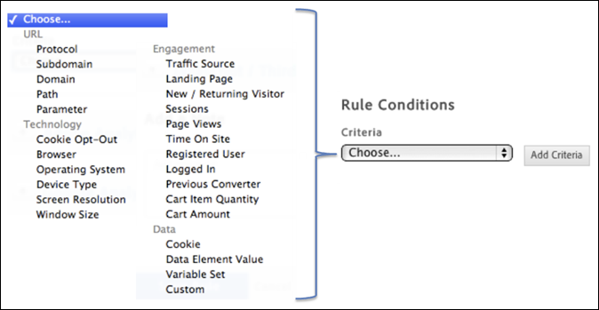

# Creare condizioni per regole di caricamento delle pagine

Crea regole che determinano in quali pagine viene attivata una regola.

1. Specificate la posizione in cui attivare la regola.

   Il momento in cui la regola viene attivata sulla pagina diventa più importante quando ci sono dipendenze dal contenuto della pagina all'interno della regola.

   

1. Specificate la condizione che determina l'attivazione della regola.

   For example, you can select **[!UICONTROL Path]** to identify specific pages for which you want the rule to fire.

   

