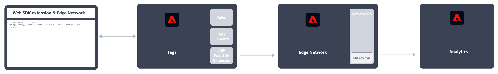
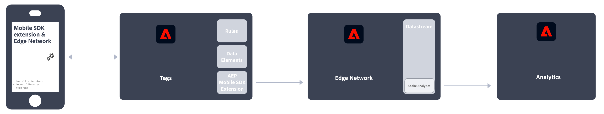

# Implementare Adobe Analytics

Per poter inviare dati ai server di raccolta dati, Adobe Analytics richiede il codice all’interno del sito web, dell’app mobile o di altre applicazioni. Esistono diversi metodi per implementare questo codice, a seconda della piattaforma e delle esigenze aziendali.

## Metodi di implementazione del sito web

Per il tuo **sito web**, sono disponibili i seguenti metodi di implementazione:

### Lato client 

* **Estensione Web SDK**: metodo standardizzato e consigliato per l’implementazione di Adobe Analytics per nuovi clienti. Aggiungi l’**estensione Adobe Experience Platform Web SDK** nei **tag** della raccolta dati di Adobe Experience Platform, quindi inserisci un tag loader in ciascuna pagina. Il tag invia i dati alla **rete Edge** di Adobe Experience Platform, che inoltra tali dati ad Adobe Analytics.
  
Consulta [Come implementare Adobe Analytics utilizzando l’estensione Adobe Experience Platform Web SDK.](./aep-edge/overview.md) per ulteriori informazioni.

* **SDK per web**: se non desideri utilizzare la raccolta dati di Adobe Experience Platform, puoi caricare manualmente le librerie SDK web sul tuo sito. Consulta la libreria SDK web (`alloy.js`) su ciascuna pagina e invia le chiamate di tracciamento desiderate alla **rete Edge** di Adobe Experience Platform in un formato adatto alla tua organizzazione. La rete Edge inoltra tali dati ad Adobe Analytics.
  
Per ulteriori informazioni, consulta [Come implementare Adobe Analytics utilizzando Adobe Experience Platform Web SDK](./aep-edge/overview.md).

* **Estensione Analytics**: aggiungi l’**estensione Adobe Analytics** nei **tag** della raccolta dati di Adobe Experience Platform, quindi inserisci un tag loader in ciascuna pagina. Il tag invia i dati direttamente ad Adobe Analytics. Utilizza questo metodo di implementazione se desideri la comodità dei tag, ma non utilizzare l’infrastruttura di rete Edge.
  
Per ulteriori informazioni, consulta [Come implementare Adobe Analytics utilizzando l’estensione Analytics](launch/overview.md).

* **JavaScript legacy:** metodo manuale che veniva utilizzato per implementare Adobe Analytics. Consulta la libreria di AppMeasurement (`AppMeasurement.js`) in ogni pagina, quindi imposta le variabili e le impostazioni in JavaScript.
  
Questo metodo di implementazione può essere utile per le implementazioni che utilizzano codice personalizzato ed è ideale per quelle non offerte altrove, ad esempio per [pagine AMP](other/amp.md).

Il seguente flusso decisionale può essere utile per selezionare un metodo di implementazione lato client:

>[!TIP]
>
>Contatta il tuo team Adobe Account per consigli e best practice sull’implementazione da scegliere in base alla situazione corrente.

### Lato server

Per implementare Adobe Analytics lato server, sono disponibili le seguenti opzioni:

* **API server Edge**: per implementare il codice sul server che utilizza l’API del server Edge di Adobe Experience Platform per comunicare con Adobe Analytics tramite uno stream di dati.
  
Consulta [Implementare Adobe Analytics utilizzando l’API del server di rete Edge di Adobe Experience Platform](/help/implement/aep-edge/server-api/overview.md) per ulteriori informazioni.

* **API di inserimento dati (in blocco)**: si utilizza l’API di inserimento dati (in blocco) di Adobe Analytics per raccogliere i dati lato server direttamente in Adobe Analytics.
  
Consulta [API di inserimento dati](../import/c-data-insertion-api/c-data-insertion-api.md) per ulteriori informazioni.

## Metodi di implementazione delle app mobili

Per la tua **app mobile**, sono disponibili i seguenti metodi di implementazione:

* **Estensione Web SDK**: metodo standardizzato e consigliato per l’implementazione di Adobe Analytics nella tua app mobile. Usa le librerie dedicate per inviare facilmente i dati ad Adobe dall’app mobile. Aggiungi l’**estensione Adobe Experience Platform Mobile SDK** nei **tag** della raccolta dati di Adobe Experience Platform, quindi implementa la libreria Mobile SDK nell’app. Puoi utilizzare l’SDK per importare librerie, registrare estensioni e caricare la configurazione di tag. Invia dati alla **Rete Edge** di Adobe Experience Platform; Edge inoltra quindi tali dati ad Adobe Analytics.
  

  Consulta [Implementare Adobe Analytics utilizzando Mobile SDK di Adobe Experience Platform](../implement/aep-edge/mobile-sdk/overview.md) per ulteriori informazioni.

* **Estensione Analytics**: aggiungi l’**estensione Adobe Analytics** nei **tag** della raccolta dati di Adobe Experience Platform e implementa la libreria di Mobile SDK nella tua app. Puoi utilizzare l’SDK per importare librerie, registrare estensioni e caricare la configurazione di tag. Questo metodo di implementazione invia i dati direttamente ad Adobe Analytics. È consigliabile se desideri la comodità di Raccolta dati di Adobe Experience Platform, ma non vuoi utilizzare l’infrastruttura di rete Edge di Adobe Experience Platform.
  

  Consulta [Implementare Adobe Analytics utilizzando l’estensione Analytics](../implement/aep-edge/mobile-sdk/overview.md) per ulteriori informazioni.

>[!CAUTION]
>
>Per il supporto delle versioni precedenti degli SDK per dispositivi mobili di Adobe, consulta [Annunci sulla fine del supporto degli SDK](https://developer.adobe.com/client-sdks/resources/sdks-end-of-support/).

## Articoli chiave di implementazione di Analytics

* [Prendere in consegna un’implementazione Adobe Analytics esistente](/help/implement/prepare/existing-implementation.md)
* [Adobe Debugger](validate/debugger.md)
* [Creare una proprietà tag in Experience Platform](launch/create-analytics-property.md)
* [Aggiornamenti AppMeasurement](appmeasurement-updates.md)
* [Tutorial sulla configurazione di Adobe Analytics con Platform Web SDK](https://experienceleague.adobe.com/docs/platform-learn/implement-web-sdk/applications-setup/setup-analytics.html?lang=it)
* [Tutorial sull’implementazione di Adobe Experience Cloud nelle app per dispositivi mobili](https://experienceleague.adobe.com/docs/platform-learn/implement-mobile-sdk/overview.html?lang=it)

## Risorse chiave per Analytics

* [Contattare l’Assistenza clienti](https://experienceleague.adobe.com/?support-solution=Analytics?lang=it#support)
* [Community Adobe Analytics su Experience League](https://experienceleaguecommunities.adobe.com/t5/adobe-analytics/ct-p/adobe-analytics-community)
* [Risorse di Adobe Analytics](https://experienceleaguecommunities.adobe.com/t5/adobe-analytics-discussions/adobe-analytics-resources/m-p/276666)
* [Note sulla versione più recente](../release-notes/latest.md)
