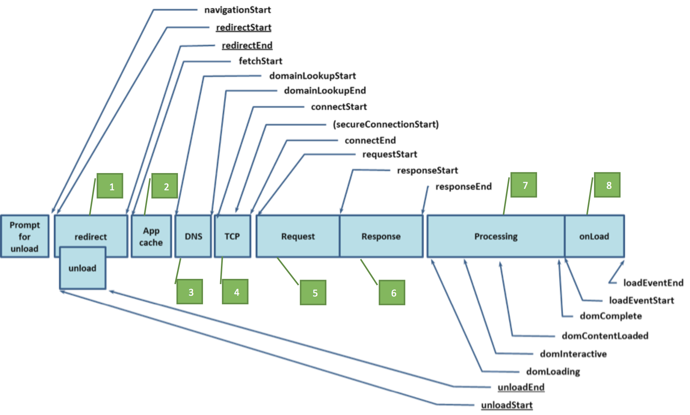

# Performancetiming

Questo plug-in utilizza l'API javascript di navigazione per misurare con precisione le prestazioni sul Web. Questo fornisce un metodo nativo per ottenere statistiche accurate e dettagliate sui tempi di caricamento delle pagine e sui tempi di caricamento delle risorse. In precedenza, le misure di questo ordinamento utilizzavano l'oggetto Date javascript per le metriche temporizzate, o un'estrapolazione rudimentaria delle metriche Temporizzazione di navigazione. Entrambe le metodologie, anche se forniscono dati con tendenze per i tempi di caricamento delle pagine, non sono affidabili.

## What This Plug-In Does {#section_4E0771B959FD4F86B4B91BD18CA01DF1}

>[!IMPORTANT]
>
>Si tratta di una versione beta del plug-in, e potrebbero essere disponibili aggiornamenti aggiuntivi.

Questo plug-in utilizza i seguenti eventi dettagliati per tenere traccia dei singoli componenti temporali del caricamento di una pagina:

| Evento | Nome | Calcolato da |
|---|---|---|
| 1 | Tempo di reindirizzamento | Fetchstart - navigationstart |
| 2 | Temporizzazione cache app | Domainlookupstart - fetchstart |
| 3 | Temporizzazione DNS | Domainlookupend - domainlookupstart |
| 4 | Tempo TCP | Connectend - connectstart |
| 5 | Tempistica richiesta | Responsestart - connectend |
| 6 | Temporizzazione risposta | Responseend - responsestart |
| 7 | Tempo di elaborazione | Loadeventstart - domloading |
| 8 | Tempo onload | Loadeventend - loadeventstart |
| 9 | Tempo totale di caricamento pagina | Loadeventend - navigationstart |
| 10 | Istanze prestazioni | Contatore |

Il grafico seguente illustra gli attributi temporale definiti dall'interfaccia performancetiming e l'interfaccia performancenavigation con o senza reindirizzamento, rispettivamente.



I dettagli completi sull'oggetto Temporizzazione di navigazione sono disponibili qui:

[https://www.w3.org/TR/navigation-timing/#sec-navigation-timing-interface](https://www.w3.org/TR/navigation-timing/#sec-navigation-timing-interface)

Inoltre, il plug-plugin può utilizzare facoltativamente l'oggetto performanceentries per registrare il nome della risorsa, il tempo di caricamento delle risorse e i dettagli sulla durata del caricamento delle risorse per ogni singola risorsa caricata in una determinata pagina. Con questo plug-plugin viene registrata una grande quantità di informazioni, quindi richiede che l'oggetto di memorizzazione DOM sia attivato per memorizzare le informazioni di caricamento della pagina tra le visualizzazioni di pagina. Accertatevi che l'Informativa sulla privacy della società consenta l'utilizzo dell'oggetto di memorizzazione DOM prima di abilitare questa funzionalità. Inoltre, richiede l'utilizzo di una listvar per tenere traccia di tutte le risorse.

## Required Supporting Plug-Ins {#section_B6447EB6548942EFBC219AEFDC245639}

* Appendlist
* Getpreviousvalue

## Plug-In Code and Implementation {#section_564D77E1CF0E445586D95AD9769CE57D}

>[!NOTE]
>
>Le istruzioni seguenti richiedono di modificare il codice della raccolta dati sul sito. Ciò può influenzare la raccolta di dati sul sito e essere realizzata da uno sviluppatore con esperienza utilizzando e implementando Adobe Analytics. This plugin is compatible only with [!DNL AppMeasurement] tracking libraries.

**Sezione di configurazione (prima di doplugins):**

`s.pte`: Elenco di eventi separati da virgole contenente gli eventi 10 che desiderate utilizzare: i componenti per l'evento singolo (eventi 1 - 8), il tempo totale di caricamento della pagina (event 9) e le istanze di prestazioni totali (event 10) - nell'ordine specifico.

`s.ptc`: Impostato per determinare se il plug-plugin deve essere eseguito o meno all'interno di doplugins. Impostato sempre su false.

*Chiamate di esempio*

```
s.pte = 'event10,event11,event12,event13,event14,event15,event16,event17,event18,event19' 
//[--------------------------- 1 to 8 ---------------------------][-- 9 --][- 10 -] 
s.ptc = false; 
```

**Sezione doplugins:**

To initialize the plug-in, one line of code is required in the `doPlugins` section of your s_code, preferably after you have designated the `s.pageName`variable. Se desiderate utilizzare la funzionalità del tempo di caricamento delle risorse all'interno del plug-in, dovete trasmettere il nome della variabile di elenco da utilizzare. Otherwise, only the performance timing entries will be tracked in the events you previously specified in the `s.pte` variable.

>[!NOTE]
>
>In order to correlate performance timing entries with pages on your site, you must also initialize the `getPreviousValue` plug-in. Consigliamo di confrontare queste voci di prestazioni con il nome della pagina precedente o con il valore dell'URL della pagina precedente.

*Chiamate di esempio*

```
/* Performance Timing */ 
s.eVar9 = s.getPreviousValue(s.pageName,'gpv_v9','');  //Record the previous page name in the designated eVar of your choice 
s.performanceTiming('list2')  
```

**Sezione plug-in:**

Infine, aggiungere il plug-in stesso all'implementazione javascript.

```
/* Plugin: Performance Timing Tracking - 0.11 BETA */ 
s.performanceTiming=new Function("v","" 
+"var s=this;if(v)s.ptv=v;if(typeof performance!='undefined'){if(perf" 
+"ormance.timing.loadEventEnd==0){s.pi=setInterval(function(){s.perfo" 
+"rmanceWrite()},250);}if(!s.ptc||s.linkType=='e'){s.performanceRead(" 
+");}else{s.rfe();s[s.ptv]='';}}"); 
s.performanceWrite=new Function("","" 
+"var s=this;if(performance.timing.loadEventEnd>0)clearInterval(s.pi)" 
+";try{if(s.c_r('s_ptc')==''&&performance.timing.loadEventEnd>0){try{" 
+"var pt=performance.timing;var pta='';pta=s.performanceCheck(pt.fetc" 
+"hStart,pt.navigationStart);pta+='^^'+s.performanceCheck(pt.domainLo" 
+"okupStart,pt.fetchStart);pta+='^^'+s.performanceCheck(pt.domainLook" 
+"upEnd,pt.domainLookupStart);pta+='^^'+s.performanceCheck(pt.connect" 
+"End,pt.connectStart);pta+='^^'+s.performanceCheck(pt.responseStart," 
+"pt.connectEnd);pta+='^^'+s.performanceCheck(pt.responseEnd,pt.respo" 
+"nseStart);pta+='^^'+s.performanceCheck(pt.loadEventStart,pt.domLoad" 
+"ing);pta+='^^'+s.performanceCheck(pt.loadEventEnd,pt.loadEventStart" 
+");pta+='^^'+s.performanceCheck(pt.loadEventEnd,pt.navigationStart);" 
+"s.c_w('s_ptc',pta);if(sessionStorage&&navigator.cookieEnabled&&s.pt" 
+"v!='undefined'){var pe=performance.getEntries();var tempPe='';for(v" 
+"ar i=0;i<pe.length;i++){tempPe+='!';tempPe+=pe[i].name.indexOf('?')" 
+">-1?pe[i].name.split('?')[0]:pe[i].name;tempPe+='|'+(Math.round(pe[" 
+"i].startTime)/1000).toFixed(1)+'|'+(Math.round(pe[i].duration)/1000" 
+").toFixed(1)+'|'+pe[i].initiatorType;}sessionStorage.setItem('s_pec" 
+"',tempPe);}}catch(err){return;}}}catch(err){return;}"); 
s.performanceCheck=new Function("a","b","" 
+"if(a>=0&&b>=0){if((a-b)<60000&&((a-b)>=0)){return((a-b)/1000).toFix" 
+"ed(2);}else{return 600;}}"); 
s.performanceRead=new Function("","" 
+"var s=this;if(performance.timing.loadEventEnd>0)clearInterval(s.pi)" 
+";var cv=s.c_r('s_ptc');if(s.pte){var ela=s.pte.split(',');}if(cv!='" 
+"'){var cva=s.split(cv,'^^');if(cva[1]!=''){for(var x=0;x<(ela.lengt" 
+"h-1);x++){s.events=s.apl(s.events,ela[x]+'='+cva[x],',',2);}}s.even" 
+"ts=s.apl(s.events,ela[ela.length-1],',',2);}s.linkTrackEvents=s.apl" 
+"(s.linkTrackEvents,s.pte,',',2);s.c_w('s_ptc','',0);if(sessionStora" 
+"ge&&navigator.cookieEnabled&&s.ptv!='undefined'){s[s.ptv]=sessionSt" 
+"orage.getItem('s_pec');sessionStorage.setItem('s_pec','',0);}else{s" 
+"[s.ptv]='sessionStorage Unavailable';}s.ptc=true;"); 
/* Remove from Events 0.1 - Performance Specific,  
removes all performance events from s.events once being tracked. */ 
s.rfe=new Function("","" 
+"var s=this;var ea=s.split(s.events,',');var pta=s.split(s.pte,',');" 
+"try{for(x in pta){s.events=s.rfl(s.events,pta[x]);s.contextData['ev" 
+"ents']=s.events;}}catch(e){return;}"); 
/* Plugin Utility - RFL (remove from list) 1.0*/ 
s.rfl=new Function("l","v","d1","d2","ku","" 
+"var s=this,R=new Array(),C='',d1=!d1?',':d1,d2=!d2?',':d2,ku=!ku?0:" 
+"1;if(!l)return'';L=l.split(d1);for(i=0;i<L.length;i++){if(L[i].inde" 
+"xOf(':')>-1){C=L[i].split(':');C[1]=C[0]+':'+C[1];L[i]=C[0];}if(L[i" 
+"].indexOf('=')>-1){C=L[i].split('=');C[1]=C[0]+'='+C[1];L[i]=C[0];}" 
+"if(L[i]!=v&&C)R.push(C[1]);else if(L[i]!=v)R.push(L[i]);else if(L[i" 
+"]==v&&ku){ku=0;if(C)R.push(C[1]);else R.push(L[i]);}C='';}return s." 
+"join(R,{delim:d2})"); 
```

## Note {#section_131C5D97A0094880AFC3A2BBE0BC9DE4}

* Verifica sempre le installazioni dei plug-in per garantire che la raccolta dati sia come previsto prima della distribuzione in un ambiente di produzione.
* Poiché il plug-in trasmette i dati sulle prestazioni essendo associati alla pagina precedente, i dati non vengono raccolti per la visualizzazione finale della pagina della visita.
* Se state tracciando il tempistico delle risorse, questo plug-in si basa sulla capacità di impostare i valori di archiviazione DOM nel browser Web dell'utente. Se l'utente non accetta cookie e l'archiviazione DOM è abilitata, il plug-in non passa i dati in Analytics.
* Una percentuale molto piccola di utenti non passa i dati temporizzati di navigazione a causa di limiti del browser e la logica è contenuta nel plug-in per garantire che i dati non vengano distorti come risultato, in particolare con una piccola parte di browser mobili. Questo plug-in è stato tuttavia testato correttamente in IE, Firefox, Chrome e Safari.
* [!UICONTROL Calculated Metrics] devono essere create per ottenere un riepilogo e comprendere il comportamento dei visitatori associati a queste metriche:

   * Temporizzazione reindirizzamento medio (Tempo reindirizzamento/Istanze di temporizzazione prestazioni)
   * Temporizzazione cache app media (Cronologia cache app/Istanza di temporizzazione prestazioni)
   * Temporizzazione DNS media (istanze DNS temporizzazione/prestazioni)
   * Tempo medio TCP (tempo TCP/Prestazioni di temporizzazione prestazioni)
   * Temporizzazione richiesta media (istanza richiesta/istanza di temporizzazione prestazioni)
   * Temporizzazione risposta media (temporizzazione risposta/istanza di temporizzazione prestazioni)
   * Tempo di elaborazione medio (tempo di elaborazione/istanze di temporizzazione prestazioni)
   * Tempo medio onload (onload Temtiming Instances/Performance Teminstances
   * Tempo medio di caricamento pagina (totale tempo di caricamento pagina/Istanza di temporizzazione prestazioni)

