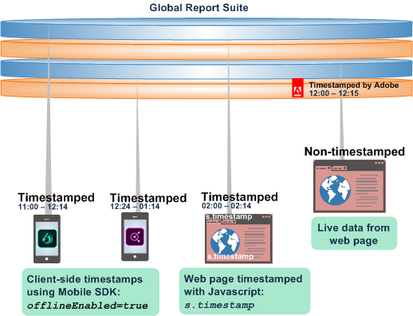
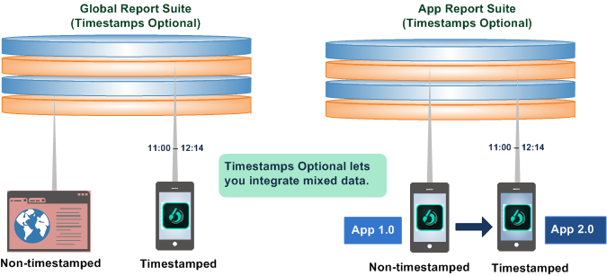
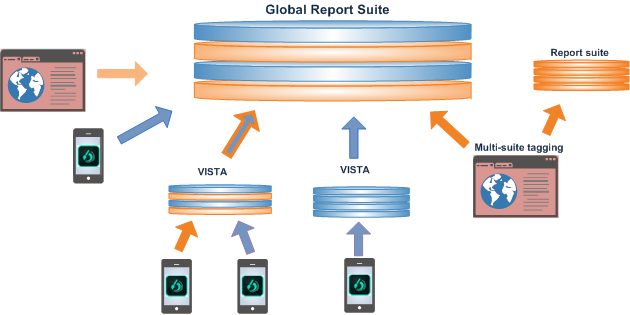
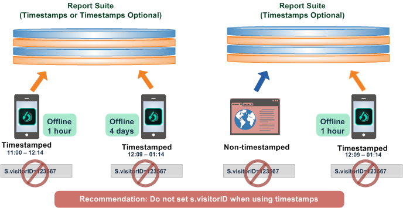
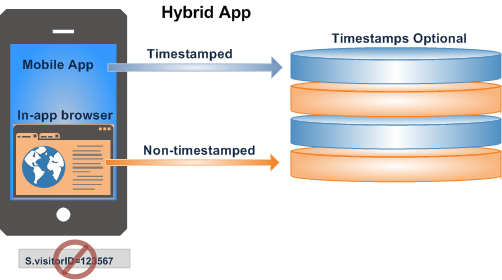

# Utilizzo dei timestamp opzionali

Scoprite i vantaggi e i vincoli dell'utilizzo dell'impostazione Marca temporale opzionale.

Marca temporale opzionale è l'impostazione predefinita per tutte le nuove suite di rapporti.

* Inserite sia i dati con marca temporale sia quelli privi di marca nella stessa suite per report globale.
* Inviate dati con marca temporale da un app per dispositivo mobile a una suite per report globale.
* Aggiornate le app per utilizzare le marche temporali senza dover creare una nuova suite di rapporti.

>[!NOTE]
>
>Marca temporale opzionale è l'impostazione predefinita per tutte le nuove suite per report generate da un modello Le nuove suite di rapporti copiate da una suite esistente erediteranno le impostazioni dall'originale.

Per ulteriori informazioni sulla configurazione, consultate [Marca temporale opzionale](https://marketing.adobe.com/resources/help/en_US/reference/timestamp-optional.html) .

## Marca temporale opzionale: Integrazione di dati con marca temporale e non con marca temporale {#section_BF17CB593044462B993FD0D28EA56518}

Utilizzando la funzione facoltativa Marca temporale, puoi combinare dati senza marca temporale con dati con marca temporale senza la conseguente perdita di dati. I dati offline con marca temporale generata da un dispositivo mobile possono essere combinati con dati live e senza marca temporale da una pagina web, oppure integrati con dati provenienti da qualsiasi piattaforma mediante una chiamata di marca temporale lato client.

* **Dati** timestamp. I dati di marca temporale lato client vengono acquisiti e inviati direttamente con i dati del dispositivo utilizzando le variabili di marca temporale lato client: Javascript in una pagina Web o utilizzando una chiamata SDK Mobile ( [!DNL offlineEnabled=true]) in un'app mobile.
* **Dati** di marca non temporale. Adobe imposta una marca temporale sui dati privi di marca temporale in una suite di rapporti quando i dati arrivano sui server di raccolta.

Una suite di rapporti può avere una delle seguenti impostazioni di marca temporale:

* Marca temporale non consentita (impostazione di visitorID supportata)
* Marca temporale richiesta (impostazione visitorID non supportata)
* Marca temporale opzionale (impostazione visitorID supportata ma non sugli hit con marca temporale)

## Informazioni sulle funzioni facoltative delle marche temporali {#section_63B2FA9A2AB24B3993E84D2C2B4BF2CE}

Marca temporale opzionale consente di integrare e generare report tra più suite di rapporti con o senza marche temporali lato client incluse. Con Marca temporale opzionale puoi aggiornare l'app per utilizzare marche temporali mentre utilizzi comunque dati non con marca temporale dell'app precedente.

| Nelle versioni precedenti... | Inoltre... |
|--- |--- |
| Impossibile inviare i dati con marca temporale a una suite di rapporti globale senza marca temporale. Di conseguenza, i dati hit inviati dai dispositivi offline venivano ignorati quando venivano aggiunti a una suite di rapporti senza marca temporale.   Di conseguenza, i dati hit inviati dai dati offline venivano ignorati quando venivano aggiunti a una suite di rapporti senza marca temporale. | Quando si aggiorna un'app per raccogliere e utilizzare le marche temporali, era necessario impiegare una nuova suite di rapporti.  Non è stato possibile salvare nella suite di rapporti esistente o integrare dati esistenti quando si aggiorna l'app per l'utilizzo di marche temporali. |

**Con Marca temporale opzionale**, puoi integrare dati privi di marca temporale da un sito Web live con dati offline da dispositivi mobili, oppure aggiornare l'app con marca temporale a un'app con marca temporale. 

## Combinazione di dati in una suite di rapporti globale {#section_5BE3BDF56007402BB1F5C3144D5FE1E0}

La combinazione di dati in una suite di rapporti globale può essere eseguita in diversi modi, tra cui l'assegnazione di tag a più suite, le regole Vista e i file batch importati da origini offline.

>[!IMPORTANT]
>
>Pianificate attentamente la progettazione di ciascun set di dati dei componenti in modo che la combinazione abbia senso in una suite di rapporti globale.

## Best practice per l'impiego di marche temporali {#section_9436394E5D7E4F8A8B369B6D11BB2B2B}

Di seguito sono riportate le best practice e alcuni requisiti e restrizioni da tenere presenti quando si integra timestamp con dati privi di marca temporale.

* In generale, le marche temporali per un dato visitatore o visita devono arrivare ad Adobe nell'ordine cronologico corretto.

   I dati fuori ordine possono includere dati in arrivo ritardati dalla raccolta dati offline e hit in arrivo ritardati, o orologi non sincronizzati su dispositivi mobili offline. I dati fuori ordine possono avere un impatto negativo sui calcoli del tempo (come i valori del tempo trascorso), sull'attribuzione (persistenza eVar), sui conteggi dei numeri di visita/visita e sui rapporti dei percorsi.

   

* L’utilizzo delle marche temporali quando si imposta un [s.visitorID](https://marketing.adobe.com/resources/help/en_US/sc/implement/visid_custom.html) non è consigliato. Può portare a dati fuori ordine.

* Le app ibride composte da un'app (con marca temporale e dati offline) che apre un browser Web (con marca temporale e dati dal vivo) non devono utilizzare marche temporali. Ne risulta una segnalazione non accurata della sessione.

   

   Inoltre, le app ibride non devono impostare un ID visitatore.
