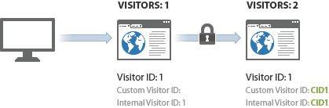

# Visitatori

>[!IMPORTANT]
>
>Questo metodo di identificazione dei visitatori su dispositivi non è più consigliato. Please refer to the [Adobe Experience Cloud Device Co-op Documentation](https://marketing.adobe.com/resources/help/en_US/mcdc/).

Analytics conta ogni ID visitatore unico unico come visitatore unico.

If you look at the [previous table](../../../implement/js-implementation/xdevice-visid/visit-example.md#concept_E3B32B8E539F4FDC8E3FA872328B87BA), this occurred 3 times: at hits 1, 9, and 10. This occurs because the effective [!UICONTROL visitor ID] is the same for both server calls, and occurs even though the visits might be several hours apart and on different devices.

Questo può aumentare il numero di visitatori unici che vedi quando l&#39;identificazione dei visitatori più dispositivi è abilitata. Il visitatore può essere conteggiato due volte nella stessa visita: una volta per la visita iniziale e di nuovo dopo l&#39;autenticazione dell&#39;utente.

When a new visitor views your site, the `s_vi`cookie is populated and stored. On the data collection server, a new visitor profile is created for this visitor ID, and the effective [!UICONTROL visitor ID] on the profile is set to match the cookie.

When cross-device visitor identification is enabled, if a [!UICONTROL visitor ID] variable is provided in a subsequent hit (for example, after authentication), the effective [!UICONTROL visitor ID] is updated to match the custom value. This can cause the effective [!UICONTROL visitor ID] to change directly after authentication, resulting in multiple visitor counts.

After the initial association, visit counts return to normal because the visitor is associated through the [!UICONTROL visitor ID] cookie. If the visitor later views your site and then authenticates, the visitor count is not inflated because the effective [!UICONTROL visitor ID] doesn&#39;t change after authentication.

