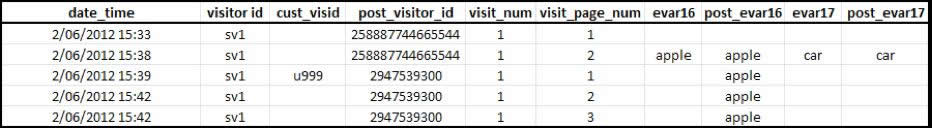

# Attribuzione e persistenza

>[!IMPORTANT]
>
>Questo metodo di identificazione dei visitatori tra dispositivi non è più consigliato. Consulta [Cross-device  Analytics](/help/components/cda/overview.md) nella guida utente dei componenti.

Quando i profili dei visitatori vengono uniti dopo essere stati associati alla stessa variabile ID visitatore, l&#39;attribuzione non viene modificata nel set di dati storici.

* Quando la variabile `s.visitorID` viene impostata e inviata su un hit, Adobe verifica la presenza di qualsiasi altro profilo visitatore con un ID visitatore corrispondente.
* Se esiste un profilo, il profilo visitatore già presente nel sistema viene utilizzato da quel momento in poi e il profilo visitatore precedente non viene più utilizzato.
* Se non viene trovato alcun ID visitatore corrispondente, viene creato un nuovo profilo.

Quando un cliente non autenticato arriva per la prima volta sul sito, al cliente viene assegnato un profilo visitatore da Adobe  Analytics. Quando viene creato il nuovo profilo, una visita termina e un&#39;altra inizia.

## Esempio 1

L&#39;esempio seguente rappresenta il modo in cui i dati vengono inviati ad Adobe  Analytics quando un cliente si autentica per la prima volta sul primo dispositivo:

* `eVar16` ha una scadenza di 1 giorno e `evar17` scade alla visita.
* La `post_visitor_id` colonna rappresenta il profilo gestito da Adobe  Analytics. Le colonne di post vengono generalmente visualizzate nei feed di dati. Consultate Feed [di](/help/export/analytics-data-feed/data-feed-overview.md) dati nella guida utente all&#39;esportazione.
* Le colonne `post_evar16` e `post_evar17` mostrano la persistenza delle eVar.
* `cust_visid` rappresenta un valore impostato in `s.visitorID`.
* Ogni riga corrisponde a un hit, una singola richiesta inviata ai server di raccolta dati Adobe  Analytics.

Nella prima connessione dati contenente un `s.visitorID` valore non riconosciuto in precedenza (`u999` sopra), viene creato un nuovo profilo. I valori persistenti del profilo precedente vengono trasferiti al nuovo profilo.

* Le eVar impostate per scadere alla visita non vengono copiate nel profilo autenticato. Il valore `car` sopra riportato non è persistente.
* Le eVar impostate per scadere da altre misure verranno copiate nel profilo autenticato. Il valore `apple` è persistente.
* Per le eVar persistenti, non viene registrata alcuna metrica Instance (Istanza). Questo significa che quando si utilizza l&#39;identificazione visitatore tra dispositivi, è possibile visualizzare rapporti in cui la metrica Visite univoche per un valore eVar è maggiore della metrica Istanza.

>[!NOTE]
>
>Se un utente è nuovo al sito (non ha mai visitato prima su questo dispositivo) e si autentica entro circa 3 minuti dall&#39;arrivo, nessun valore persiste nel profilo autenticato.

## Esempio 2

L&#39;esempio seguente rappresenta il modo in cui i dati vengono inviati ad Adobe  Analytics quando un cliente si autentica su un nuovo dispositivo, dopo che è stato precedentemente autenticato su un dispositivo diverso.

Quando il cliente esegue l&#39;autenticazione, viene confrontato con il profilo &quot;autenticato&quot; precedente - `2947539300`. Il profilo utilizzato all&#39;inizio della visita ( `5477766334477`) non è più utilizzato e il file non contiene dati.

* I dati di geosegmentazione vengono registrati in base al primo hit della visita e non vengono modificati per una singola visita, indipendentemente dal dispositivo utilizzato. Ciò significa che in una connessione dati successiva su un nuovo dispositivo, i dati di geosegmentazione non sono in genere inclusi.
* Le colonne tecnologiche come browser, sistema operativo e profondità del colore vengono registrate al primo hit di una visita. Come i valori di geosegmentazione, non vengono copiati nel profilo con punti.
* I canali di marketing sovrascrivono altri canali su una connessione dati successiva contenente una prima autenticazione per quel dispositivo.
