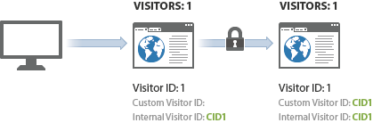

# Esempio di identificazione visitatore tra dispositivi

>[!IMPORTANT]
>
>Questo metodo di identificazione dei visitatori tra dispositivi non è più consigliato. Consulta [Cross-device  Analytics](/help/components/cda/overview.md) nella guida utente dei componenti.

L’esempio seguente illustra il funzionamento dell’identificazione dei visitatori su più dispositivi mediante un esempio di chiamate server inviate in una comune interazione con il cliente.

| Chiamata server | Azione | Cookie ID visitatore | Variabile ID visitatore | ID visitatore effettivo | Numero pagina visita | Numero visita |
|--- |--- |--- |--- |--- |--- |--- |
| 1 | Un visitatore fa clic su un collegamento in un messaggio e-mail di marketing e visita il sito dal computer di casa. Questo visitatore ha visitato il sito 7 altre volte in passato. | 1 | - | 1 | 1 | 8 |
| 2-8 | Visita 7 pagine aggiuntive sul tuo sito. | 1 | - | 1 | 2-8 | 8 |
| 9 | Effettua l&#39;autenticazione sul computer di casa. | 1 | CID1 | CID1 | 9  (questo è il primo hit di CID1 in assoluto, quindi prende il sopravvento e continua sul profilo del visitatore dall’ID visitatore 1). | 8 |
| 10 | Visita 1 pagina aggiuntiva. | 1 | CID1 | CID1 | 10 | 8 |
| 11 | Apre il sito dal laptop in ufficio. Il visitatore non ha visitato il sito prima di utilizzare questo dispositivo. | 2 | - | 2 | 1 | 1 |
| 12 | Effettua l&#39;autenticazione sul laptop. | 2 | CID1 | CID1 | 1 | 9 |
| 13 | Visualizzazioni 1 pagina aggiuntiva. | 2 | CID1 | CID1 | 2 | 9 |

## Conteggio delle visite

 Analytics conteggia una visita ogni volta che viene visualizzato un hit con un numero di pagina visita pari a 1.

Utilizzando la tabella precedente, una nuova visita è stata conteggiata 4 volte: sugli hit 1, 9, 11 e 12.

## Conteggio visitatori

 Analytics conteggia ciascun ID visitatore effettivo univoco come visitatore unico.

Utilizzando la tabella precedente, un nuovo visitatore è stato conteggiato 3 volte: sugli hit 1, 9 e 10.

Quando utilizzate l&#39;identificazione visitatore cross-device, potete aumentare il numero di visitatori univoci. Il visitatore può essere conteggiato due volte nella stessa visita: una volta per la visita iniziale e una volta autenticato l’utente.

Dopo l’associazione iniziale, il conteggio delle visite torna alla normalità, perché il visitatore è associato tramite il cookie del browser. Se il visitatore visualizza successivamente il sito e quindi si autentica, il conteggio dei visitatori non viene ingrandito perché l’ID visitatore effettivo non cambia dopo l’autenticazione.

Assicurati di essere il più coerente possibile nell&#39;identificare i visitatori univoci. Ad esempio, utilizzare sempre la `visitorID` variabile quando l&#39;utente è autenticato.
