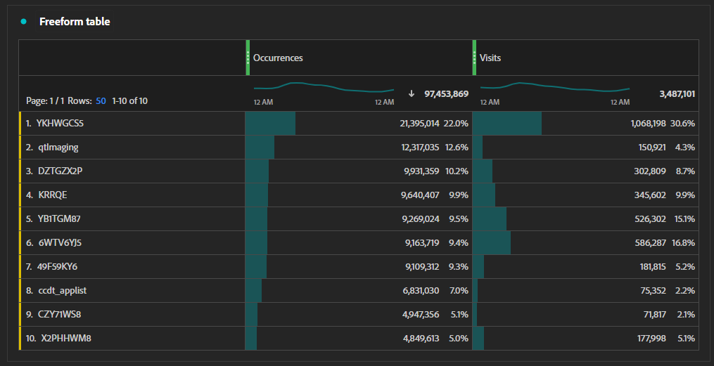

# Flusso di lavoro di tracciamento delle campagne

Se la tua organizzazione desidera tenere traccia delle prestazioni e del tasso di click-through delle attività relative al marketing, puoi utilizzare il seguente processo. Ciascuno di questi passaggi presenta sezioni dedicate in basso che contengono maggiori dettagli.

1. [Stabilire un processo di generazione del codice di tracciamento](#establish-a-tracking-code-generation-process)
1. [Aggiungere il codice di tracciamento desiderato all’e-mail](#add-the-desired-tracking-code-to-the-email)
1. [Impostare o regolare l’implementazione di Adobe Analytics per includere i dati del codice di tracciamento](#include-campaign-variables-in-your-implementation)
1. [Visualizzare i rapporti in Analysis Workspace](#view-the-reports-in-analysis-workspace)

[Adobe Campaign](https://business.adobe.com/it/products/campaign/adobe-campaign.html?lang=it) può aiutare a semplificare ciascuno di questi passaggi per dare il massimo valore alle attività relative al marketing. Per ulteriori informazioni, contatta il tuo rappresentante commerciale Adobe.

## Stabilire un processo di generazione del codice di tracciamento

Ogni organizzazione ha esigenze diverse per i codici di tracciamento. Alcune organizzazioni potrebbero avere esigenze minime per cui i codici di tracciamento creati manualmente sono più che sufficienti. Altre organizzazioni potrebbero desiderare un maggiore controllo sul tracciamento e disporre di più sistemi per la creazione dei codici di tracciamento desiderati. Se la tua organizzazione utilizza Google Analytics oltre ad Adobe Analytics, potrebbe già avere un modello del codice di tracciamento `utm` stabilito.

Indipendentemente dalla modalità di creazione o generazione dei codici di tracciamento, l’esistenza di un sistema coerente consente all’organizzazione di raggruppare i codici di tracciamento a scopo di reporting in modo molto più semplice. I codici di tracciamento strutturati in modo coerente ti consentono di creare [Regole di classificazione](/help/components/classifications/crb/classification-rule-builder.md) in modo da ottenere informazioni sulle prestazioni per categoria.

## Aggiungere il codice di tracciamento desiderato a un URL

Una volta ottenuto il valore desiderato del codice di tracciamento, puoi aggiungerlo a tutti i collegamenti pubblicati online, ad esempio annunci pubblicitari, social media o e-mail. L’aggiunta di questi codici di tracciamento si verifica in genere nella stringa di query di un collegamento. Il parametro della stringa di query utilizzato dipende dai requisiti di tracciamento della tua organizzazione; un parametro della stringa di query comune è `cid` (abbreviazione per ID campagna). Alcune organizzazioni che utilizzano anche Google Analytics potrebbero già disporre di più parametri di stringa di query per campagne, come `utm_source`, `utm_medium` e altri.

L’aggiunta di stringhe di query a un collegamento in un messaggio e-mail avrà un aspetto simile al seguente:

```text
https://example.com?cid=EM989027
```

## Includere le variabili della campagna nella tua implementazione

Adobe Analytics dispone di un [Codice di tracciamento](/help/components/dimensions/tracking-code.md) che puoi utilizzare per misurare le varie attività di marketing all’interno dell’organizzazione. Tuttavia, organizzazioni diverse potrebbero avere requisiti di tracciamento diversi. È importante fare riferimento al [Documento di progettazione della soluzione](../prepare/solution-design.md) per tenere traccia in modo coerente dei valori corretti nelle variabili giuste.

Se l’organizzazione non ha ancora configurato il tracciamento della campagna, puoi regolare l’implementazione per impostare la variabile [`campaign`](/help/implement/vars/page-vars/campaign.md). Consulta il metodo [`getQueryParam`](/help/implement/vars/plugins/getqueryparam.md) per scoprire come raccogliere i valori dei parametri delle stringhe di query specifici per l’implementazione della tua organizzazione.

Se l’organizzazione raccoglie stringhe di query `utm`, puoi scegliere di:

* Inviare tutte le stringhe di query `utm` nella dimensione Codice di tracciamento come valori concatenati. A questo punto puoi utilizzare le [Regole di classificazione](/help/components/classifications/crb/classification-rule-builder.md) per creare dimensioni aggiuntive incentrate su ciascun parametro `utm`. Questo metodo ha una curva di apprendimento più complessa, ma non utilizza eVar aggiuntive.
* Inviare ciascuna stringa di query `utm` in una stringa separata [eVar](/help/components/dimensions/evar.md). Questo metodo è più semplice da implementare complessivamente, ma richiede l’utilizzo di eVar aggiuntive.

## Visualizzare i rapporti in Analysis Workspace

Dopo aver configurato correttamente l’implementazione per raccogliere i dati del codice di tracciamento, puoi visualizzare i rapporti in Analysis Workspace.

1. Accedere a [Adobe CX Enterprise](https://experience.adobe.com) e selezionare [!UICONTROL Adobe Analytics].
1. Crea un [progetto Workspace](/help/analyze/analysis-workspace/build-workspace-project/freeform-overview.md).
1. Nell’elenco dei componenti a sinistra, trascina la dimensione [Codice di tracciamento](/help/components/dimensions/tracking-code.md) nell’area di lavoro di Workspace.
1. Trascina la metrica desiderata, ad esempio [Visite](/help/components/metrics/visits.md) o [Ordini](/help/components/metrics/orders.md) sul lato a destra dell’area di lavoro di Workspace.


