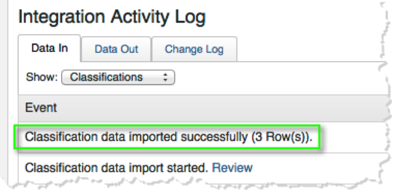

# Distribuzione dell&#39;integrazione{#deploying-the-integration}

La distribuzione di questa integrazione è un processo semplice che richiede le seguenti azioni:

## Completa l&#39;Integrazione guidata Adobe{#completing-the-adobe-integration-wizard}

Passaggi per completare l&#39;integrazione guidata nell&#39;interfaccia Data Connectors.

1. Passa all’area Data Connectors (precedentemente Genesis) all’interno di Adobe Experience Cloud.
1. Avvia la procedura guidata di integrazione di ContactLab.
1. Scegli la suite di rapporti desiderata e specifica un nome per l’integrazione.
1. Configura i seguenti elementi:

   | Elemento | Descrizione |
   |---|---|
   | Indirizzo e-mail | Indirizzo e-mail del contatto principale |
   | Descrizione | (Facoltativo) Descrizione per questa configurazione di integrazione |

1. Configura i seguenti elementi **[!UICONTROL Variable Mappings]**:

   | Elemento | Descrizione |
   |---|---|
   | ID collegamento | Seleziona un eVar per raccogliere gli ID collegamento in tempo reale. |
   | ID messaggio | Seleziona un eVar per raccogliere gli ID messaggio in tempo reale. |
   | Recipient ID | Seleziona un eVar per raccogliere gli ID dei destinatari in tempo reale. |
   | Rimbalzi | Selezionare un evento numerico per ricevere rimbalzi giornalieri da ContactLab. |
   | Inviato | Selezionare un evento numerico da ricevere quotidianamente da ContactLab. |
   | Clic | Selezionare un evento numerico per ricevere i clic totali giornalieri da ContactLab. |
   | Aperto | Selezionare un evento numerico per ricevere le aperture totali giornaliere da ContactLab. |
   | Annulla sottoscrizione | Selezionare un evento numerico per ricevere gli annullamenti giornalieri dell&#39;iscrizione da ContactLab. |

1. Abilita l’accesso ai dati e configura la raccolta dati.
   1. Rinomina le classificazioni in base alle esigenze.
   1. **[!UICONTROL Partner segments]** sono segmenti di remarketing standard inclusi nell’integrazione.
   1. In **[!UICONTROL Your Segments]**, seleziona i segmenti personalizzati che desideri includere in questa integrazione. Puoi creare ulteriori segmenti personalizzati nel pannello di amministrazione.
   1. In **[!UICONTROL Access Requests]**, seleziona la casella per consentire l’esportazione delle informazioni di prodotto in ContactLab nei segmenti di remarketing giornalieri.
   1. Rinomina le metriche calcolate come necessario.
   1. Configura se raccogliere gli ID aggiornando manualmente il codice di raccolta di Analytics o utilizzando la soluzione automatizzata. Se selezioni **[!UICONTROL Automated Solution]**, devi includere i parametri utilizzati nei collegamenti e-mail per trasmettere gli ID.
1. Rivedi tutti gli elementi di configurazione e fai clic su **[!UICONTROL Activate Now]**.

## Verifica l&#39;integrazione{#verifying-the-integration}

Visualizza la configurazione dell’integrazione ContactLab in Adobe Experience Cloud

1. Visualizza il registro delle attività di integrazione.
   1. In Adobe Experience Cloud, passa a **[!UICONTROL Support]** > **[!UICONTROL Integration Activity Log]**.

      

   1. Cerca voci come **[!UICONTROL Classification Data imported successfully]**, **[!UICONTROL Metrics Data imported successfully]** e **[!UICONTROL Metric Data exported successfully]**. Queste voci devono essere visualizzate entro 1 giorno dalla distribuzione corretta.
1. Visualizza i dati dei rapporti in Adobe Analytics.
   1. Passa a **[!UICONTROL Custom Conversion]** > **[!UICONTROL Custom Conversion 1-10]** > **[!UICONTROL Message ID Reports]**.

      

   1. Cercare il reporting di ContactLab. Questi dati devono essere visualizzati entro 24-48 ore dalla distribuzione riuscita.
