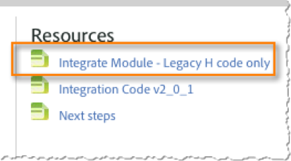

# Inclusione del modulo Integra{#including-the-integrate-module}

Il codice di integrazione richiede che il modulo Integrazione esista nella vostra distribuzione Adobe Analytics.

Se non disponete già del modulo Integra come parte della distribuzione, completate i passaggi seguenti in base al tipo di implementazione disponibile.

## Per appmeasurement v 1.0 + {#section-f28d090bf2404cabaae34cd9c66fc575}

1. Decomprimete il file zip appmeasurement scaricato da **[!UICONTROL Analytics]** &gt; **[!UICONTROL Admin]** &gt; **[!UICONTROL CodeManager]**.

1. Aprite il file denominato [!DNL AppMeasurement_Module_Integrate.js].
1. Copiate e incollate il contenuto di questo file nel [!DNL AppMeasurement.js] file principale.

   >[!NOTE]
   >
   >Incolla immediatamente prima del commento NON MODIFICA sotto il commento LINE all'interno del file.

## Per Codice legacy (H-code) {#section-bba8ad8c715e4f97883e7de3269f681a}

1. Scarica il modulo Integra dall'area «Risorse» nell'interfaccia utente Connettori dati (nella scheda Assistenza).

   

1. Copiate e incollate il contenuto di tale file nel [!DNL s_code] file.

   >[!NOTE]
   >
   >Incolla immediatamente prima del commento NON MODIFICA sotto il commento LINE all'interno del file.

