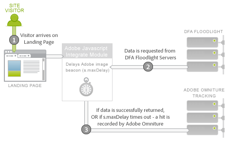
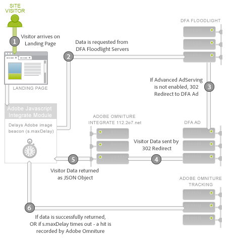

# Connettore dati DFA per Adobe Analytics{#dfa-data-connector-for-adobe-analytics}

>[!IMPORTANT]
>
>La tecnologia Adobe Data Connector terminerà a metà del 2021. [Ulteriori informazioni...](/help/import/data-connectors/data-connectors-eol.md)

Nel sempre più complesso e competitivo mercato online di oggi, gli inserzionisti e le agenzie pubblicitarie online devono continuamente migliorare la loro comprensione dell&#39;ambiente di marketing online e il loro ritorno sulla spesa pubblicitaria. Sebbene gli inserzionisti, le agenzie e gli editori siano in possesso di strumenti individuali per contribuire al raggiungimento di questi obiettivi, l&#39;aggregazione manuale dei dati da sistemi e processi di dati diversi può seriamente compromettere l&#39;efficacia delle campagne di marketing on-line, riducendo al minimo le prestazioni delle campagne, le discrepanze dei dati e la confusione.

L&#39;integrazione DoubleClick for Advertiser (DFA) risolve questo problema utilizzando Adobe® Data Connectors™ per consentire a DoubleClick DFA di trasmettere automaticamente i dati a Reporting e  Analytics.

**[!UICONTROL Analytics]** (Workspace) > **[!UICONTROL Admin]** (Progetto) > **[!UICONTROL Data Connectors]** (Annulla/Ripeti)

## Vantaggi chiave{#key-benefits}

I vantaggi principali del Connettore dati - Integrazione DFA includono:

* **Conversione** aumentata: Ottenete informazioni approfondite sulla direzione per ottimizzare il posizionamento delle campagne pubblicitarie e la conversione sul sito in base al comportamento e alle preferenze dei visitatori dopo aver fatto clic.
* **Percorso condiviso per i dati**: Combinate doppio clic su dati DFA click-through e visualizzazione-through con Reporting e  Analytics per migliorare la collaborazione e le capacità aziendali per prendere decisioni obiettive.
* **Analisi** a valore aggiunto: L&#39;integrazione automatizzata tra DFAE e Adobe Reports &amp;  Analytics consente a inserzionisti e agenzie pubblicitarie di dedicare meno tempo all&#39;analisi dei report e all&#39;adozione di misure.
* **Approfondimenti** dei clienti: Scopri meglio da dove provengono i visitatori e cosa fanno sul tuo sito.
* **Metriche** di successo del ciclo di vita: Misura l’efficacia delle campagne di acquisizione nell’intero ciclo di vita del visitatore.
* **Generazione di rapporti** integrati: Sincronizza automaticamente i dati tra DFA e Reporting e  Analytics per processi aziendali semplificati e generazione di report.
* **Lifetime Visitor Analysis**: Misura l’efficacia delle campagne in base a più eventi di successo definiti dall’utente e al valore del ciclo di vita.
* **Metriche** costi: Ottimizzare il rendimento degli investimenti confrontando i costi e i ricavi del DFA generati da tali costi in un unico sistema.

## Panoramica sull&#39;integrazione di Ad Serving{#ad-serving-integration-overview}

Esistono diversi modi in cui questa integrazione acquisisce i dati sul visitatore basato su annunci. Il primo modo è fare clic su un annuncio e arrivare su una pagina di destinazione con tag, denominata click-through:

Il visitatore arriva sul sito dell&#39;editore, che ospita l&#39;annuncio. Questo annuncio ha un identificatore univoco, denominato Ad ID. Gli annunci includono un Posizionamento e un Creative, che descrivono dove si trova l&#39;annuncio sul sito dell&#39;Editore e quale contenuto è stato mostrato al visitatore. Quando il visitatore recupera l&#39;annuncio, il posizionamento o la creatività dai server di contenuti DFA, tiene traccia di un&#39;impressione sui server di luce mobile DFA per il visitatore (1).

Se il visitatore fa clic sull’annuncio (2), viene interrogato il server di Floodlight, che conta un clic, 302 reindirizzerà (3) il visitatore alla pagina di destinazione. Quando il visitatore è arrivato sulla pagina di destinazione, questo viene definito click-through. Questa pagina contiene il codice di tracciamento Adobe che invia una query ai dati del DFA Floodlight Server.

Se il visitatore non arriva effettivamente sulla pagina di destinazione dopo che il server di Floodlight ha tracciato un clic, questo non viene definito click-through. Alcuni annunci e implementazioni potrebbero non causare il reindirizzamento 302 del browser del visitatore. Per ulteriori discussioni su questo argomento, vedere [Riconciliazione delle discrepanze](../dfa-data-connector-analytics/dfa-reconciling-metric-discrepancies.md)tra metriche.

La metrica successiva acquisita da questa integrazione si verifica quando il visitatore riceve l&#39;impressione Annuncio, non fa clic, ma nel prossimo futuro arriva sulla pagina di destinazione con altri mezzi.

Questo scenario viene definito &quot;visualizzazione-through&quot;. La differenza in questo scenario con lo scenario di click-through sta nel fatto che il visitatore non fa clic sull’annuncio, ma continua ad altre attività prima di passare alla pagina di destinazione (2). Nel caso più semplice, il visitatore digita l’URL della pagina di destinazione nel browser. In altri casi, il visitatore continua a navigare ma successivamente utilizza un motore di ricerca, che indirizza il visitatore alla pagina di destinazione. In ogni caso, l’utente arriva sulla pagina di destinazione.

## Integrazione Adobe: Raccolta dati in tempo reale{#adobe-integration-real-time-data-collection}

La figura seguente mostra il funzionamento della raccolta dati.

La parte di raccolta dei dati dell&#39;integrazione Adobe inizia quando il visitatore arriva alla pagina di destinazione (1). Il codice di raccolta dati Adobe in esecuzione sulla pagina di destinazione non è a conoscenza della cronologia del visitatore con gli annunci serviti. Il team di Google DFA ha coordinato un servizio in esecuzione sul DFA Floodlight Server per consentire al codice Adobe di eseguire query e informazioni sul visitatore attualmente sul sito (2). Per ottenere questi dati, il beacon immagine Adobe viene temporaneamente ritardato e richiede i dati dal server di Mobile.

Quando i dati arrivano o richiedono troppo tempo, viene attivato l’hit sui server di tracciamento Adobe (3).

Il modulo Integrate è uno speciale modulo JavaScript di base di Adobe che causa il ritardo del beacon immagine Adobe, in attesa di una richiesta di terze parti per un periodo di tempo specifico (`s.maxDelay`). `s.maxDelay` definisce per quanto tempo il modulo Integrate attenderà i dati dal DFA Floodlight Server prima di attivare il tag immagine nel browser del visitatore. Questo comportamento è importante in modo che i dati visitatore di base vengano ancora raccolti, anche quando i server DFA Floodlight sono inattivi o fortemente caricati. Se i dati di Floodlight arrivano prima della `s.maxDelay` scadenza, i dati di tracciamento Adobe verranno attivati immediatamente e conterranno i dati DFA aggiuntivi.

Quando si verifica un timeout, il codice della pagina può specificare un evento Adobe Reports &amp;  Analytics da utilizzare come evento di timeout. Questo evento è utile per diagnosticare problemi con l&#39;integrazione o per la regolazione `s.maxDelay`. Nei casi in cui si verificano timeout eccessivi, aumentare `s.maxDelay`. `s.maxDelay` può tuttavia essere impostato su un valore troppo elevato, in cui i visitatori potrebbero lasciare il sito prima della scadenza del `s.maxDelay` timer. .

A volte il server di Floodlight risponde con errori relativi al visitatore. In genere questo si verifica quando il server di Floodlight non sa nulla del visitatore, perché quest&#39;ultimo non ha ancora visto annunci o non dispone di un cookie visitatore DFA. Il codice della pagina può specificare una variabile Conversione personalizzata (eVar) che raccoglierà tali errori e può aiutare a risolvere i problemi di implementazione o segnalare i problemi con la transazione Google. Gli errori più comuni sono: Nessuna cronologia, Nessun cookie, Errore query e Rifiuto, come descritto nella tabella seguente:

| Errore | Nome | Descrizione |
|---|---|---|
| nh | Nessuna cronologia | Il visitatore non ha visualizzato né fatto clic su alcun annuncio. |
| nc | Nessun cookie | Il visitatore non dispone di un cookie visitatore DFA. |
| qe | Errore query | Errore durante la query dei dati per il server Floodlight. |
| oo | Rifiuto | Il visitatore ha rinunciato al tracciamento di impression/clic di Google. |

## Integrazione Adobe: Importazione dati notturna{#adobe-integration-nightly-data-import}

La parte dell&#39;integrazione relativa alla raccolta dei dati raccoglie i dati click-through e view-through relativi ai visitatori del sito. Per ottenere le metriche relative a clic, impression e costi del DFA, è previsto un processo notturno coordinato da Google e Adobe per importare questi dati aggiuntivi nella suite di rapporti integrata. Queste metriche vengono importate tramite Origini dati, il che significa che sono disponibili solo in aggregazione e non a livello di visita.

## Differenze tra versioni{#version-differences}

Attualmente sono disponibili tre versioni dell’integrazione DFAE: 1.0, 1.5 e 2.0.

Nella tabella seguente sono riepilogate le funzioni di ciascuna versione dell&#39;integrazione.

| Funzione | Versione 1.0 | Versione 1.5 | Versione 2.0 |
|---|---|---|---|
| Metriche notturne di clic e impressione DFA | Sì | Sì | Sì |
| Tracciamento Click-through e View-through | Sì | Sì | Sì |
| L&#39;integrazione riceve i dati a livello di inserzionista | No | Sì | Sì |
| L&#39;integrazione riceve i dati su un livello di configurazione Floodlight | No | No | Sì |
| Metriche costi | No | No | Sì |
| Metriche creative | No | No | Sì |
| Stringhe query oltre 2 Kbyte | No | Sì | Sì |
| Utilizza il modulo Integrate per una raccolta dati ottimale di terze parti | No | Sì | Sì |
| Timeout e tracciamento errori | No | Sì | Sì |
| Non è necessario un ID lato client negoziato | No | No | Sì |

### Informazioni sulla versione 1.5 {#section-b5a3e967cfa141ea8f740612336181be}

La versione 1.5 dell&#39;integrazione introduce il modulo Integrate nello script JavaScript della pagina di destinazione. Il modulo Integrate consente richieste di dimensioni fisse al DFA ad server (ad.doubleclick.net) che superano i limiti di richiesta 2K dell&#39;integrazione precedente. Inoltre, introduce un timeout configurabile *`s.maxDelay`*, per continuare a raccogliere i dati dei visitatori Adobe in caso di interruzioni di rete. Gli errori e i timeout possono essere acquisiti anche  variabili Analytics.

L&#39;illustrazione seguente mostra le interazioni di rete sulla pagina di destinazione nella versione 1.5.

Nella versione 1.5, il modulo Integrate (2) richiede i dati dal server Floodlight (3). Il server Floodlight si reindirizzerà al DFA ad server, che restituirà i dati sul visitatore allo stesso modo della versione 1.0. Sarà 302 reindirizzare (4) a uno speciale servizio di traduttori su integration.112.2o7.net, che trasformerà la struttura di risposta in un oggetto JSON. Il modulo Integrate utilizza questo oggetto JSON e trasmette le informazioni ad Adobe Tracking (5).

Il passaggio dalla versione 1.0 dell&#39;integrazione alla versione 1.5 comporta una modifica JavaScript. Per ottenere questo JavaScript, accedete al vostro account Adobe Online Marketing Suite, scegliete il prodotto Genesis, fate clic su Edit on your DFA integration e seguite la procedura guidata. Se in precedenza è stato assegnato un ID del sito client, una volta salvata l&#39;integrazione riceverete immediatamente il nuovo codice JavaScript via e-mail. Una volta ottenuto questo codice, sarà necessaria anche una nuova versione del core s_code che dispone del modulo Integrate. Questo codice può essere richiesto al tuo Account Manager o Consulente per l&#39;implementazione.

Una caratteristica importante del nuovo codice JavaScript è che tra la versione 1.5 e la versione 2.0 non è necessaria alcuna modifica all&#39;implementazione.

### Informazioni sulla versione 2.0 {#section-afd56de0c56c4489bb5ddc5798d6709a}

L’ultima versione dell’integrazione DFAE contiene i dati per un’intera configurazione Floodlight. Precedentemente alla versione 2.0, le singole integrazioni erano legate a un singolo inserzionista DFA. Con questa modifica, le metriche Click, Impression e Cost per l&#39;intera configurazione del faro verranno incluse nella suite di rapporti integrata. È inoltre possibile tenere traccia della visualizzazione tra più siti, quando questi due siti si trovano all’interno della stessa configurazione di Floodlight.

A partire dalla versione 2.0 dell’integrazione sono disponibili anche le metriche Media Cost. Per abilitare le metriche dei costi dei supporti per un&#39;integrazione, è necessario scegliere un evento Reporting e  Analytics per Media Cost nella procedura guidata Genesi, nonché specificare la valuta in cui si trovano le cifre delle metriche nell&#39;interfaccia DFAE.

I timeout dovrebbero diminuire con l&#39;integrazione 2.0, dal momento che i reindirizzamenti 302 sono stati eliminati. L’eliminazione di questi hop dovrebbe ridurre i timeout e aumentare la quantità di dati DFA che puoi integrare.

Se una configurazione Floodlight è una configurazione condivisa in DFA, l’aggiornamento dalla versione 1. Da 5 a 2.0 i dati di conversione per tutti gli inserzionisti condivisi all&#39;interno della configurazione di Floodlight vengono inclusi nella suite di rapporti.

### Aggiornamento alla versione 2.0 {#section-f0bf90b9a7a1434ab1540b6c0999f4c7}

La tabella seguente delinea i proprietari per la migrazione alle versioni più recenti dell&#39;integrazione:

| Migrazione | Proprietario | Attività |
|---|---|---|
| Da 1.0 a 1.5 | Client | Implementazione della versione 1.5 di JavaScript con il modulo integrato |
| Da 1.5 a 2.0 | Client | Il client inizia la discussione con Google sui tempi di aggiornamento. Dopo l&#39;approvazione, Google abilita Advanced Ad Serving. |
