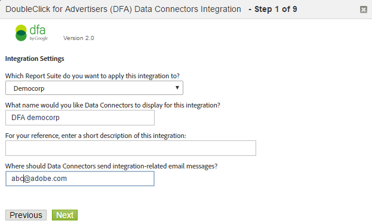

# Configurare l'integrazione DFA{#configure-the-dfa-integration}

Passa all'integrazione dei connettori dati DFA.

Le pagine di configurazione forniscono una panoramica dell'integrazione e dei collegamenti utili per ulteriori informazioni. Esistono delle tariffe Adobe e doubleclick associate a questa integrazione. Contatta i tuoi rappresentanti vendite appropriati per entrambe le organizzazioni e assicurati di conoscere la struttura delle tariffe.

1. Log in to the [!DNL Adobe Analytics].
1. Click **[!UICONTROL Admin]** &gt; **[!UICONTROL Data Connectors]**.

   

1. Individuate **[!UICONTROL DoubleClick DFA]**, quindi fate clic **[!UICONTROL Add New]** su.

   

   In ogni pagina della procedura guidata Integrazione, fornite le informazioni richieste, quindi fate clic **[!UICONTROL Next]** su. Nella tabella seguente sono illustrate le informazioni necessarie per completare l'integrazione tramite la procedura guidata.

<table id="table_8F6F7F304C36431DA5FD6E5D54F60FC0"> 
 <thead> 
  <tr> 
   <th colname="col1" class="entry"> Pagina della procedura guidata # </th> 
   <th colname="col2" class="entry"> Campo </th> 
   <th colname="col3" class="entry"> Descrizione </th> 
  </tr> 
 </thead>
 <tbody> 
  <tr> 
   <td colname="col1"> 1 </td> 
   <td colname="col2"> Nome integrazione </td> 
   <td colname="col3"> Il nome dell'integrazione visualizzato Genesis nell'Elenco integrazione attivo della suite di rapporti. </td> 
  </tr> 
  <tr> 
   <td colname="col1"> 1 </td> 
   <td colname="col2"> Indirizzo e-mail integrazione </td> 
   <td colname="col3"> L'indirizzo e-mail che riceve tutte le notifiche correlate a questa integrazione. </td> 
  </tr> 
  <tr> 
   <td colname="col1"> 2 </td> 
   <td colname="col2"> Nome utente </td> 
   <td colname="col3"> Il nome utente API DFA da utilizzare con l'integrazione. Per abilitare l'accesso a un utente, controlla l'attributo API nell'interfaccia DFA. Dopo aver attivato l'accesso API, viene visualizzato un campo password per fornire una password all'utente. Questa password viene inserita insieme al nome utente nella procedura guidata per l'autenticazione. </td> 
  </tr> 
  <tr> 
   <td colname="col1"> 2 </td> 
   <td colname="col2"> Password </td> 
   <td colname="col3"> La password API DFA. </td> 
  </tr> 
  <tr> 
   <td colname="col1"> 2 </td> 
   <td colname="col2"> ID inserzionista </td> 
   <td colname="col3"> 
L'ID pubblicitario DFA o l'ID della configurazione geometdlight principale. Connettori dati usa questo ID per identificare l'inserzionista DFA da tenere traccia (versione 1.5 dell'integrazione). L'ID pubblicitario non viene utilizzato nella versione 2.0 dell'integrazione; l'ID di configurazione Floodlight principale verrà cercato e utilizzato. Vedere le istruzioni sullo schermo 
 </td> 
  </tr> 
  <tr> 
   <td colname="col1"> 3 </td> 
   <td colname="col2"> Variabile annunci DFA </td> 
   <td colname="col3"> Evar di Analytics che riceve l'attributo della campagna DFA, impression e fa clic sui dati. In genere, si tratta della evar di codice di tracciamento (  s. campaign ), ma puoi scegliere qualsiasi evar disponibile. I Connettori dati aggiungono inoltre le seguenti classificazioni DFA alla evar selezionata: 
<b>Campagne</b>: Una raccolta di annunci serviti a più siti che hanno messaggi comuni. 
 
<b>Nome sito</b>: Il sito in cui è stato distribuito l'annuncio. 
 
<b>Nome annuncio</b>: Il nome Annuncio, come definito nell'account DFA. 
 
<b>Nome posizionamento sito</b>: Sito Web e pagina in cui è stato distribuito l'annuncio. 
 
<b>Strumento di consegna</b>: Doubleclick per Advertiser. 
 
<b>Canale</b>: Banner Ad. 
 
<b>Struttura costi</b>: CPM, CPC o Fisso, in base alla struttura costi dell'annuncio. 
 
<b>Creativi</b>: Il nome delle credenziali associate a un annuncio/posizionamento/ID creativo. 
 
<b>DFA &gt; Deduplicazione searchcenter</b>: Specifica che il DFA deve posizionare i valori nelle variabili Searchcenter quando si verificano click-through DFA o Visualizza-through. Per ulteriori informazioni, consulta <a href="../../dfa-data-connector-analytics/dfa-integration-features.md#concept-ff93289d1662410e98f62c200394b3e3" format="dita" scope="local"> Deduplicazione di searchcenter </a> . 
 </td> 
  </tr> 
  <tr> 
   <td colname="col1"> 4 </td> 
   <td colname="col2"> Impressioni </td> 
   <td colname="col3"> L'Evento personalizzato che riceve i dati delle metriche DFA Impressioni. Impression indica quante volte è stato effettuato l'annuncio. </td> 
  </tr> 
  <tr> 
   <td colname="col1"> 4 </td> 
   <td colname="col2"> Clic </td> 
   <td colname="col3"> Seleziona l'evento personalizzato che riceve i dati della metrica clic su DFA. I clic indicano quante volte i visitatori hanno fatto clic sull'annuncio come misurato dal reindirizzamento di DFA. La metrica Clic si correla alla metrica di Click-through Analytics. 
Nota: Clic su DFA e Clic su Analytics potrebbero non corrispondere esattamente a causa di differenze nel modo in cui vengono raccolti i dati. Per ulteriori informazioni, consultate <a href="../../dfa-data-connector-analytics/dfa-reconciling-metric-discrepancies/dfa-metric-definitions.md#concept-2d5cd5ddd2594bb386a16a2764f30982" format="dita" scope="local"> Definizioni </a>delle metriche. 
 </td> 
  </tr> 
  <tr> 
   <td colname="col1"> 5 </td> 
   <td colname="col2"> Variabile View-Through </td> 
   <td colname="col3"> 
Evar di Analytics che riceve i dati di visualizzazione DFA. La variabile View-Through ti aiuta a vedere in che modo le valutazioni influiscono sui tassi di conversione sul tuo sito. 
 
Connettori dati aggiunge le stesse classificazioni DFA a questa evar come accade alla variabile Ad DFA (vedi sopra). 
 </td> 
  </tr> 
  <tr> 
   <td colname="col1"> 5 </td> 
   <td colname="col2"> Ora dall'ultima visualizzazione (variabile bucket ora-visualizzazione) </td> 
   <td colname="col3"> Evar di Analytics che riceve Ora DFA dai dati dell'ultima visualizzazione. L'ora dall'ultima visualizzazione indica il tempo trascorso dall'ultimo visualizzazione ad annuncio. </td> 
  </tr> 
  <tr> 
   <td colname="col1"> 5 </td> 
   <td colname="col2"> View-Through </td> 
   <td colname="col3"> L'Evento personalizzato che riceve i dati delle metriche della visualizzazione DFA. Utilizzate l'evento View-Through con la variabile View-through per vedere quali campagne non hanno influenzato un click-through diretto, ma potrebbero aver svolto un ruolo per guidare il traffico verso il sito in un momento successivo. 
Connettori dati rinomina l'evento personalizzato selezionato in «Visualizza le esecuzioni». 
 </td> 
  </tr> 
  <tr> 
   <td colname="col1"> 6 </td> 
   <td colname="col2"> Errore query DFA </td> 
   <td colname="col3"> (Facoltativo) evar di Analytics che riceve eventuali codici messaggi di query DFA segnalati. I codici dei messaggi DFA possibili includono: 
    <ul id="ul_85FC7FB19F7F4ADF83ABCA6DDB44CE19"> 
     <li id="li_0A3181DED5A149588A0D3F1584E2FE8B"><b>nc</b>: Cookie doubleclick. </li> 
     <li id="li_D397AA73AD5E4086A18B87F271E4EC14"><b>oo</b>: L'utente ha rinunciato. </li> 
     <li id="li_5AC1D0C8049340B4AD857D88E275CBD6"><b>nh</b>: Nessuna cronologia delle campagne. </li> 
     <li id="li_73A8C5E905C54E2BB531A1FCDBC6AA1A"><b>qe</b>: Errore query (timeout, server in basso, ecc.) </li> 
    </ul> </td> 
  </tr> 
  <tr> 
   <td colname="col1"> 6 </td> 
   <td colname="col2"> Evento timeout </td> 
   <td colname="col3"> 
L'evento di contatore di Analytics che si incrementa ogni volta che il timer  s. maxdelay  scade e non viene ricevuta alcuna risposta dai server DFA. Utilizzare questo evento per configurare la  variabile s. maxdelay (consultate <a href="../../dfa-data-connector-analytics/dfa-integration/dfa-tuning-s-maxlelay.md#concept-6deb28eee18e414db220d6009d449f0d" format="dita" scope="local"> Tuning s. maxdelay </a>.) 
 </td> 
  </tr> 
 </tbody> 
</table>

