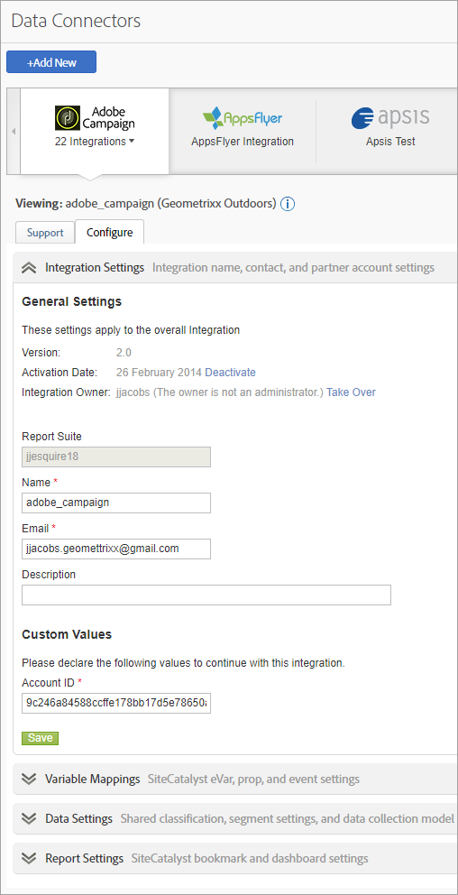

# Panoramica dei connettori dati

Adobe fornisce alle organizzazioni informazioni fruibili e in tempo reale sulle strategie digitali e le iniziative di marketing digitali. I connettori dati consentono di importare dati di tracciamento da applicazioni di terze parti in Analytics, in modo da raccogliere e utilizzare dati da una singola posizione centrale. Se utilizzi uno dei prodotti partner, puoi creare un’integrazione che importa i dati dell’applicazione nei rapporti di marketing. Una volta integrati, puoi generare rapporti che includono dati dell’applicazione.

Ad esempio, un’integrazione e-mail potrebbe voler utilizzare un partner e-mail per distribuire una campagna e-mail. Quando i visitatori accedono al tuo sito web, è importante per te sapere quali sono arrivati grazie alla campagna e-mail. I connettori dati integrano i dati del partner e-mail nei rapporti di marketing in modo da poter determinare l’efficacia della tua campagna e-mail.

>[!IMPORTANT]
>
>Il 1 agosto 2021 terminerà il ciclo di vita della tecnologia del Connettore dati del Adobe . [Ulteriori informazioni...](/help/import/data-connectors/data-connectors-eol.md)

**Requisiti di sistema**

I connettori dati dovrebbero essere integrati in modo appropriato con la maggior parte dei browser più diffusi. Tuttavia, i rapporti hanno aspetto e funzioni ottimali nei sistemi che soddisfano i seguenti suggerimenti:

* Browser: Microsoft Internet Explorer versione 6 e successive
* Cookie: obbligatori
* JavaScript: abilitato
* Sistema operativo: basato su Windows
* Macromedia Flash Player: versione 6 o successive
* Risoluzione monitor: 1024x768 (800x600 è sufficiente)
* Profondità colore: 16 bit o superiore

Inoltre, la raccolta dei dati migliora quando i browser web degli utenti hanno JavaScript abilitato.

**Prerequisiti**

Prima di configurare un’integrazione dei connettori dati per il prodotto, effettua le seguenti operazioni:

* Assicurati di disporre delle credenziali di accesso necessarie per l’account del prodotto partner, con i diritti di accesso a tutti i dati da integrare con i rapporti di marketing. Potresti creare un account e-mail specifico per i distributori di rapporti e per le notifiche relative alle operazioni integrate.
* Identifica le variabili personalizzate che contengono le informazioni sulla campagna. Questo viene comunemente definito codice di tracciamento campagna, ma la tua organizzazione potrebbe usare altri termini.
* Determina per quali eventi desideri ricevere impressioni e fai clic sui dati. È possibile rinominare gli eventi di conseguenza.
* Inserisci il codice appropriato nella pagina di destinazione in modo che Analytics possa eseguire la modellazione appropriata con i dati provenienti dal prodotto partner. Le istruzioni specifiche per ciascun prodotto partner sono disponibili nella scheda Risorse in Data Connectors Showcase.

## Aggiungere un’integrazione

Per accedere alla pagina di destinazione [!UICONTROL Data Connectors] (console) è necessario disporre di un account corrente. Inoltre è consigliabile avere familiarità con Adobe Analytics.

1. Accedi ad Adobe Experience Cloud.
1. Fai clic su **[!UICONTROL Analytics]** > **[!UICONTROL Admin]** > **[!UICONTROL Data Connectors]**.
1. Fai clic su **[!UICONTROL Add New]**.
1. Scorri l’interfaccia **[!UICONTROL Add Integration]**.

   A seconda dell’integrazione dei singoli prodotti, potrebbe essere necessario fornire informazioni di configurazione specifiche nell’ambito del processo di integrazione.

   Al termine dell’integrazione, l’icona del prodotto partner viene visualizzata nella pagina Data Connectors Network ed è disponibile nei menu.

## Console Data Connectors

Dopo aver attivato un’integrazione, questa viene visualizzata sulla pagina [!UICONTROL Data Connectors]. Puoi visualizzare i dettagli e apportare modifiche alla configurazione nella console. Puoi visualizzare integrazioni attive e integrazioni in tutte le suite di rapporti della tua azienda. Inoltre puoi visualizzare un registro delle attività, impostare un’integrazione come dashboard, configurare un’integrazione e avere assistenza.



## Segmenti di remarketing nei connettori dati

I segmenti di remarketing sono file di dati creati in base alle variabili utilizzate nell’integrazione dei connettori dati.

Adobe Analytics invia questi dati in file giornalieri separati tramite data warehouse a un FTP creato da Adobe per terze parti. Le terze parti distribuiscono quindi questi file al cliente. Comunemente le aziende utilizzano questi file per effettuare remarketing rivolto a coloro che possono aver visitato il sito e guardato un prodotto, ma non lo hanno acquistato. Ad esempio, puoi contattare un cliente per offrire uno sconto relativo a un prodotto che ha visualizzato ma che non ha acquistato.

**Segmenti**

* [!UICONTROL Cart Abandonment]: la percentuale di visitatori che ha aggiunto un articolo al carrello ma non lo ha acquistato. Tecnicamente è una metrica calcolata composta da Ordini divisi per Aggiunte al carrello.
* [!UICONTROL Purchases]: gli ID destinatario (o ID visitatore) che hanno effettuato acquisti in base all’ID messaggio in un prodotto specifico.
* [!UICONTROL Product Views]: simile a [!UICONTROL Cart Abandonment], anche questa è una metrica calcolata. Riporta [!UICONTROL Product Views] divisa per Ordini, in quanto la visualizzazione del prodotto da parte dei clienti è significativa e va tenuta in considerazione.

**Esempi di implementazione**

Per implementare correttamente i segmenti di remarketing, è necessario soddisfare le seguenti condizioni:

* È stato creato un contratto relativo ai connettori dati e la tua organizzazione ha completato la fase di implementazione con un consulente Adobe.
* L’evento corrispondente viene attivato contemporaneamente alla variabile di prodotti:
   * Abbandono carrello: evento `scAdd`
   * Acquisti: evento `purchase`
   * Visualizzazioni prodotto: evento `prodView`

>[!NOTE]
>
>Se il prodotto è definito senza un evento associato, l&#39;evento `prodView` viene attivato automaticamente.
>
>Se i requisiti precedenti non sono soddisfatti, i segmenti di remarketing corrispondenti non vengono segnalati correttamente.

[!UICONTROL Cart Abandonment]: viene attivato dopo che l’utente ha aggiunto un prodotto al carrello:

```
s.products=";cat";
s.events="scAdd";
```

[!UICONTROL Purchases]: viene attivato nella pagina di conferma dell’acquisto:

```
s.products=";
cat;1;50";
s.events="purchase";
//Note: Though optional, adding the purchaseID variable increases accuracy by preventing duplicate purchases
```

**Problemi comuni**

| Problema | Descrizione |
| -----------| ---------- |  
| Nessuna informazione ID prodotto visualizzata nel file Segmento di remarketing. | Ciò si verifica quando viene attivato l’evento corretto, ma non è presente alcuna variabile di prodotto nella stessa richiesta di immagine. Per risolvere questo problema, accertati che la variabile di prodotti e l’evento corrispondente vengano attivati sulla stessa pagina, come mostrato negli esempi di implementazione riportati sopra. |
| File dei segmenti di remarketing non ricevuti. | Se non ricevi i file, chiedi a uno degli utenti supportati della tua organizzazione di contattare ClientCare per indagare sulla causa della mancata ricezione dei rapporti. |


>[!IMPORTANT]
>
>I consulenti spesso impostano una richiesta di data warehouse come rapporto pianificato giornaliero, oltre al file del segmento di remarketing dell’integrazione connettori dati standard. Questa richiesta di data warehouse includerebbe variabili di connettori dati e variabili di connettori non dati; potrebbe essere inoltre pianificata solo in base alla richiesta specifica della tua organizzazione. Per evitare confusione durante la risoluzione dei problemi, specifica se il file in questione è il file del segmento di remarketing effettivo o una richiesta di data warehouse contenente variabili non genesis.
