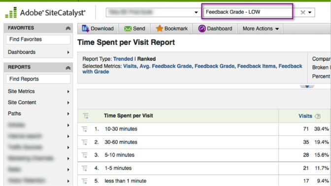

# Segmento per dimensione feedback{#segment-by-feedback-dimension}

Puoi creare segmenti in base alle dimensioni del feedback.

Una caratteristica principale di questa integrazione è la capacità di creare segmenti Adobe Analytics basati sulle dimensioni del feedback Kampyle. Ad esempio, puoi creare un segmento che includerà solo Visite in cui è stato fornito un valore di 1 o 2. Potreste chiamare questo «Punteggio di feedback - LOW». La definizione del segmento sarà simile a quella riportata di seguito:

Questo segmento può essere applicato a praticamente qualsiasi rapporto, ad esempio il Tempo trascorso per Report sulle visite visualizzato qui.

