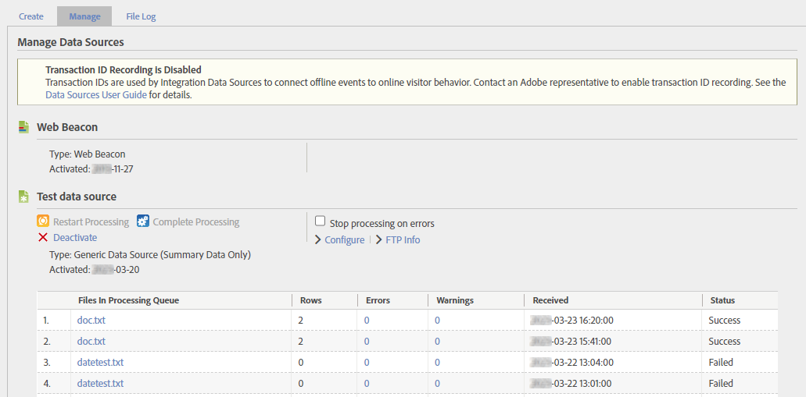

# Gestione delle origini dati

Utilizza Gestione origini dati per creare, modificare o disattivare le origini di dati. È possibile inoltre utilizzare questa interfaccia per tracciare lo stato dei file caricati nelle posizioni FTP di origini di dati.

**[!UICONTROL Admin]** > **[!UICONTROL All Admin]** > **[!UICONTROL Data sources]**

Utilizza il selettore suite di rapporti in alto a destra per passare da una suite di rapporti all’altra nell’organizzazione.

Sono disponibili tre schede principali per questa interfaccia: **[!UICONTROL Manage]**, **[!UICONTROL Create]** e **[!UICONTROL File Log]**.

## Gestire i

La scheda **[!UICONTROL Manage]** gestisce tutte le origini dati create dall&#39;organizzazione. È possibile visualizzare le informazioni FTP, apportare modifiche alle variabili utilizzate nei file modello o disattivare completamente le origini dati.

L&#39;origine dati più in alto è sempre [!UICONTROL Web Beacon]. Questa origine dati è ciò che si utilizza per la raccolta dati tipica tramite AppMeasurement. Non può essere modificato o disattivato.

Ciascuna origine dati dispone delle seguenti opzioni:

* **[!UICONTROL Restart Processing]**: riavvia l&#39;elaborazione dell&#39;origine dati precedentemente interrotta a causa di errori. L&#39;elaborazione continua fino al rilevamento dell&#39;errore successivo. Origini dati interrompe l&#39;elaborazione di un file Origini dati solo quando si seleziona **[!UICONTROL Stop processing on errors]**.
* **[!UICONTROL Complete Processing]**: non più utilizzato. Questo pulsante è stato utilizzato solo per [origini dati a elaborazione completa](full-processing-eol.md).
* **[!UICONTROL Stop processing on errors]**: casella di controllo che indica al server di elaborazione di arrestarsi quando viene rilevato un errore. L&#39;origine dati riprende l&#39;elaborazione solo dopo la selezione di **[!UICONTROL Restart Processing]**. Quando un&#39;origine dati rileva un errore di file, notifica l&#39;errore. Adobe sposta il file con l&#39;errore in una cartella denominata `files_with_errors` sul server FTP. Dopo aver risolto il problema, invia nuovamente il file per l&#39;elaborazione.
* **[!UICONTROL Configure]**: collegamento che consente di eseguire la procedura guidata di creazione delle origini dati per questa origine dati. Questa procedura guidata consente di rinominare l&#39;origine dati o riconfigurare le variabili incluse automaticamente durante il download di un file modello.
* **[!UICONTROL FTP Info]**: collegamento all&#39;ultimo passaggio della procedura guidata di creazione delle origini dati in cui vengono visualizzate le credenziali FTP.

Una volta che un’origine dati riceve i dati, viene visualizzata una tabella contenente diverse colonne per i file caricati.

* **[!UICONTROL Files In Processing Queue]**: nome del file.
* **[!UICONTROL Rows]**: numero totale di righe nel file.
* **[!UICONTROL Errors]**: numero di righe contenenti errori e che non è stato possibile acquisire.
* **[!UICONTROL Warnings]**: numero di righe contenenti avvisi.
* **[!UICONTROL Received]**: la marca temporale con cui il file è stato ricevuto nel fuso orario della suite di rapporti.
* **[!UICONTROL Status]**: stato del file (`Success` o `Failed`).

## Creazione

La scheda **[!UICONTROL Create]** offre un punto di partenza per la procedura guidata di creazione delle origini dati.

La categoria e il tipo di origine dati erano più importanti nelle versioni precedenti di Adobe Analytics. Tuttavia, hanno ancora un uso limitato:

* Il tipo di origine dati viene visualizzato nella scheda [Gestisci](#manage) per l&#39;origine dati stessa e nella scheda [Registro file](#file-log) per ogni singolo file.
* Alcuni tipi di origini dati includono automaticamente le variabili durante il download del file modello. Tuttavia, puoi includere qualsiasi dimensione o metrica disponibile purché sia conforme al [Formato file](file-format.md) stabilito.

Oltre a questi motivi, tutte le categorie e i tipi di origini dati che è possibile scegliere sono effettivamente identici. Selezionare la categoria e il tipo che meglio rappresentano lo scopo dell&#39;utilizzo delle origini dati.

Con il ritiro di [Origini dati a elaborazione completa](full-processing-eol.md), non è possibile selezionare più categorie e tipi. Se si seleziona un tipo di origine dati a elaborazione completa, il pulsante **[!UICONTROL Activate]** è disattivato.

## Registro file

La scheda **[!UICONTROL File Log]** offre una visualizzazione aggregata di tutti i file di origine dati caricati per la suite di rapporti specificata.

È disponibile una barra di ricerca che consente di individuare un’origine dati specifica. La tabella mostra le colonne seguenti:

* **[!UICONTROL Data Source Name]**: nome dell&#39;origine dati.
* **[!UICONTROL Type]**: tipo dell&#39;origine dati.
* **[!UICONTROL Filename]**: nome del file caricato.
* **[!UICONTROL Rows]**: numero totale di righe nel file.
* **[!UICONTROL Errors]**: numero di righe contenenti errori.
* **[!UICONTROL Warnings]**: non più utilizzato. Numero di righe contenenti avvisi.
* **[!UICONTROL Received]**: data e ora in cui Adobe ha iniziato l&#39;elaborazione del file.
* **[!UICONTROL Status]**: stato del file (`Success` o `Failed`).
