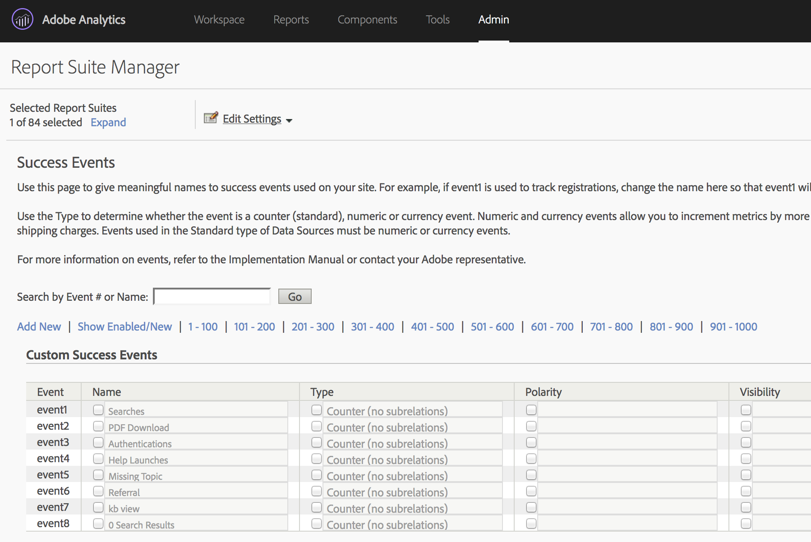
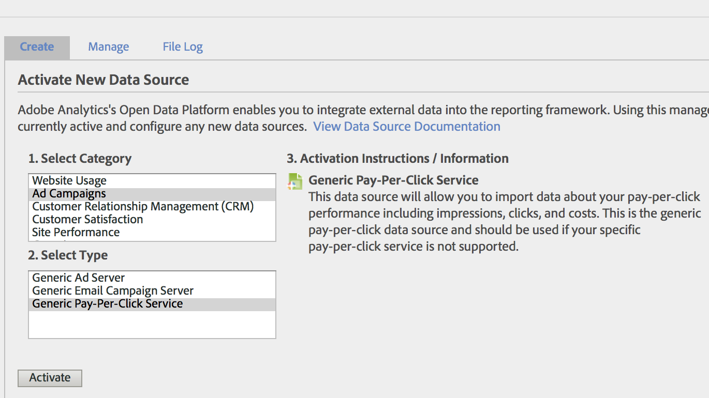
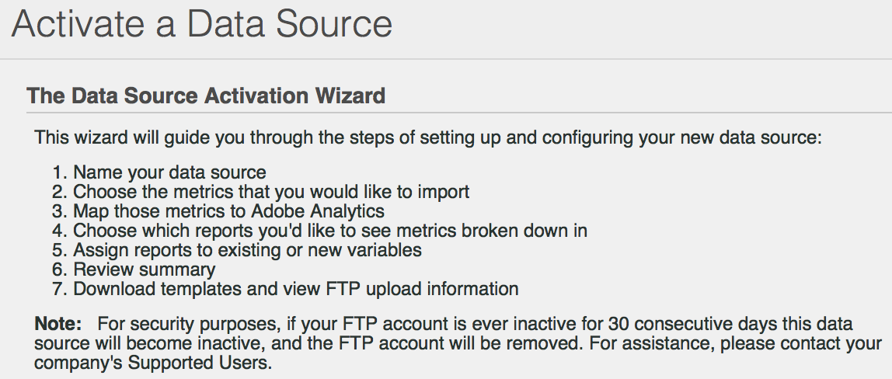

# Importare metriche [!UICONTROL Paid Search] utilizzando [!UICONTROL Data Sources]

Per molte organizzazioni di marketing, la ricerca a pagamento è uno dei modi più affidabili e importanti sia per &#x200B; raggiungere nuovi clienti che per mantenere quelli esistenti. La funzionalità [!UICONTROL Data Sources] di Adobe Analytics semplifica l’importazione di dati di ricerca a pagamento avanzati da piattaforme di pubblicità digitale come Google AdWords. Puoi integrarlo con il resto dei tuoi dati di marketing, insieme ai dati comportamentali e degli attributi del cliente sul sito, per consentirti di ottenere migliori informazioni sulle attività di ricerca a pagamento della tua organizzazione.

Questi passaggi mostrano come configurare un’integrazione con AdWords per importare dati di parole chiave e metriche quali impression, clic, costo per clic e altro ancora.

I passaggi spiegano come impostare un&#39;importazione unica di dati Pay-Per-Click. Tuttavia, [!UICONTROL Data Sources] consente l&#39;importazione continua di dati utilizzando il formato di file descritto qui. A seconda della piattaforma di ricerca a pagamento, puoi pianificare esportazioni periodiche (giornaliere, mensili, ecc.), impostare processi automatizzati per trasformare queste esportazioni nel formato di file richiesto da Adobe Analytics e caricare questi file in Adobe Analytics per generare rapporti sull’integrazione a pagamento.

## Prerequisiti

* Hai implementato il rilevamento di ricerche a pagamento.
* Stai acquisendo i dati del codice di tracciamento.
* Hai codici di tracciamento univoci per ogni gruppo di annunci.

## Configura [!UICONTROL Success Events]

Il primo passo è preparare Adobe Analytics a ricevere le metriche. A questo scopo, è necessario impostare alcuni eventi di successo.

[!UICONTROL Success events] sono azioni che possono essere tracciate. È possibile determinare l&#39;elemento [!UICONTROL success event]. Ai fini del tracciamento delle metriche [!UICONTROL paid search], vogliamo impostare [!UICONTROL success events] intorno a [!UICONTROL clicks], [!UICONTROL impressions], [!UICONTROL total cost] e abilitare[!UICONTROL tracking codes].

1. Vai a **[!UICONTROL Adobe Analytics > Admin > Report Suites]**.
1. Seleziona una suite di rapporti.
1. Fai clic su **[!UICONTROL Edit Settings > Conversion > Success Events]**.

   

1. In Eventi di successo personalizzati, utilizza **[!UICONTROL Add New]** per creare 3 eventi di successo personalizzati: [!UICONTROL Clicks] (Contatore), [!UICONTROL Impressions] (Contatore) e [!UICONTROL Total Cost] (Valuta).

   

1. Fai clic su Salva.
Dovresti ricevere un messaggio di approvazione dei salvataggi.
1. Passa a **[!UICONTROL Admin > Report Suites > Edit Settings > Conversion > Conversion Variables]**.
1. Abilita i codici di tracciamento selezionando la casella di controllo accanto a **[!UICONTROL Tracking Code]** in **[!UICONTROL Campaign > Campaign Variable]**.

   

## Configurazione origini dati

[!UICONTROL Data Sources] consente di condividere dati non di click-stream con Adobe Analytics. In questo caso utilizziamo Adobe Analytics per monitorare le metriche di ricerca a pagamento. Utilizziamo il codice di tracciamento come chiave per collegare le due parti di dati (metriche di ricerca a pagamento e metriche di Adobe Analytics) insieme.

1. Passa a **[!UICONTROL Adobe Analytics > Admin > All admin > Data sources]**.
1. Seleziona la scheda **[!UICONTROL Create]** per iniziare a attivare nuove origini dati.
1. In **[!UICONTROL Select Category]**, selezionare **[!UICONTROL Ad Campaign]**.

   

1. In **[!UICONTROL Select Type]**, selezionare **[!UICONTROL Generic Pay-Per-Click Service]**.
1. Fai clic su **[!UICONTROL Activate]**.
Viene visualizzato [!UICONTROL Data Source Activation Wizard]:

   

1. Fare clic su **[!UICONTROL Next]** e assegnare un nome all&#39;origine dati. Questo nome viene visualizzato in Gestione origini dati.
1. Accetta il contratto di servizio e fai clic su **[!UICONTROL Next]**.
1. Seleziona le tre metriche standard: [!UICONTROL Impressions], [!UICONTROL Clicks] e [!UICONTROL Total Cost] e fare clic su **[!UICONTROL Next]**.
1. Ora &quot;mappa&quot; questa nuova origine dati agli eventi personalizzati creati in [Configura eventi di successo](/help/admin/admin/c-success-events/t-success-events.md).

   

1. Scegli dimensioni dati
Seleziona la casella accanto a Codici di tracciamento e fai clic su **[!UICONTROL Next]**.
1. Mappare Dimension di dati.
Mappa la dimensione dati importata (attributo) sull’attributo Adobe Analytics in cui desideri memorizzarla. Può trattarsi di una dimensione standard o di un eVar. Dopo aver fatto clic su **[!UICONTROL Next]**, le mappature risultanti vengono visualizzate nel riepilogo:

   

1. Fai clic su **[!UICONTROL Save]**.
1. Fai clic su **[!UICONTROL Download]** per scaricare il file modello per questa origine dati.
Il nome del file corrisponde al tipo di origine dati inizialmente specificato - in questo caso, &quot;Modello di servizio Pay-Per-Click generico&quot;.
1. Apri il modello nell’editor di testo preferito.
Il file è già compilato con le metriche e le dimensioni e le relative mappature.

## Esportare i dati PPC e caricarli in Analytics

Passaggi simili a questi funzionano per Google Adwords, MSN, Yahoo e altri account PPC.

### Esportare i dati

1. Accedi al tuo account PPC e crea un nuovo report o un&#39;esportazione.
Accertati che l’esportazione includa i campi seguenti: data, URL di destinazione (pagina di destinazione), impression, clic e costo. L’esportazione può includere altri campi, ma li eliminerai nei passaggi seguenti.
1. Se possibile, salva il rapporto come file `.csv` o delimitato da tabulazioni. In questo modo sarà più facile lavorare con nei seguenti passaggi.
1. Apri il file in Microsoft Excel.

### Modificare il file in Microsoft Excel

1. In Microsoft Excel, eliminare tutte le colonne diverse da quelle menzionate in precedenza.
1. Elimina le righe aggiuntive nella parte superiore.
1. Per isolare i codici di tracciamento dagli URL di destinazione:
a) Copia e incolla dati da tutte le colonne.
b) Fare clic su **[!UICONTROL Data > Text to Columns]**.
c. Nel passaggio 1 della procedura guidata, assicurati che **[!UICONTROL Delimited]** sia selezionato e fai clic su **[!UICONTROL Next]**.
d. Nel passaggio 2 della procedura guidata, specifica il delimitatore a seconda di come hai creato gli URL (o ? oppure &amp;) e fai clic su **[!UICONTROL Next]**.
e. Nel passaggio 3 della procedura guidata, visualizza in anteprima i dati e assicurati che una delle colonne sia &quot;trackingcodename=trackingcode&quot;. Se disponi di variabili aggiuntive, ripeti questi passaggi (utilizzando &amp; come delimitatore).
f. Elimina tutte le colonne ad eccezione dei codici di tracciamento, delle impression, dei clic e dei costi. Aggiungi una nuova colonna denominata Data e organizza le colonne nel seguente ordine: Data : Codice di tracciamento : Impression :: Clic : Costo
1. Aggiungi questi dati al modello scaricato nella sezione &quot;Imposta origini dati&quot; di cui sopra.
Ora puoi caricare il file.

### Caricamento del file in Adobe Analytics tramite FTP

Torna alla procedura guidata Origine dati per le istruzioni e carica il file tramite FTP:

## Creare metriche calcolate

L’aggiunta di metriche calcolate sarà utile quando si prendono decisioni a pagamento per clic.

Ad esempio, puoi aggiungere le seguenti [metriche calcolate](https://experienceleague.adobe.com/docs/analytics/components/calculated-metrics/calcmetric-workflow/cm-build-metrics.html?lang=en#calculated-metrics):

| Nome | Formula | Tipi di metriche | Descrizione |
| --- | --- | --- | --- |
| Visualizzazioni pagina per visita | Visualizzazioni/visite pagina | Numeriche | Se applicata a livello di sito: mostra il numero medio di pagine per visita. Quando applicato nel rapporto Pagine più popolari: mostra il numero medio di volte in cui una pagina specifica è stata visualizzata per visita. |
| Valore ordine medio | Entrate/Ordini | Valuta | Mostra i ricavi medi per ordine. |
| Ricavo per visita | Entrate/visita | Valuta | Mostra i ricavi medi per visita. |
| Frequenza di click-through (CTR) | Clic/Impressioni | Numeriche | Misura il rapporto tra clic e impression di una campagna di marketing online per annunci o e-mail. |
| Profitto | Ricavi - Costo | Valuta | Mostra i ricavi di una campagna meno il costo. |
| Profitto per impression (PPI) | (Ricavo - Costo)/Impressione | Valuta | Mostra il fatturato generato ogni volta che viene visualizzato un annuncio, bilanciato con il costo. |
| Restituzione della spesa pubblicitaria (ROAS) | Importo/spesa pubblicitaria | Valuta | (ROI) Rappresenta i dollari guadagnati per dollari spesi per la pubblicità corrispondente. |

## Configurare ed eseguire rapporti

Il passaggio finale consiste nell’aggiungere le metriche dell’origine dati e tutte le metriche calcolate al rapporto Codice di tracciamento ed eseguire un drill-down a una campagna per ottenere una visualizzazione immediata delle prestazioni di ciascun gruppo di annunci.

1. In **[!UICONTROL Adobe Analytics > Reports]**, seleziona la suite di rapporti in cui hai importato le origini dati.
1. Passa a **[!UICONTROL Reports > Campaigns > Tracking Code > Tracking Code]**.
1. Seleziona l’intervallo di date.
1. Fai clic su **[!UICONTROL Metrics > Add]** e aggiungi le metriche dell’origine dati (clic, impressioni, costo totale) dall’elenco Metriche standard.
1. Effettua la stessa operazione per tutte le metriche calcolate eventualmente aggiunte. Il rapporto viene aggiornato man mano che si aggiungono le metriche.
