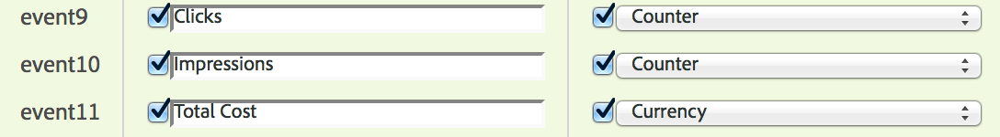

# Importa [!UICONTROL Paid Search] metriche con [!UICONTROL Data Sources]

Per molte organizzazioni di marketing, la ricerca a pagamento è uno dei modi più importanti e affidabili&#x200B; sia per raggiungere nuovi clienti che per mantenere quelli esistenti. Il [!UICONTROL Data Sources] funzionalità in Adobe Analytics semplifica l’importazione di dati di ricerca avanzata a pagamento da piattaforme di pubblicità digitale come Google AdWords. Puoi integrarli con gli altri dati di marketing, insieme ai dati comportamentali e agli attributi cliente sul sito, per consentirti di ottenere informazioni migliori sulle attività di ricerca a pagamento della tua organizzazione.

Questi passaggi mostrano come configurare un’integrazione con AdWords per importare i dati delle parole chiave, nonché metriche quali impression, clic, costo per clic e altro ancora.

I passaggi spiegano come impostare un’importazione una tantum di dati pay-per-click. Tuttavia, [!UICONTROL Data Sources] consente l’importazione continua di dati utilizzando il formato di file descritto qui. A seconda della piattaforma di ricerca a pagamento, puoi pianificare esportazioni periodiche (giornaliere, mensili ecc.), impostare processi automatizzati per trasformare tali esportazioni nel formato di file richiesto da Adobe Analytics e caricare tali file in Adobe Analytics per i rapporti sull’integrazione della ricerca a pagamento.

## Prerequisiti

* Hai implementato il rilevamento di ricerche a pagamento.
* Stai acquisendo i dati del codice di tracciamento.
* Disponi di codici di tracciamento univoci per ciascun gruppo di annunci.

## Configura [!UICONTROL Success Events]

Il primo passaggio consiste nel preparare Adobe Analytics a ricevere le metriche. A questo scopo, devi impostare alcuni eventi di successo.

[!UICONTROL Success events] sono azioni che possono essere tracciate. È possibile determinare quale [!UICONTROL success event] è. Ai fini del tracciamento [!UICONTROL paid search] metriche, vogliamo impostare [!UICONTROL success events] intorno a [!UICONTROL clicks], [!UICONTROL impressions], [!UICONTROL total cost] e abilita[!UICONTROL tracking codes].

1. Vai a **[!UICONTROL Adobe Analytics > Admin > Report Suites]**.
1. Seleziona una suite di rapporti.
1. Fai clic su **[!UICONTROL Edit Settings > Conversion > Success Events]** (Usa modello di attribuzione non predefinito).

   

1. In Eventi di successo personalizzati, utilizza **[!UICONTROL Add New]** per creare 3 eventi di successo personalizzati: [!UICONTROL Clicks] (Contatore), [!UICONTROL Impressions] (Contatore) e [!UICONTROL Total Cost] (Valuta).

   

1. Fai clic su Salva.
Dovresti ricevere un messaggio che informa che i tuoi salvataggi sono stati approvati.
1. Passa a **[!UICONTROL Admin > Report Suites > Edit Settings > Conversion > Conversion Variables]**.
1. Abilita i codici di tracciamento selezionando la casella di controllo accanto a **[!UICONTROL Tracking Code]** in **[!UICONTROL Campaign > Campaign Variable]**.

   

## Configurare le origini dati

[!UICONTROL Data Sources] consente di condividere i dati non clickstream con Adobe Analytics. In questo caso usiamo Adobe Analytics per tenere traccia delle metriche di ricerca a pagamento. Utilizziamo il codice di tracciamento come chiave per collegare i due dati (metriche di ricerca a pagamento e metriche di Adobe Analytics).

1. Passa a **[!UICONTROL Adobe Analytics > Admin > All admin > Data sources]**.
1. Seleziona la **[!UICONTROL Create]** per iniziare ad attivare nuove origini dati.
1. Sotto **[!UICONTROL Select Category]**, seleziona **[!UICONTROL Ad Campaign]**.

   

1. Sotto **[!UICONTROL Select Type]**, seleziona **[!UICONTROL Generic Pay-Per-Click Service]**.
1. Clic **[!UICONTROL Activate]**.
Il [!UICONTROL Data Source Activation Wizard] visualizza:

   

1. Clic **[!UICONTROL Next]** e assegna un nome all’origine dati. Questo nome viene visualizzato in Gestione origini dati.
1. Accettare il contratto di assistenza e fare clic su **[!UICONTROL Next]**.
1. Seleziona le tre metriche standard: [!UICONTROL Impressions], [!UICONTROL Clicks] e [!UICONTROL Total Cost] e fai clic su **[!UICONTROL Next]**.
1. Ora &quot;mappa&quot; questa nuova origine dati agli eventi personalizzati creati in [Configurare eventi di successo](/help/admin/admin/c-manage-report-suites/c-edit-report-suites/conversion-var-admin/c-success-events/t-success-events.md).

   

1. Scegli le dimensioni dati Seleziona la casella accanto a Codici di tracciamento e fai clic su **[!UICONTROL Next]**.
1. Mappare Dimension di dati.
Mappa la dimensione dati importata (attributo) sull’attributo Adobe Analytics in cui desideri memorizzarla. Può trattarsi di una quota standard o di un eVar. Dopo aver fatto clic su **[!UICONTROL Next]**, le mappature risultanti sono visualizzate nel riepilogo:

   

1. Fai clic su **[!UICONTROL Save]** (Usa modello di attribuzione non predefinito).
1. Clic **[!UICONTROL Download]** per scaricare il file modello per questa origine dati.
Il nome del file corrisponde al tipo di origine dati specificato inizialmente, in questo caso &quot;Generic Pay-Per-Click Service template.txt&quot;.
1. Apri il modello nel tuo editor di testo preferito.
Il file è già compilato con le metriche, le dimensioni e le relative mappature.

## Esportare i dati PPC e caricarli in Analytics

Passaggi simili a questi funzionano per Google Adwords, MSN, Yahoo e altri account PPC.

### Esporta dati

1. Accedi al tuo account PPC e crea un nuovo report o esporta.
Assicurati che l’esportazione includa i seguenti campi: data, URL di destinazione (pagina di destinazione), impression, clic e costo. L’esportazione può includere altri campi, ma li eliminerai seguendo la procedura riportata di seguito.
1. Se possibile, salva il rapporto come `.csv` o file delimitato da tabulazioni. In questo modo sarà più semplice utilizzare nei passaggi seguenti.
1. Apri il file in Microsoft Excel.

### Modificare il file in Microsoft Excel

1. In Microsoft Excel eliminare tutte le colonne diverse da quelle sopra indicate.
1. Elimina eventuali righe in eccesso nella parte superiore.
1. Per isolare i codici di tracciamento dagli URL di destinazione: a. Copia e incolla dati da tutte le colonne.
b. Fai clic su **[!UICONTROL Data > Text to Columns]**.
c. Nel passaggio 1 della procedura guidata, assicurati che **[!UICONTROL Delimited]** è selezionato e fai clic su **[!UICONTROL Next]**.
d. Nel passaggio 2 della procedura guidata, specifica il delimitatore a seconda di come hai creato i tuoi URL (? o &amp;) e fai clic su **[!UICONTROL Next]**.
e. Nel passaggio 3 della procedura guidata, visualizza l’anteprima dei dati e assicurati che una delle colonne sia &quot;trackingcodename=trackingcode&quot;. Se disponi di variabili aggiuntive, ripeti questi passaggi (utilizzando &amp; come delimitatore).
f. Elimina tutte le colonne ad eccezione dei codici di tracciamento, delle impression, dei clic e dei costi. Aggiungi una nuova colonna denominata Data e organizza le colonne nel seguente ordine: Data :: Codice di tracciamento :: Impression :: Clic :: Costo.
1. Aggiungi questi dati al modello scaricato nella sezione &quot;Imposta origini dati&quot; di cui sopra.
Ora puoi caricare il file.

### Carica il file in Adobe Analytics tramite FTP

Torna alla procedura guidata Origine dati per istruzioni e carica il file tramite FTP:

## Creare metriche calcolate

L’aggiunta di metriche calcolate sarà utile quando si prendono decisioni pay-per-click.

Ad esempio, puoi aggiungere questi [metriche calcolate](https://experienceleague.adobe.com/docs/analytics/components/calculated-metrics/calcmetric-workflow/cm-build-metrics.html#calculated-metrics):

| Nome | Formula | Tipi di metriche | Descrizione |
| --- | --- | --- | --- |
| Visualizzazioni pagina per visita | Visualizzazioni/visite pagina | Numeriche | Se applicato a livello di sito: mostra il numero medio di pagine per visita. Quando applicato nel rapporto Pagine più popolari: mostra il numero medio di volte in cui una pagina specifica è stata visualizzata per visita. |
| Valore ordine medio | Ricavi/Ordini | Valuta | Mostra i ricavi medi per ordine. |
| Ricavo per visita | Ricavo/visita | Valuta | Mostra il reddito medio per visita. |
| Percentuale di click-through (CTR) | Clic/impressioni | Numeriche | Misura il rapporto tra clic e impression di un annuncio online o di una campagna di marketing via e-mail. |
| Profitto | Ricavi - Costo | Valuta | Mostra i ricavi di una campagna meno il costo. |
| Profitto per impression (PPI) | (Ricavi - Costo)/Impression | Valuta | Mostra l’importo dei ricavi generati ogni volta che un annuncio veniva visualizzato, bilanciato con il costo. |
| ROAS (Return on Ad Spend) | Importo vendite/spesa pubblicitaria | Valuta | (ROI) Rappresenta i dollari guadagnati per ogni dollaro speso per la corrispondente pubblicità. |

## Configurare ed eseguire rapporti

Il passaggio finale consiste nell’aggiungere le metriche dell’origine dati e tutte le metriche calcolate al rapporto Codice di tracciamento e approfondire una campagna per ottenere una visualizzazione immediata delle prestazioni di ogni gruppo di annunci.

1. In entrata **[!UICONTROL Adobe Analytics > Reports]**, seleziona la suite di rapporti in cui hai importato le origini dati.
1. Passa a **[!UICONTROL Reports > Campaigns > Tracking Code > Tracking Code]**.
1. Seleziona l’intervallo di date.
1. Clic **[!UICONTROL Metrics > Add]** e aggiungi le metriche dell’origine dati (clic, impression, costo totale) dall’elenco delle metriche standard.
1. Fai lo stesso per qualsiasi metrica calcolata aggiunta. Il rapporto verrà aggiornato man mano che aggiungi le metriche.
