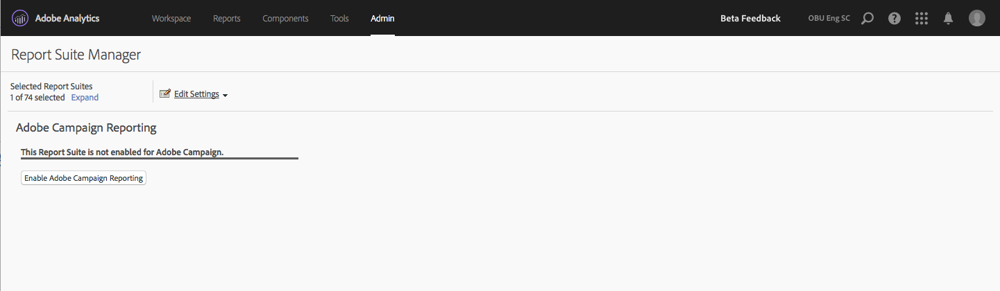

# Generazione rapporti di Adobe Campaign Standard

Per ulteriori informazioni su come configurare questa integrazione, consulta la [documentazione di Adobe Campaign](https://helpx.adobe.com/it/campaign/standard/integrating/using/about-campaign-analytics-integration.html).

>[!IMPORTANT]
>Questo articolo si applica solo alla generazione rapporti di Adobe Campaign **Standard**. Consulta [qui](/help/integrate/analytics-to-campaign-classic.md) per aggiungere il reporting di Adobe Campaign **Classic**.

Questa integrazione tra Adobe Analytics e Adobe Campaign Standard:

* Consente di condividere i dati KPI (Key Performance Indicator, indicatore di prestazioni) da Adobe Campaign Standard ad Adobe Analytics.
* Arricchisce le formule di tracciamento con i parametri di Adobe Analytics.
* Aggiunge un nuovo rapporto in **[!UICONTROL Analytics]** > **[!UICONTROL Reports]** > **[!UICONTROL Adobe Campaign.]**
* Aggiunge 5 nuove classificazioni di Adobe Campaign.
* Aggiunge 9 nuove metriche di Adobe Campaign.
* Aggiunge 6 nuove dimensioni di Adobe Campaign.
* Sincronizzare i dati con Analytics ogni 15 minuti tramite un’origine dati con provisioning automatico.

## Passaggio 1. Abilitare la generazione rapporti di Adobe Campaign Standard {#section_C685EF10505045708A6536BB13F6CD58}

Per visualizzare i dati di Campaign Standard in Analytics devi prima abilitare la generazione rapporti di Campaign in Report Suite Manager.

1. Passa a **[!UICONTROL Analytics]** > **[!UICONTROL Admin]** > **[!UICONTROL Report Suites]** > **`<select report suite>`** > **[!UICONTROL Edit Settings]** > **[!UICONTROL Adobe Campaign]** > **[!UICONTROL Adobe Campaign Reporting]**.
1. Fai clic su **[!UICONTROL Enable Campaign Reporting]**.

   

## Passaggio 2: Visualizzare i rapporti di Adobe Campaign {#section_9C18A29F3CC54BD4AC5EA96417F17B33}

L’integrazione tra Adobe Campaign Standard e Adobe Analytics aggiunge il seguente rapporto in **[!UICONTROL Analytics]** > **[!UICONTROL Reports]**

* **[!UICONTROL Adobe Campaign Executed Delivery ID]**: mostra i dati importati da Adobe Campaign sulle e-mail inviate da Adobe Campaign. |

## Passaggio 3. Usare le classificazioni di Adobe Campaign {#section_74A28AF3F4CA4091943789DE4D8B2B63}

**[!UICONTROL Analytics]** > **[!UICONTROL Admin]** > **[!UICONTROL Report Suites]** > **`<select report suite>`** > **[!UICONTROL Edit Settings]** > **[!UICONTROL Adobe Campaign]** > **[!UICONTROL Adobe Campaign Classifications]**

Una volta che la suite di rapporti è abilitata per Adobe Campaign, sono disponibili le seguenti classificazioni:

| Classificazione | Descrizione |
| --- | --- |
| [!UICONTROL Delivery ID] | Nome della consegna interna visualizzato in Campaign |
| [!UICONTROL Delivery Label] | Consegna in Campaign: consegna individuale/ricorrente/di transazione |
| [!UICONTROL Campaign ID] | Nome della consegna interna visualizzato in Campaign |
| [!UICONTROL Campaign Label] | Campagna in Adobe Campaign |
| [!UICONTROL Executed Delivery Label] | Elenco delle singole consegne eseguite |

## Dimensioni e metriche di Adobe Campaign Standard disponibili in Adobe Analytics {#section_F33385C9660644AF84172EC39601469B}

Le seguenti **metriche** sono disponibili da Campaign nelle suite di rapporti di Adobe Analytics:

* Adobe Campaign invio
* Adobe Campaign apertura
* Adobe Campaign clic
* Adobe Campaign consegna
* Adobe Campaign apertura univoca
* Adobe Campaign clic univoco
* Adobe Campaign disiscrizione
* Adobe Campaign rimbalzi totali
* Adobe Campaign istanze di ID consegna eseguita

Le seguenti **dimensioni** sono disponibili da Campaign nelle suite di rapporti di Adobe Analytics:

| Nome dimensione | Definizione |
| --- | --- |
| ID campagna | ID di tutte le campagne per le quali sono stati inviati KPI mentre erano in corso. |
| Etichetta della campagna | Etichette degli ID campagna |
| ID consegna | ID di tutte le consegne per le quali sono stati inviati KPI mentre erano in corso. Sono inclusi inoltre gli ID delle consegne principali di consegna periodica e di transazione. Esempio: è stata pianificata una consegna ricorrente DM1 e DM2, DM3, DM4 e DM5 erano consegne secondarie della consegna ricorrente.  L’ID consegna visualizza i risultati per tutte le consegne, da DM1 a DM5. |
| Etichetta della consegna | Etichette degli ID consegna |
| ID consegna eseguita | ID solo delle consegne eseguite. Nessun ID della consegna principale ricorrente/transazionale. Esempio: è stata pianificata una consegna ricorrente DM1 e DM2, DM3, DM4 e DM5 erano consegne secondarie della consegna ricorrente. L’ID consegna eseguita visualizza i risultati per tutte le consegne da DM2 a DM5, ovvero le consegne effettivamente eseguite. |
| Etichetta della consegna eseguita | Etichette degli ID consegna eseguita |
