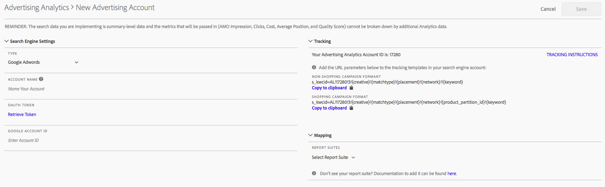

# Configurare un account Advertising

Gli amministratori di Adobe Analytics possono creare nuovi account pubblicitari e mappare più account a più suite di rapporti (1:1, 1:Molti, Molti:Molti).

Gli amministratori possono anche [concedere l&#39;accesso agli utenti non amministratori](/help/integrate/c-advertising-analytics/overview.md#section_FCC58EB635954A32990D4E67B52B4369) per l&#39;impostazione di account pubblicitari.

1. In Adobe Analytics, navigate to **[!UICONTROL Admin]** > **[!UICONTROL Advertising Accounts]**.
1. (Solo per uso iniziale) Accettate i termini del contratto di licenza con l&#39;utente finale.
1. Fai clic su **[!UICONTROL + Add]**.
1. Viene [!UICONTROL New Search Engine Account] visualizzata la finestra di dialogo:

   

1. Compila i **[!UICONTROL Search Engine Settings]** seguenti orientamenti:

   <table id="table_B3BE66B7D4C54766B8FFD2C6DCD657AF"> 
    <thead> 
      <tr> 
      <th colname="col1" class="entry"> Impostazione </th> 
      <th colname="col2" class="entry"> Descrizione </th> 
      </tr>
    </thead>
    <tbody> 
      <tr> 
      <td colname="col1"> 
Tipo 
 </td> 
      <td colname="col2"> 
Sono disponibili due opzioni: Google AdWords e Microsoft Bing Ads. 
 
Nota: Yahoo Gemini è stato assorbito da Microsoft Bing il 31 marzo 2019. Di conseguenza, l’opzione per l’account per annunci Yahoo Gemini non è più disponibile.  
 </td> 
      </tr> 
      <tr> 
      <td colname="col1"> 
Nome account 
 </td> 
      <td colname="col2"> 
Potete scegliere di impostare questo nome account su qualsiasi nome adatto. Questo è il nome descrittivo dell'account che verrà visualizzato nell'interfaccia utente. 
 </td> 
      </tr> 
      <tr> 
      <td colname="col1"> 
Token OAuth 
 </td> 
      <td colname="col2"> 
Nota:  OAuth è uno standard aperto per la delega di accesso, comunemente utilizzato come modo per garantire ai siti Web o alle applicazioni l'accesso alle loro informazioni su altri siti Web, ma senza dare loro le password. 
 
Nota:  Noterete che verrete indirizzati a un URL di terze parti (efrontier.com). Adobe utilizza Edge per alimentare il processo di autenticazione OAuth per tutti e tre i motori di ricerca. 
 
Nota:  Se si utilizza Internet Explorer 11 (o versioni precedenti), non sarà possibile recuperare correttamente il token Oauth per nessuno dei tre motori di ricerca. Utilizzate altri browser Web. 
 
Facendo clic su Recupera token si avvia il processo di autenticazione OAuth2. Questo significa che ti verrà chiesto di accedere al tuo account di ricerca Google/Bing utilizzando le tue credenziali. A seconda del motore di ricerca scelto, il processo è leggermente diverso: 
 
        <ul id="ul_FC9B5612F6554495B04C357CB0AB72EB"> 
        <li id="li_CD54231BFF134F83B3B5B14B34A0E1D2">Google Adwords: Fornite l'ID account Google. </li> 
        <li id="li_89B9D54BAA914E5DB2959B193489582E">Microsoft Bing: Fornite l'ID account Bing e l'ID cliente Bing. </li> 
        </ul> 
Per informazioni su questi ID, consultate <a href="/help/integrate/c-advertising-analytics/c-adanalytics-workflow/aa-locate-account-id.md"  > Individuare l'ID</a> account. 
 
Dopo aver eseguito l'accesso, viene visualizzato il campo Token OAuth 
        <systemoutput>
          Recuperato
        </systemoutput>. 
 </td> 
      </tr> 
    </tbody> 
    </table>

1. Nella **[!UICONTROL Tracking]** sezione , fornisci informazioni su come i dati del motore di ricerca vengono tracciati dall’implementazione di Adobe Analytics. Si tratta di un passaggio necessario per incrementare correttamente i dati di Adobe Analytics con i dati del motore di ricerca.
Compila i **[!UICONTROL Tracking Settings]** seguenti orientamenti:

   | Impostazione | Descrizione |
   |--- |--- |
   | Tipo | <ul><li>**Automatico:** Consente al motore di Advertising Cloud di decidere in che modo i parametri di tracciamento vengono aggiunti ai modelli di tracciamento/agli URL di destinazione del motore di ricerca. Questo è l&#39;approccio più semplice, ma non può portare al miglior set di dati integrato. **Importante:**Per configurare un account del motore di ricerca in modalità automatica, è necessario eseguire le azioni seguenti: - Il parametro e il valore &quot;s_kwcid&quot; verranno aggiunti ai modelli di tracciamento dell&#39;account o agli URL delle pagine di destinazione nell&#39;account aggiunto. Questo verrà inserito alla fine dell’URL. Di conseguenza, potrebbe essere necessaria un&#39;azione aggiuntiva da parte dell&#39;utente se il server Web richiede una determinata coppia chiave=valore alla fine dell&#39;URL OPPURE un aggiornamento per supportare qualsiasi nuova coppia chiave=valore nell&#39;URL.** Nota:**Ulteriori informazioni sull&#39;aggiunta di questo parametro all&#39;informativa sulla sicurezza dei[contenuti](https://docs.adobe.com/content/help/en/id-service/using/reference/csp.html). - Inoltre, le parole chiave possono essere inserite nell&#39;URL di destinazione come parte del valore &quot;s_kwcid&quot;, quindi se contengono caratteri speciali o simboli, si prega di confermare che il server Web può supportare tali caratteri (un esempio di caratteri speciali comuni è &quot;+&quot;, utilizzato nelle parole chiave &quot;Broad Match Modified&quot;).</li><li>**Manuale:** Consente di gestire il modo in cui i parametri di tracciamento vengono aggiunti ai modelli di tracciamento/agli URL di destinazione del motore di ricerca. [Fare riferimento a questi esempi di tracciamento manuale per ciascun motore](/help/integrate/c-advertising-analytics/c-adanalytics-workflow/aa-manual-vs-automatic-tracking.md)di ricerca.</li></ul> |

1. Nella **[!UICONTROL Mapping]** sezione, scegliete le suite di rapporti da collegare a questo account del motore di ricerca. Devi fornire almeno una suite di rapporti prima di poter salvare l&#39;account pubblicitario. Potete mappare più account a più suite di rapporti (1:1, 1:Molti, Molti:Molti). Notate che i dati che AMO estrae dal motore di ricerca vengono semplicemente copiati in qualsiasi suite di rapporti mappata, quindi non c&#39;è divisione dei dati.

   >[!IMPORTANT]
   >
   >Solo le suite di rapporti che sono state [mappate a un&#39;organizzazione](https://docs.adobe.com/content/help/it-IT/core-services/interface/about-core-services/report-suite-mapping.html) Experience Cloud saranno disponibili per la selezione. Se la suite di rapporti non è elencata, consulta [Risoluzione dei problemi relativi ad Analisi](/help/integrate/c-advertising-analytics/c-adanalytics-workflow/aa-troubleshooting.md)pubblicitaria.

   Per i **[!UICONTROL Mapping Settings]** seguenti orientamenti:

   <table id="table_AF876DC40F97403882C0AA528BD204FF"> 
    <thead> 
      <tr> 
      <th colname="col1" class="entry"> Impostazione </th> 
      <th colname="col2" class="entry"> Descrizione </th> 
      </tr>
    </thead>
    <tbody> 
      <tr> 
      <td colname="col1"> 
Mappatura suite di rapporti 
 </td> 
      <td colname="col2"> 
La mappatura della suite di rapporti determina la suite di rapporti che viene collegata a questo account del motore di ricerca. In altre parole, determina in quali suite di rapporti vengono inviati i dati del motore di ricerca. 
 
Se la suite di rapporti non è elencata, puoi <a href="https://docs.adobe.com/content/help/it-IT/core-services/interface/about-core-services/report-suite-mapping.html"  > mappare la tua suite di rapporti su un'organizzazione</a> Experience Cloud utilizzando questo strumento. 
 </td> 
      </tr> 
    </tbody> 
    </table>

1. Fai clic su **[!UICONTROL Save]**.
1. Dopo il salvataggio, una liberatoria visualizza un elenco di avvertenze. Vi verrà chiesto di confermare di aver letto e di comprendere il presente contratto. Click the checkbox, then click **[!UICONTROL OK]**.

   Ora puoi passare all’interfaccia utente [di](/help/integrate/c-advertising-analytics/c-adanalytics-workflow/aa-manage-ad-accounts.md)gestione degli account pubblicitari, in cui deve essere elencato l’account appena creato.

>[!NOTE] Devi aspettare almeno 24 ore prima che i dati del motore di ricerca inizino a compilare i report di Analytics.

