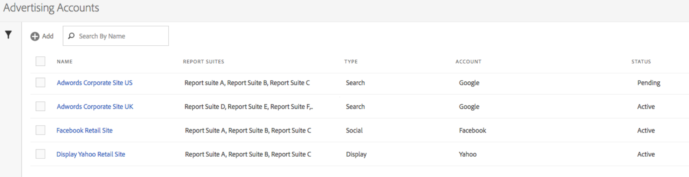

# Configurare un account Advertising

Gli amministratori di Adobe Analytics possono creare nuovi account pubblicitari e mappare più account su più suite di rapporti (1 : 1, 1 : Many, Many : Many).

Gli amministratori possono anche [concedere l&#39;accesso agli utenti non amministratori](/help/integrate/c-advertising-analytics/overview.md#section_FCC58EB635954A32990D4E67B52B4369) per la configurazione di account pubblicitari.

<!--

-->

1. In Adobe Analytics, passa a **[!UICONTROL Admin]** > **[!UICONTROL Advertising Accounts]**.
1. Accettare i termini del Contratto di Licenza con l&#39;utente finale (solo per il primo utilizzo).
1. Seleziona **[!UICONTROL + Add]**.
1. Viene visualizzata la finestra di dialogo [!UICONTROL New search engine setting].

   

1. Compila **[!UICONTROL search engine Settings]** seguendo queste linee guida:

   | Impostazione | Descrizione |
   | --- | --- |
   | **[!UICONTROL Type]** | Sono disponibili 2 opzioni: **[!UICONTROL Google Adwords]** e **[!UICONTROL Bing Ads]**. Nota: Yahoo Gemini è stata assorbita da Microsoft il 31 marzo 2019. Di conseguenza, l’opzione per l’account per annunci Yahoo Gemini non è più disponibile. |
   | Nome account | Puoi scegliere di impostare questo nome account su un nome che ti soddisfi.  Nome account è il nome descrittivo dell’account visualizzato nell’interfaccia utente. |
   | Token OAuth | **Nota**: OAuth è uno standard aperto per la delega degli accessi, comunemente utilizzato per consentire l&#39;accesso a siti Web o applicazioni alle informazioni sui siti Web ma senza fornire password. Noti che vieni indirizzato a un URL di terze parti (efrontier.com). Adobe utilizza Adobe Media Optimizer per potenziare il processo di autenticazione OAuth per tutti e tre i motori di ricerca. Se si utilizza Internet Explorer 11 (o versioni precedenti), non è possibile recuperare il token Oauth per nessuno dei tre motori di ricerca. Usa altri browser web.
Selezionare **[!UICONTROL Retrieve Token]** per avviare il processo di autenticazione OAuth2. Ti viene chiesto di accedere al tuo account di ricerca Google Ads o Microsoft Advertising utilizzando le tue credenziali. A seconda della scelta effettuata, il processo è leggermente diverso: <ul><li>Google Ads: fornisci ID account Google</li><li>Microsoft Advertising: fornisci l’ID account e l’ID account manager.</li></ul>Per informazioni su questi ID, consulta [Individua l&#39;ID account](aa-locate-account-id.md). Dopo aver effettuato l&#39;accesso, nel campo **[!UICONTROL OAuth Token]** viene visualizzato **[!UICONTROL Retrieved]**. |

1. Nella sezione **[!UICONTROL Tracking]**, fornisci informazioni su come tracciare i dati utilizzando l&#39;implementazione di Adobe Analytics. Il tracciamento è un passaggio necessario per integrare correttamente i dati di Adobe Analytics con i dati del motore di ricerca.
Compila **[!UICONTROL Tracking Settings]** seguendo queste linee guida:

   | Impostazione | Descrizione |
   | --- | --- |
   | Tipo | <ul><li>**Automatico**: consente al motore Adobe Advertising di decidere in che modo i parametri di tracciamento vengono aggiunti ai modelli di tracciamento/URL di destinazione di. [!UICONTROL Auto Type Tracking] è l&#39;approccio più semplice, ma potrebbe non risultare nel set di dati meglio integrato. **Importante:** Per configurare un account del motore di ricerca con [!UICONTROL Auto Type Tracking], è necessario eseguire le azioni seguenti:<ul><li>Il parametro e il valore `s_kwcid` vengono aggiunti ai modelli di tracciamento dell&#39;account o agli URL della pagina di destinazione nell&#39;account aggiunto. Il parametro e il valore vengono inseriti alla fine dell’URL. Se il server Web richiede una coppia di `key=value` alla fine dell&#39;URL, potrebbe essere necessaria un&#39;azione aggiuntiva. Oppure è necessario un aggiornamento per supportare qualsiasi nuova coppia `key=value` nell&#39;URL. **Nota**: ulteriori informazioni sull&#39;aggiunta di questo parametro ai [Criteri sulla sicurezza dei contenuti](https://experienceleague.adobe.com/it/docs/id-service/using/reference/csp).</li><li>Inoltre, è possibile inserire parole chiave nell&#39;URL di destinazione come parte del valore `s_kwcid`. Se le parole chiave contengono caratteri o simboli speciali, verificare che il server Web in uso supporti tali caratteri. Un esempio di caratteri speciali comuni è `+`, utilizzato nelle parole chiave &quot;Broad Match Modified&quot;.</li></ul></li><li>**Manuale**: consente di gestire come i parametri di tracciamento vengono aggiunti ai modelli di tracciamento/URL di destinazione del motore di ricerca. [Per ogni motore di ricerca](/help/integrate/c-advertising-analytics/c-adanalytics-workflow/aa-manual-vs-automatic-tracking.md), fare riferimento a questi esempi di rilevamento manuali.</li></ul> |

1. Seleziona **[!UICONTROL Save]**.
1. Una liberatoria visualizza un elenco di avvertenze. Conferma di aver letto e compreso il presente contratto. Selezionare la casella di controllo, quindi selezionare **[!UICONTROL OK]**.

   Ora vieni reindirizzato all&#39;interfaccia utente [Gestione account](/help/integrate/c-advertising-analytics/c-adanalytics-workflow/aa-manage-ad-accounts.md) di Advertising, in cui dovrebbe essere elencato il tuo account appena creato.

>[!NOTE]
>
>Dovrai aspettare almeno 24 ore prima che i dati del motore di ricerca inizino a popolare i rapporti di Analytics.
