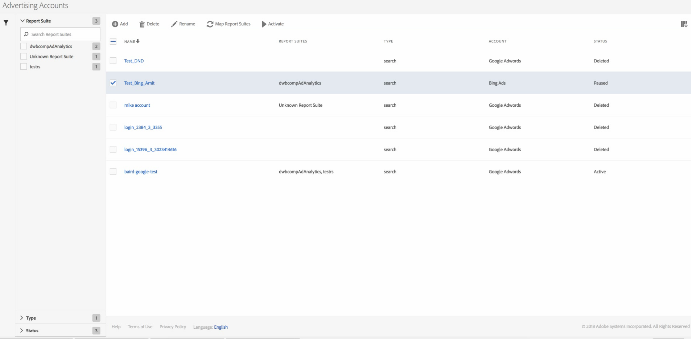

# Gestire gli account pubblicitari

You can access the Management UI by navigating to **[!UICONTROL Admin]** &gt; **[!UICONTROL Advertising Accounts]**.

<table id="table_BE318026CF024E94A885EED86AA7077F"> 
 <thead> 
  <tr> 
   <th colname="col1" class="entry"> Elemento </th> 
   <th colname="col2" class="entry"> Definizione </th> 
  </tr>
 </thead>
 <tbody> 
  <tr> 
   <td colname="col1"> 
<b>Azioni</b> 
 </td> 
   <td colname="col2"> 
<b>Nota: Le azioni vengono visualizzate solo se hai selezionato almeno un account pubblicitario. </b> 
 </td> 
  </tr> 
  <tr> 
   <td colname="col1"> 
+ Aggiungi 
 </td> 
   <td colname="col2"> 
Takes you to the <a href="../../../integrate/c-advertising-analytics/c-adanalytics-workflow/aa-create-ad-account.md#concept_1958E8C15C334E8B9DC510EC8D5DCA7C" format="dita" scope="local"> Set Up Advertising Account</a> UI. 
 </td> 
  </tr> 
  <tr> 
   <td colname="col1"> 
Rinomina 
 </td> 
   <td colname="col2"> 
Rinomina questo account in tutte le suite di rapporti a cui viene mappato. 
 </td> 
  </tr> 
  <tr> 
   <td colname="col1"> 
Mappa suite di rapporti 
 </td> 
   <td colname="col2"> 
Consente di modificare le mappature delle suite di rapporti. 
 </td> 
  </tr> 
  <tr> 
   <td colname="col1"> 
Pausa 
 </td> 
   <td colname="col2"> 
Disattiva l'account. To activate it again, click  Activate. 
 </td> 
  </tr> 
  <tr> 
   <td colname="col1"> 
<b>Intestazioni colonna</b> 
 </td> 
   <td colname="col2"> </td> 
  </tr> 
  <tr> 
   <td colname="col1"> 
Nome 
 </td> 
   <td colname="col2"> 
Nome assegnato a questo account pubblicitario. 
 </td> 
  </tr> 
  <tr> 
   <td colname="col1"> 
Suite di rapporti 
 </td> 
   <td colname="col2"> 
La suite di rapporti mappata su questo account pubblicitario. 
 </td> 
  </tr> 
  <tr> 
   <td colname="col1"> 
Type 
 </td> 
   <td colname="col2"> 
Al momento è supportato solo un tipo: Cerca. 
 </td> 
  </tr> 
  <tr> 
   <td colname="col1"> 
Account 
 </td> 
   <td colname="col2"> 
Elenca uno dei 2 tipi di account supportati: Google Adwords o Bing Ads. 
 </td> 
  </tr> 
  <tr> 
   <td colname="col1"> 
Stato 
 </td> 
   <td colname="col2"> 
Esistono indicatori di stato 2: 
 
    <ul id="ul_376263DEF6EE44B48564D272D3CBFCBC"> 
     <li id="li_75E329B68B4D4E929E227E717C993082"><b>Attivo</b>: L'account sta richiamando attivamente i dati di ricerca. </li> 
     <li id="li_5E2DF98B22D34437A2A2C93F996C1EA2"><b>In pausa</b>: L'account è attualmente disattivato e non è possibile estrarre i dati di ricerca. </li> 
    </ul> </td> 
  </tr> 
  <tr> 
   <td colname="col1"> 
<b>Filtri</b> 
 </td> 
   <td colname="col2"> 
(Margine sinistro) Potete filtrare gli account pubblicitari in base a Suite di rapporti, Tipo e Stato. 
 </td> 
  </tr> 
 </tbody> 
</table>

