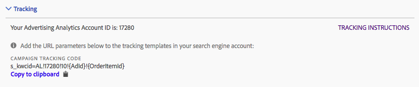

# Tracciamento: Modalità manuale e Modalità automatica

Il tracciamento determina il modo in cui i dati del motore di ricerca vengono tracciati dall'implementazione di Adobe Analytics. Questo è un passaggio obbligatorio per potenziare correttamente i dati di Adobe Analytics con i dati del motore di ricerca.

Sono supportate due modalità di tracciamento: Modalità automatica e Modalità manuale.

## Auto Mode Tracking {#concept_C4C6107838C947CFBB7F4E0CB94264F0}

In modalità automatica, puoi consentire al motore di Advertising Cloud di decidere come gestire i dati dei motori di ricerca. Questo è l'approccio più semplice, ma potrebbe non dare luogo al miglior set di dati integrato.

Di conseguenza, quando selezionate la modalità Automatica, dovete controllare una casella di controllo quando selezionate la modalità Automatica.


Tenere presente che per configurare un account del motore di ricerca in modalità automatica, è necessario effettuare le azioni seguenti:

* Il parametro "s_ kwcid" e il valore verranno aggiunti al tracciamento dell'account o agli URL delle pagine di destinazione nell'account aggiunto. Verrà inserita alla fine dell'URL. Se il server Web richiede una determinata coppia chiave = valore alla fine dell'URL, potrebbe essere necessaria un'azione aggiuntiva per supportare qualsiasi nuova coppia chiave = valore nell'URL. **Assicuratevi che i parametri degli URL aggiunti rimangano correttamente nella pagina di destinazione finale.**
* Inoltre, le parole chiave possono essere inserite nell'URL di destinazione come parte del valore "s_ kwcid". Se contengono caratteri speciali o simboli, confermate che il server Web possa supportare tali caratteri. Esempio: I caratteri speciali comuni sono " +" utilizzati nelle parole chiave "Corrispondenza ampia".

## Manual Mode Tracking {#concept_87B28BA9E7F84BA5972F69E6F3482A33}

In modalità Manuale, è necessario specificare in che modo i dati dei motori di ricerca devono essere gestiti dal processo di integrazione dei dati di analisi della pubblicità.

### Add Manual Tracking to Google Account {#section_41C1EB1AEB034544A5BC291F53C05C67}

La stringa da aggiungere al tuo account Google è indicata di seguito. Devi aggiungere la stringa a tutti i modelli di tracciamento utilizzati nell'account.

>[!IMPORTANT]
>
>The `<Advertising Analytics ID>` value (in **bold** below) is generic and **must be replaced with your specific account ID string**. Puoi ottenere la stringa ID account specifica dall'account, nella sezione «Tracking» (Tracciamento).

**Stringa di tracciamento per campagne:**

```
s_kwcid=AL! 
<b><Advertising Analytics ID></b>!3!{creative}!{matchtype}!{placement}!{network}!{product_partition_id}!{keyword}
```


Esempi di codici di monitoraggio in vari formati modello di tracciamento:

**`{lpurl}`**

```
{lpurl}?s_kwcid=AL!9999!3!{creative}!{matchtype}!{placement}!network}!{product_partition_id}!{keyword}
```

**`{lpurl}`con parametro URL aggiuntivo**

```
{lpurl}?campaign=PPC&s_kwcid=AL!9999!3!{creative}!{matchtype}!{placement}!network}!{product_partition_id}!{keyword}
```

**3 rd-party (doubleclick)`{unescapedlpurl}`**

```
https://clickserve.dartsearch.net/link/click?{_dssagcrid}&{_dssftfiid}&ds_e_adid={creative}&ds_e_matchtype={ifsearch:search}{ifcontent:content}&ds_e_device={device}&ds_e_network={network}&{ifpla:ds_e_product_group_id={product_partition_id}&ds_e_product_id={product_id}&ds_e_product_merchant_id={merchant_id}&ds_e_product_country={product_country}&ds_e_product_language={product_language}&ds_e_product_channel={product_channel}&ds_e_product_store_id={product_store_id}}&ds_url_v=2&ds_dest_url={unescapedlpurl}?s_kwcid=AL!9999!3!{creative}!{matchtype}!{placement}!{network}!{product_partition_id}!{keyword}
```

**3 rd-party (doubleclick)`{lpurl}`**

Se l'URL attraversa un reindirizzamento e non utilizza un valore «unescapedlpurl», occorre codificarla troppo volte per mantenere il reindirizzamento all'URL della pagina di destinazione finale.

```
https://clickserve.dartsearch.net/link/click?{_dssagcrid}&{_dssftfiid}&ds_e_adid={creative}&ds_e_matchtype={ifsearch:search}{ifcontent:content}&ds_e_device={device}&ds_e_network={network}&{ifpla:ds_e_product_group_id={product_partition_id}&ds_e_product_id={product_id}&ds_e_product_merchant_id={merchant_id}&ds_e_product_country={product_country}&ds_e_product_language={product_language}&ds_e_product_channel={product_channel}&ds_e_product_store_id={product_store_id}}&ds_url_v=2&ds_dest_url={lpurl}?s_kwcid%3DAL!9999!3!{creative}!{matchtype}!{placement}!{network}!{product_partition_id}!{keyword}
```

### Add Manual Tracking to Bing Account {#section_094F8ACA493C4D65B1F54A695558EBF2}

La stringa da aggiungere all'account Bing è indicata di seguito. Devi aggiungere la stringa a tutti i modelli di tracciamento utilizzati nell'account.

>[!IMPORTANT]
>
>The `<Advertising Analytics ID>` value (in **bold** below) is generic and **must be replaced with your specific account ID string**. Puoi ottenere la stringa ID account specifica dall'account, nella sezione «Tracking» (Tracciamento).

**Stringa di tracciamento per campagne:**

```
s_kwcid=AL!<Advertising Analytics ID>!10!{AdId}!{OrderItemId} 
```



Esempi di codici di monitoraggio in vari formati modello di tracciamento:

**{lpurl}**

```
{lpurl}?s_kwcid=AL!9999!10!{AdId}!{OrderItemId}`
```

**`{lpurl}`con parametro URL aggiuntivo**

```
{lpurl}?campaign=PPC&
s_kwcid=AL!9999!10!{AdId}!{OrderItemId}
```

**3 rd-party (doubleclick)'{unescapedlpurl}**

```https://clickserve.dartsearch.net/link/click?{_dssagcrid}&{_dssftfiid}&ds_e_adid={creative}&ds_e_matchtype={ifsearch:search}{ifcontent:content}&ds_e_device={device}&ds_e_network={network}&{ifpla:ds_e_product_group_id={product_partition_id}&ds_e_product_id={product_id}&ds_e_product_merchant_id={merchant_id}&ds_e_product_country={product_country}&ds_e_product_language={product_language}&ds_e_product_channel={product_channel}&ds_e_product_store_id={product_store_id}}&ds_url_v=2&ds_dest_url={unescapedlpurl}?s_kwcid=AL!9999!10!{AdId}!{OrderItemId}

```

**3 rd-party (doubleclick)`{lpurl}`**

Se l'URL attraversa un reindirizzamento e non utilizza un valore «unescapedlpurl», occorre codificarla troppo volte per mantenere il reindirizzamento all'URL della pagina di destinazione finale.

```
https://clickserve.dartsearch.net/link/click?{_dssagcrid}&{_dssftfiid}&ds_e_adid={creative}&ds_e_matchtype={ifsearch:search}{ifcontent:content}&ds_e_device={device}&ds_e_network={network}&{ifpla:ds_e_product_group_id={product_partition_id}&ds_e_product_id={product_id}&ds_e_product_merchant_id={merchant_id}&ds_e_product_country={product_country}&ds_e_product_language={product_language}&ds_e_product_channel={product_channel}&ds_e_product_store_id={product_store_id}}&ds_url_v=2&ds_dest_url={lpurl}?s_kwcid%3DAL!9999!10!{AdId}!{OrderItemId}
```
