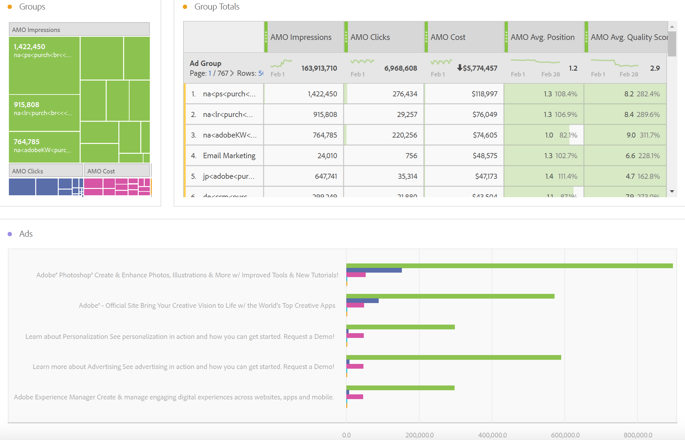

# Report sui dati pubblicitari in Adobe Analytics

Dettagli sul modello Analysis Workspace  e reporting in Reporting e  Analytics e Generatore di report.

>[!NOTE]
>
>Attendere almeno 24 ore prima che i dati del motore di ricerca inizino a essere inseriti nei report Analytics . Inoltre,  report Analytics non restituirà i dati per la granularità oraria, perché i dati AMO non supportano la granularità oraria.

##  Analysis Workspace: Motori di ricerca {#section_8173F42B2C784F41B9FD82CBB66F9ADF}

Questo modello consente a chiunque implementa questa integrazione con Motore di ricerca di accedere ai dati copiosi del motore di ricerca in  Analytics. Potete accedervi tramite **[!UICONTROL Workspace]** > **[!UICONTROL Templates]** > **[!UICONTROL Advertising]** **[!UICONTROL Search Engines.]**

>[!NOTE]
>
>La categoria Modello pubblicitario è visibile a tutti i clienti, anche se non avete implementato alcun Account pubblicitario. Tuttavia, se provate ad aprire il modello Motori di ricerca per una società che non ha ancora effettuato il provisioning, un messaggio di errore vi spiegherà che non avete ancora configurato alcun account Motore di ricerca. In questo caso, fate clic su **[!UICONTROL Configure Now]**, per passare alla schermata [Impostazione](/help/integrate/c-advertising-analytics/c-adanalytics-workflow/aa-create-ad-account.md) account pubblicitario.

       

| Tabella/Visualizzazione | Descrizione |
|--- |--- |
| Tendenze della pubblicità | Panoramica con tendenze giornaliere per le impression AMO, i clic AMO e il costo AMO. |
| Piattaforme pubblicitarie | Grafico ad anello per il costo delle prime 2 piattaforme (Google, Bing). |
| Aggiungi totali Platform | Tabella a forma libera delle piattaforme principali suddivise per Impression AMO, Clic AMO, Costi AMO, Avg AMO. Posizione, AMO Avg. punteggio di qualità. |
| Account | Area di costo sovrapposta. |
| Totali account | Tabella a forma libera degli account principali suddivisa per le metriche associate. |
| Campagne | Grafico a barre del costo della campagna. |
| Totali campagna | Tabella a forma libera delle campagne principali suddivise per le metriche associate. |
| Groups (Gruppi) | Mappa ad albero del costo. |
| Totali gruppo | Tabella a forma libera dei principali gruppi pubblicitari suddivisi per le metriche associate. |
| Annunci | Grafico a barre orizzontale di impression, clic e costi. |
| Totali annuncio | Tabella a forma libera degli annunci principali suddivisa per le metriche associate. |
| Parole chiave | Grafico a dispersione di impression, clic e costi per tutte le combinazioni di parole chiave/tipo di corrispondenza. |
| Totali parola chiave | Tabella a forma libera delle principali combinazioni di parole chiave/tipi di corrispondenza suddivise per le metriche associate. |

## Reports &amp; Analytics {#section_BB2E75DF909C49EA8D4E92D14D6DFD85}

Non appena hai impostato un account Analytics  pubblicità, il report Annuncio  Analytics sarà disponibile.

## Report Builder {#section_8E0371CF81144C33990D909685D1726E}

Non appena hai impostato un account Analytics  pubblicità, il report Annuncio  Analytics sarà disponibile.
