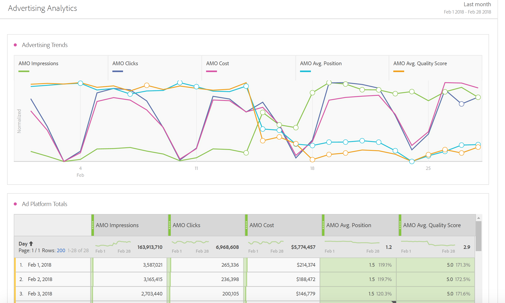
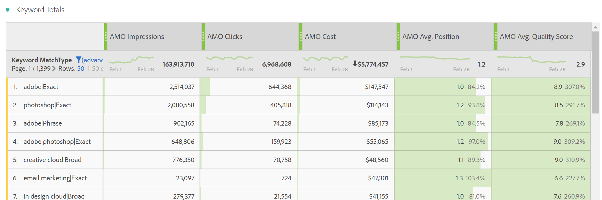
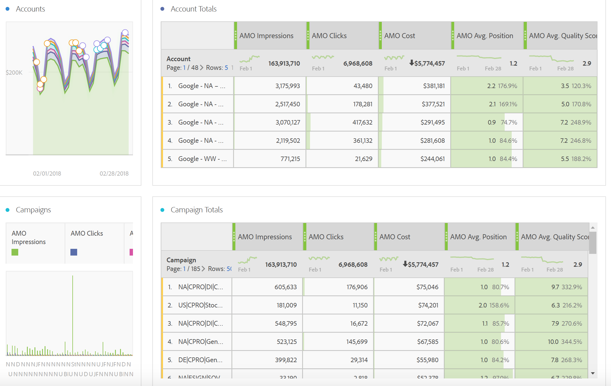
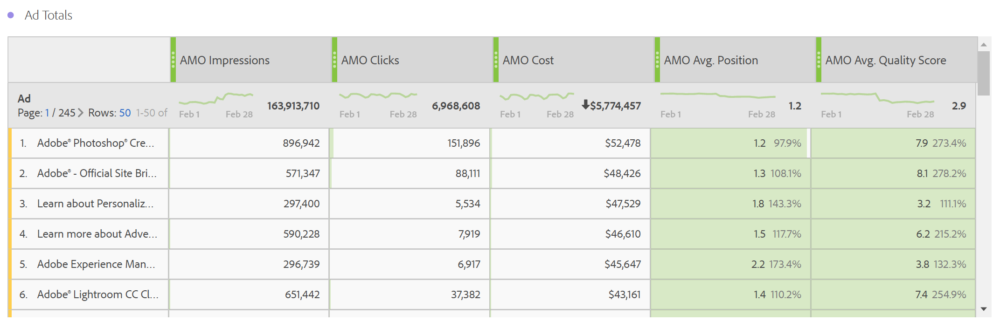

# Relazione sui dati pubblicitari

Questo articolo fornisce dettagli sul rapporto di Analysis Workspace e sul reporting in Report Builder.

>[!NOTE]
>
>I rapporti di Analytics devono essere compilati almeno 24 ore prima che i dati del motore di ricerca inizino a essere inseriti. La generazione rapporti di Analytics non restituisce dati con granularità oraria, perché i dati di Adobe Advertising non supportano tale granularità.

## Rapporto di ricerca a pagamento {#section_8173F42B2C784F41B9FD82CBB66F9ADF}

Questo rapporto consente a chiunque implementi l’integrazione del motore di ricerca di accedere ai dati del motore di ricerca all’interno di Analytics. Puoi accedervi tramite **[!UICONTROL Workspace]** > **[!UICONTROL Reports]** > **[!UICONTROL Acquisition]** > **[!UICONTROL Advertising Analytics: paid search]**

>[!NOTE]
>
>Il rapporto Ricerca a pagamento è visibile a tutti i clienti, anche se non hai implementato alcun account Advertising. Se tenti di aprire il rapporto Ricerca a pagamento per una società per la quale non è stato eseguito il provisioning, viene visualizzato un messaggio di errore per informare che non hai configurato alcun account del motore di ricerca. Selezionare **[!UICONTROL Configure Now]**, per visualizzare la schermata [Configurazione account Advertising](/help/integrate/c-advertising-analytics/c-adanalytics-workflow/aa-create-ad-account.md).

       

| Tabella/Visualizzazione | Descrizione |
|--- |--- |
| Tendenze pubblicitarie | Panoramica con tendenze giornaliere per impressioni AMO, clic AMO e costo AMO. |
| Piattaforme annuncio | Grafico ad anello per il costo delle prime 2 piattaforme (Google Ads, Microsoft Advertising). |
| Totali piattaforma di annunci | Tabella a forma libera delle piattaforme principali suddivisa per impressioni AMO, clic AMO, costi AMO, media AMO. Posizione, media AMO punteggio di qualità. |
| Account | Superfici di costo in pila. |
| Totali account | Tabella a forma libera dei principali account suddivisa per le metriche associate. |
| Campagne | Grafico a barre del costo della campagna. |
| Totali campagna | Tabella a forma libera delle campagne principali suddivisa per le metriche associate. |
| Gruppi | Mappa ad albero del costo. |
| Totali gruppo | Tabella a forma libera dei principali gruppi pubblicitari suddivisi per le metriche associate. |
| Annunci | Grafico a barre orizzontale con impression, clic e costi. |
| Totali annuncio | Tabella a forma libera dei principali annunci suddivisa per le metriche associate. |
| Parole chiave | Grafico a dispersione di impression, clic e costo per tutte le combinazioni parola chiave/tipo di corrispondenza. |
| Totali parole chiave | Tabella a forma libera delle combinazioni principali di parole chiave/tipi di corrispondenza suddivisa per le metriche associate. |

## Report Builder {#section_8E0371CF81144C33990D909685D1726E}

Non appena hai impostato un account Advertising Analytics, il rapporto di Advertising Analytics è disponibile.
