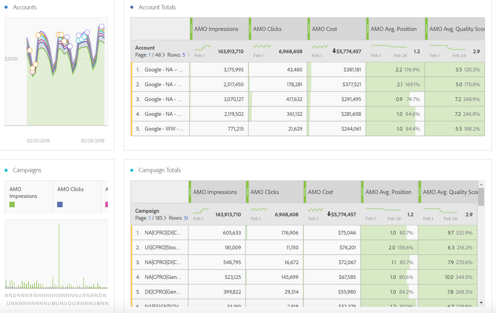

# Report sui dati pubblicitari in Adobe Analytics

Dettagli sul modello Analysis Workspace e sui rapporti in Reporting e analisi e Generatore di report.

>[!NOTE]
>
>È previsto di attendere almeno 24 ore prima che i dati del motore di ricerca inizino a compilare i report di Analytics. Inoltre, il report di Analytics non restituirà i dati per granularità oraria, poiché i dati AMO non supportano la granularità oraria.

## Analysis Workspace: Search Engines {#section_8173F42B2C784F41B9FD82CBB66F9ADF}

Questo modello consente a chiunque implementi questa integrazione di Motore di ricerca di accedere ai dati del motore di ricerca di ricerca in Analytics. You can access it via **[!UICONTROL Workspace]** &gt; **[!UICONTROL Templates]** &gt; **[!UICONTROL Advertising]** &gt; **[!UICONTROL Search Engines.]**

>[!NOTE]
>
>La categoria Modello pubblicitario è visibile a tutti i clienti, anche se non hai implementato nessun account pubblicitario. Tuttavia, se provate ad aprire il modello Motori di ricerca per una società che non ha il provisioning, un messaggio di errore spiega che non avete ancora configurato gli account motore di ricerca. In this case, click **[!UICONTROL Configure Now]**, which will take you to the [Advertising Account Setup](../../../integrate/c-advertising-analytics/c-adanalytics-workflow/aa-create-ad-account.md#concept_1958E8C15C334E8B9DC510EC8D5DCA7C) screen.

       

| Tabella/Visualizzazione | Descrizione |
|--- |--- |
| Tendenze della pubblicità | Panoramica con tendenze giornaliera per impression AMO, clic AMO e AMO Cost. |
| Piattaforme pubblicitarie | Grafico anello per i costi delle prime 2 piattaforme (Google, Bing). |
| Totals della piattaforma annunci | Tabella freeform delle piattaforme principali suddivise per AMO Impression, clic AMO, premi AMO, AMO Avg. Posizione, AMO Avg. Punteggio di qualità. |
| Account | Area di spesa sovrapposta. |
| Totali account | Tabella freeform degli account principali suddivisi per le metriche associate. |
| Campagne | Grafico a barre del costo della campagna. |
| Totali campagna | Tabella freeform delle campagne principali suddivise per metriche associate. |
| Groups (Gruppi) | Mappa ad albero costi. |
| Totali gruppo | Tabella freeform dei gruppi pubblicitari principali suddivisi per le metriche associate. |
| Annunci | Grafico a barre orizzontale di impression, clic e costi. |
| Annunci pubblicitari | Tabella Freeform degli annunci principali suddivisi per metriche associate. |
| Parole chiave | Grafico dispersione di impression, clic e costi per tutte le combinazioni di tipo parola chiave/corrispondenza. |
| Totali parole chiave | Tabella freeform delle combinazioni di tipo parola chiave/corrispondenza corrispondente suddivise per le metriche associate. |

## Reporting e analisi {#section_BB2E75DF909C49EA8D4E92D14D6DFD85}

Non appena avete impostato un account Analytics sulla pubblicità, il report Analisi della pubblicità sarà reso disponibile.

## Generatore di report {#section_8E0371CF81144C33990D909685D1726E}

Non appena avete impostato un account Analytics sulla pubblicità, il report Analisi della pubblicità sarà reso disponibile.
