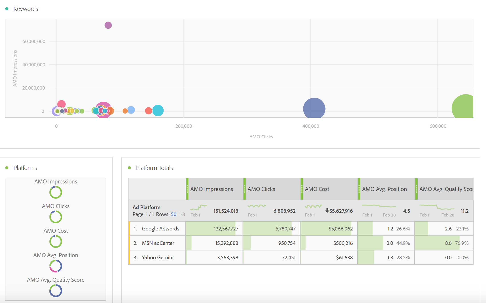

# Rapporto sui dati pubblicitari in Adobe Analytics

Dettagli sul modello Analysis Workspace e reporting in Report Builder.

>[!NOTE]
>
>Devi aspettare almeno 24 ore prima che i dati del motore di ricerca inizino a essere inseriti nei rapporti di Analytics. Inoltre, il reporting di Analytics non restituirà dati con granularità oraria, perché i dati AMO non supportano tale granularità.

## Analysis Workspace: motori di ricerca {#section_8173F42B2C784F41B9FD82CBB66F9ADF}

Questo modello consente a chiunque implementi questa integrazione del motore di ricerca di accedere a numerosi dati del motore di ricerca in Analytics. Puoi accedervi tramite **[!UICONTROL Workspace]** > **[!UICONTROL Templates]** > **[!UICONTROL Advertising]** > **[!UICONTROL Search Engines.]**

>[!NOTE]
>
>La categoria Modello pubblicitario è visibile a tutti i clienti, anche se non hai implementato alcun account pubblicitario. Tuttavia, se tenti di aprire il modello Motori di ricerca per un’azienda per la quale non è stato ancora eseguito il provisioning, viene visualizzato un messaggio di errore per informare che non hai ancora configurato alcun account Motore di ricerca. In questo caso, fai clic su **[!UICONTROL Configure Now]**, che ti porterà alla sezione [Impostazione account Advertising](/help/integrate/c-advertising-analytics/c-adanalytics-workflow/aa-create-ad-account.md) schermo.

       

| Tabella/Visualizzazione | Descrizione |
|--- |--- |
| Tendenze pubblicitarie | Panoramica con tendenze giornaliere per impressioni AMO, clic AMO e costo AMO. |
| Piattaforme annuncio | Grafico ad anello per il costo delle prime 2 piattaforme (Google, Bing). |
| Totali in Ad Platform | Tabella a forma libera delle piattaforme principali suddivisa per impressioni AMO, clic AMO, costi AMO, media AMO. Posizione, media AMO punteggio di qualità. |
| Account | Superfici di costo in pila. |
| Totali conto | Tabella a forma libera dei principali account suddivisa per le metriche associate. |
| Campagne | Grafico a barre del costo della campagna. |
| Totali campagna | Tabella a forma libera delle campagne principali suddivisa per le metriche associate. |
| Groups (Gruppi) | Mappa ad albero del costo. |
| Totali gruppo | Tabella a forma libera dei principali gruppi pubblicitari suddivisi per le metriche associate. |
| Annunci | Grafico a barre orizzontale con impression, clic e costi. |
| Totali annuncio | Tabella a forma libera dei principali annunci suddivisa per le metriche associate. |
| Parole chiave | Grafico a dispersione di impression, clic e costo per tutte le combinazioni parola chiave/tipo di corrispondenza. |
| Totali parole chiave | Tabella a forma libera delle combinazioni principali di parole chiave/tipi di corrispondenza suddivisa per le metriche associate. |

## Report Builder {#section_8E0371CF81144C33990D909685D1726E}

Non appena hai impostato un account Advertising Analytics, il rapporto di Advertising Analytics sarà disponibile.
