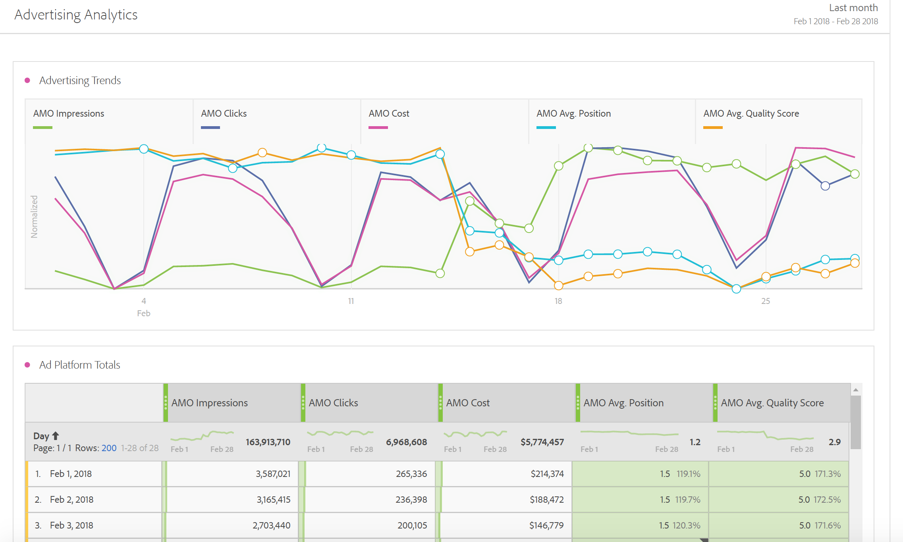

# Panoramica su Advertising Analytics

Advertising Analytics consente di vedere affiancati i dati Paid Search di Google e di Bing in Adobe Analytics. In precedenza, qualsiasi dato di Google AdWords/DFA o Microsoft Bing Ads doveva essere visualizzato in Adobe Advertising Cloud (AMO) o su Google/Bing. Ora avrai accesso ai seguenti dati in Adobe Analytics: impression, clic, costi, punteggio di qualità e posizione media direttamente dai motori di ricerca, così come istanze AMO ID (Istanze di clic).

>[!NOTE] Il 31 marzo 2019 Yahoo Gemini è stata assorbita da Microsoft Bing. Di conseguenza, l’opzione per l’account per annunci Yahoo Gemini non è più disponibile.

Riunendo i dati di questi motori di ricerca in Adobe Analytics è possibile analizzarli servendosi della potenza di Analysis Workspace. L’analisi è facilitata da un nuovo modello di [Prestazioni di Paid Search](/help/integrate/c-advertising-analytics/c-adanalytics-workflow/aa-report-ad-data-an.md) in Workspace.

Questa integrazione è destinata ai seguenti tipi di pubblico:

* L’**analista** incaricato di raccogliere i rapporti sulle prestazioni per l’esperto di Paid Search Marketing.
* L’**esperto di Paid Search Marketing** che cerca le risposte alle seguenti domande: quanto traffico sto inviando al sito? I clienti si stanno convertendo? Quali sono le mie campagne pubblicitarie più redditizie?

## Prerequisiti {#section_C25E0CA3474C4EDEAEAA9A5B8AAC9299}

* Advertising Analytics è disponibile solo per gli SKU di Adobe Analytics [Select](https://www.adobe.com/it/data-analytics-cloud/analytics/select.html), [Prime](https://www.adobe.com/it/data-analytics-cloud/analytics/prime.html) e [Ultimate](https://www.adobe.com/it/data-analytics-cloud/analytics/ultimate.html).

* Questa funzionalità è disponibile per chi non è cliente Advertising Cloud e AMO.
* Per accedere ad Advertising Analytics devi essere un amministratore di Adobe Analytics. Successivamente puoi [concedere autorizzazioni di accesso](/help/integrate/c-advertising-analytics/overview.md#section_FCC58EB635954A32990D4E67B52B4369) agli utenti non amministratori.
* Ogni suite di rapporti di Analytics in cui desideri visualizzare i dati di ricerca Google/Bing deve essere [mappata alla tua organizzazione Experience Cloud](https://docs.adobe.com/content/help/it-IT/core-services/interface/about-core-services/report-suite-mapping.html).
* Per ogni suite di rapporti in cui desideri visualizzare i dati di ricerca Google/Bing, devi [abilitare la/le suite di rapporti per Advertising Analytics](/help/integrate/c-advertising-analytics/c-adanalytics-workflow/aa-provision-rs.md) ( **[!UICONTROL Admin]** > **[!UICONTROL Edit Settings]** > **[!UICONTROL Advertising Analytics Configuration]**).

* È necessario disporre di credenziali di accesso per utenti con autorizzazioni di modifica per gli account di ricerca che si desidera integrare con Adobe Analytics, ad esempio l’ID e la password di un account Google.
* Nel caso di Bing Ads, è necessario anche l’ID cliente Bing.
* Se si utilizza Internet Explorer 11 (o versioni precedenti) non si riuscirà a [impostare un account per annunci](/help/integrate/c-advertising-analytics/c-adanalytics-workflow/aa-create-ad-account.md) per nessuno dei tre motori di ricerca. Usa altri browser web.

## Autorizzazioni per Advertising Analytics {#section_FCC58EB635954A32990D4E67B52B4369}

Analytics dispone di due autorizzazioni che vengono concesse automaticamente agli amministratori di Analytics. Gli amministratori possono quindi scegliere di concedere queste autorizzazioni agli utenti non amministratori.

<table id="table_86256AD8B4554F369439A8FDF2F545E1"> 
 <thead> 
  <tr> 
   <th colname="col1" class="entry"> Autorizzazione </th> 
   <th colname="col2" class="entry"> Definizione </th> 
   <th colname="col3" class="entry"> Concedere l’autorizzazione in Adobe Analytics </th> 
   <th colname="col4" class="entry"> Concedere l’autorizzazione se è stato effettuato l’accesso ad Adobe Experience Cloud </th> 
  </tr>
 </thead>
 <tbody> 
  <tr> 
   <td colname="col1"> 
Gestione di Advertising Analytics 
 </td> 
   <td colname="col2"> 
Consente agli utenti di configurare, modificare e visualizzare gli account per annunci e di ricerca. 
 </td> 
   <td colname="col3"> Amministratore &gt;  Gestione utente &gt;  Gruppi &gt;  Modifica accesso a tutti i rapporti &gt;  Personalizza strumenti di Analytics &gt;  Gestione di Advertising Analytics </td> 
   <td colname="col4"> Accedi a adminconsole.adobe.com &gt;  Prodotti &gt;  Profilo del prodotto &gt;  Scheda autorizzazioni &gt;  Strumenti di Analytics &gt;  Gestione di Advertising Analytics </td> 
  </tr> 
  <tr> 
   <td colname="col1"> 
Configurazione di Advertising Analytics 
 </td> 
   <td colname="col2"> 
Consente agli utenti di configurare suite di rapporti su cui effettuare il provisioning per Advertising Analytics. 
 </td> 
   <td colname="col3"> Admin &gt;  Gestione utente &gt;  Gruppi &gt;  Modifica accesso a tutti i rapporti &gt;  Personalizza strumenti delle suite di rapporti &gt;  Configurazione di Advertising Analytics </td> 
   <td colname="col4"> Accedi a adminconsole.adobe.com &gt;  Prodotti &gt;  Profilo del prodotto &gt;  Scheda autorizzazioni &gt;  Strumenti delle suite di rapporti &gt;  Configurazione di Advertising Analytics </td> 
  </tr> 
 </tbody> 
</table>

## Metriche e dimensioni di Advertising Analytics {#section_C0DF4A08EA9E46ADABE9E465AFC11E32}

Advertising Analytics aggiunge le metriche e le dimensioni seguenti ad Analysis Workspace, Reports &amp; Analytics, Report Builder e all’API Analytics Reporting.

**Dimensioni**

>[!IMPORTANT]
>
>Questa integrazione crea un nuovo set di dimensioni attraverso classificazioni della variabile AMO ID. Le nuove dimensioni non influiscono né modificano i canali di marketing esistenti o le dimensioni variabili di tracciamento delle campagne. L’AMO ID è connesso al profilo di un visitatore quando questo arriva sul sito da un annuncio di ricerca a pagamento. Di conseguenza, le dimensioni AMO possono essere utilizzate per suddividere sia le metriche AMO fornite da questa integrazione che i dati acquisiti a valle dal visitatore (visite, visitatori, visualizzazioni di pagina, frequenza di rimbalzo, ordini, ricavi, eventi personalizzati, ecc.). È possibile suddividere questi dati anche per altre dimensioni quando si generano rapporti su altre metriche nel sito.
>
>Le classificazioni per queste metriche vengono aggiornate ogni giorno. Pertanto, se si apportano modifiche ai metadati in un motore di ricerca, tali modifiche potrebbero non essere visibili fino al giorno successivo nel momento in cui le classificazioni vengono aggiornate.

| Nome classificazione (dimensione) | Definizione |
|--- |--- |
| Tipo di corrispondenza delle parole chiave (AMO ID) | Il tipo di corrispondenza delle parole chiave. Il tipo di corrispondenza può essere generico, a frase, esatto o nullo se il tipo di annuncio non ha un tipo di corrispondenza. |
| Piattaforma annunci (AMO ID) | Il nome del motore di ricerca. I valori possono includere Google AdWords o Microsoft Bing Ads. |
| Account (AMO ID) | Il nome dell’account del motore di ricerca che viene tracciato. |
| Campagna (AMO ID) | Il nome della campagna nell’account del motore di ricerca. |
| Gruppi di annunci (AMO ID) | Il nome del gruppo di annunci nelle campagne del motore di ricerca. |
| Annunci (AMO ID) | Il titolo e la descrizione usati nell’annuncio. |
| Parola chiave (AMO ID) | Il valore della parola chiave dall’account del motore di ricerca. |
| Tipo di corrispondenza (AMO ID) | Tipo di corrispondenza assegnato alla parola chiave. Il tipo di corrispondenza può essere generico, a frase, esatto o nullo se il tipo di annuncio non ha un tipo di corrispondenza. |
| Tipo di annuncio (AMO ID) | Il tipo di annuncio che viene distribuito, che in genere è “Annuncio di testo”. |
| Titolo dell’annuncio (AMO ID) | L’oggetto titolo utilizzato nell’annuncio. |
| Descrizione dell’annuncio (AMO ID) | L’oggetto descrizione utilizzato nell’annuncio. |
| URL di visualizzazione dell’annuncio (AMO ID) | L’oggetto URL di visualizzazione utilizzato nell’annuncio. |
| URL di destinazione dell’annuncio (AMO ID) | L’URL della pagina di destinazione o l’URL finale assegnato all’annuncio. |
| Rete (AMO ID) | La rete su cui viene servito l’annuncio. Per Advertising Analytics questo valore è sempre “Search”. |
| Posizionamento (AMO ID) | Il sito web di posizionamento gestito (per le reti di contenuti). Questa dimensione viene utilizzata solo per i posizionamenti gestiti. |
| Target di prodotto (AMO ID) | Nome del target di prodotto utilizzato sugli annunci PLA (non il prodotto effettivamente acquistato). |
| Ottimizzazione (AMO ID) | Questa dimensione non viene utilizzata da Advertising Analytics, ma solo dai clienti di Advertising Cloud. |
| Dispositivo (AMO ID) | Non è in uso al momento. È un segnaposto per un potenziale miglioramento futuro del prodotto per il tipo di dispositivo di destinazione indicato dell’annuncio (ad es. mobile, desktop), non il dispositivo effettivo del visitatore. |

**Metriche**

>[!IMPORTANT]
>
>Le metriche fornite da Advertising Analytics (elencate di seguito) sono dati di riepilogo provenienti dai motori di ricerca. Non sono connesse ai profili visitatore di Analytics. Sono collegate solo alla variabile AMO ID e alle dimensioni di classificazione associate a essa. Di conseguenza, non devono essere segnalate da dimensioni/segmenti diversi da quelli basati sulle dimensioni dell’AMO ID. Fare ciò porterebbe Analytics a mostrare degli zeri in corrispondenza dei dati. Puoi includerle nelle metriche calcolate con altre metriche, ma anche queste ultime devono essere suddivise solo per le dimensioni dell’AMO ID.
>
>Queste metriche sono dati originati su base giornaliera, pertanto non contengono dati per il giorno corrente. Inoltre, non devono essere segnalate con una granularità inferiore a quella giornaliera.
>
>Esiste una metrica Istanze AMO ID che viene attivata quando l’AMO ID è impostato su una pagina di destinazione (ad esempio un clickthrough). Questa metrica viene acquisita in tempo reale con l’hit della pagina di destinazione ed è disponibile per raggruppamenti con altre dimensioni impostate a loro volta sulla pagina di destinazione.

| Nome della metrica | Definizione |
|--- |--- |
| Impression AMO | Il numero di ad impression riportato dal motore di ricerca. |
| Clic AMO | Il numero di clic sugli annunci riportato dal motore di ricerca. |
| Costo AMO | Il costo di ogni parola chiave/annuncio riportato dal motore di ricerca. |
| Media della posizione | Una metrica calcolata che riflette la posizione media degli annunci segnalata dal motore di ricerca. |
| Media del punteggio di qualità | Una metrica calcolata che riflette il punteggio medio di qualità riportato dal motore di ricerca. |
