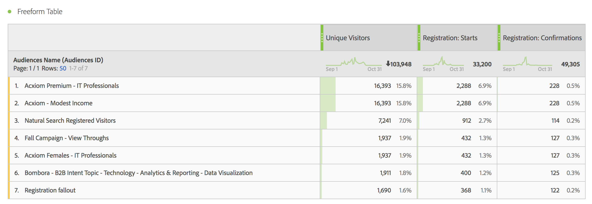
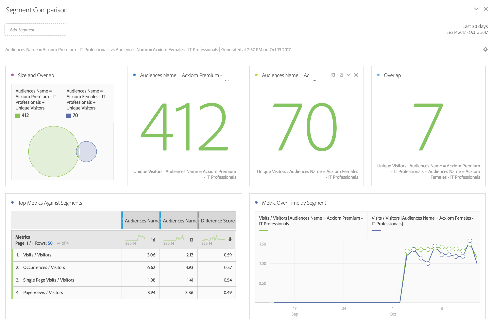

# Uso dei dati di audience in Analytics

Puoi utilizzare le dimensioni Pubblico AAM in Analytics. I segmenti integrati sono nuove dimensioni di Analytics denominate ID pubblico e Nome pubblico e possono essere utilizzati come qualsiasi altra dimensione che Analytics raccoglie. In Feed dati, gli ID pubblico sono memorizzati nella colonna &quot;mc_audiences&quot;. Queste dimensioni non sono attualmente disponibili in Data Workbench o Livestream. Alcuni esempi di come sfruttare le dimensioni Pubblico includono:

## Analysis Workspace {#section_C70837499BEA4DED885B3486C9E02C68}

In Analysis Workspace, i segmenti AAM vengono visualizzati come due dimensioni.

1. Vai a **[!UICONTROL Workspace]**.
1. Dall’elenco di **[!UICONTROL Dimensions]**, seleziona le dimensioni **[!UICONTROL Audience ID]** o **[!UICONTROL Audience Name]**. Il nome è una classificazione semplice dell’ID.

   

## Confronto fra segmenti {#section_E72B80B6470C42D4B9B19BE90E6070A2}

[Il ](https://experienceleague.adobe.com/docs/analytics/analyze/analysis-workspace/panels/segment-comparison/segment-comparison.html) confronto dei segmenti rileva le differenze più importanti dal punto di vista statistico tra due segmenti. I dati sui tipi di pubblico possono essere utilizzati in Segment Comparison (Confronto segmenti) in due modi: 1) come i 2 segmenti che vengono confrontati, e 2) come elementi nella tabella &quot;Elementi Dimension principali&quot;.

1. Vai a **[!UICONTROL Workspace]** e seleziona il pannello **[!UICONTROL Segment Comparison]** dalla barra a sinistra.

1. Cerca [!UICONTROL Audiences Name] nel menu **[!UICONTROL Component]**.

1. Apri [!UICONTROL Audiences Name]in modo che vengano visualizzati gli elementi dimensionali correlati.
1. Trascina i tipi di pubblico da confrontare nel generatore Segment Comparison (Confronto segmenti).
1. (Facoltativo): Puoi importare anche altri elementi o segmenti di dimensione, fino a 2 possono essere confrontati.
1. Fai clic su **[!UICONTROL Build]**.

   Le dimensioni ID e Nome del pubblico verranno visualizzate automaticamente nella tabella &quot;Elementi principali del Dimension&quot;, in quanto sono dati di profilo aggiuntivi per i due segmenti che vengono confrontati.

   

## Percorso cliente (Flusso) in Analysis Workspace {#section_FC30E5795C9D4539838E30FE11FAEA6E}

I dati dei segmenti AAM vengono trasmessi ad Analytics in base all’hit e rappresentano l’appartenenza all’audience per un visitatore in quel momento. Ciò significa che un visitatore potrebbe rientrare in un segmento (ad es. &quot;Consapevolezza&quot;), poi si qualifica per un segmento più qualificato (ad esempio &quot;Considerazione&quot;). Puoi utilizzare [Flusso](https://experienceleague.adobe.com/docs/analytics/analyze/analysis-workspace/visualizations/fallout/fallout-flow.html) in Analysis Workspace per visualizzare il percorso che un visitatore prende tra i tipi di pubblico.

1. Vai a **[!UICONTROL Workspace]** e seleziona la visualizzazione **[!UICONTROL Flow]** dalla barra a sinistra.

1. Trascina la dimensione [!UICONTROL Audience Name] nel Generatore di flusso.
1. Fai clic su **[!UICONTROL Build]**.
1. (Facoltativo): Trascina qualsiasi altra dimensione nella visualizzazione Flusso per creare un [Flusso interdimensionale](https://experienceleague.adobe.com/docs/analytics/analyze/analysis-workspace/visualizations/flow/multi-dimensional-flow.html).

I tipi di pubblico possono essere utilizzati anche nelle [visualizzazioni Abbandono](https://experienceleague.adobe.com/docs/analytics/analyze/analysis-workspace/visualizations/fallout/fallout-flow.html).

## Visualizzazione di Venn in Analysis Workspace {#section_E78AB764FB5047148B51DC1526B0DF89}

[Visualizzazioni ](https://experienceleague.adobe.com/docs/analytics/analyze/analysis-workspace/visualizations/venn.html) di VennMostra la sovrapposizione tra un massimo di 3 segmenti.

1. Vai a **[!UICONTROL Workspace]** e seleziona la visualizzazione **[!UICONTROL Venn]** dalla barra a sinistra.

1. Cerca [!UICONTROL Audience Name] nel menu del componente.
1. Apri [!UICONTROL Audience Name] in modo che vengano visualizzati gli elementi dimensionali correlati.
1. Trascina i tipi di pubblico da confrontare nel generatore di Venn.
1. (Facoltativo): Puoi importare anche altri elementi o segmenti di dimensioni; si possono confrontare fino a 3.
1. Fai clic su **[!UICONTROL Build]**.

## Generatore di segmenti {#section_2AA81852A1404AB894472CA8959461B6}

Puoi incorporare le dimensioni Tipi di pubblico in Analytics [Generatore di segmenti](/help/components/segmentation/segmentation-workflow/seg-build.md), insieme alle informazioni comportamentali raccolte da Analytics.

1. Vai a  **[!UICONTROL Components]** > **[!UICONTROL Segments]** .
1. Fai clic su **[!UICONTROL Add]** per creare un nuovo segmento.
1. Dopo aver assegnato un nome al segmento, trascina la dimensione [!UICONTROL Audience Name] nel pannello Definizioni .
1. (Facoltativo): Aggiungi altri criteri al segmento.
1. Salva il segmento.

   

## Reports &amp; Analytics e Report Builder {#section_04E8FD30F73344D7937AD3C6CD19E34A}

1. Per visualizzare il rapporto di Analytics, passa a **[!UICONTROL Reports]** > **[!UICONTROL Visitor Profile]** > **[!UICONTROL Audience ID Reports]** .
1. Da questa cartella puoi accedere sia alle dimensioni ID pubblico che Nome pubblico .

   
