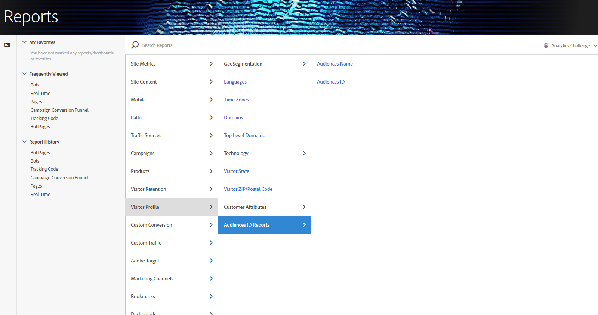

# Uso dei dati di audience in Analytics

Puoi utilizzare le dimensioni AAM Pubblico in Analytics. I segmenti integrati sono nuove dimensioni di Analytics denominate ID pubblico e Nome audience e possono essere utilizzati come qualsiasi altra dimensione raccolta da Analytics. In Feed dati, gli ID audience sono memorizzati nella colonna &quot;mc_audiences&quot;. Queste dimensioni non sono attualmente disponibili in Data Workbench o Livestream. Alcuni esempi di come sfruttare le dimensioni Audiences sono:

## Analysis Workspace {#section_C70837499BEA4DED885B3486C9E02C68}

In  Analysis Workspace, i segmenti AAM appaiono come due dimensioni.

1. Vai a **[!UICONTROL Workspace]**.
1. Dall’elenco di **[!UICONTROL Dimensions]**, selezionate le dimensioni **[!UICONTROL Audience ID]** o **[!UICONTROL Audience Name]**. Nome è una classificazione semplice dell’ID.

   

## Confronto fra segmenti {#section_E72B80B6470C42D4B9B19BE90E6070A2}

[Confronto](https://docs.adobe.com/content/help/it-IT/analytics/analyze/analysis-workspace/panels/segment-comparison/segment-comparison.html) segmenti rileva le differenze più importanti dal punto di vista statistico tra due segmenti. I dati sui tipi di pubblico possono essere utilizzati in Confronto segmenti in due modi: 1) come i 2 segmenti che vengono confrontati, e 2) come elementi nella tabella &quot;Elementi Dimension principali&quot;.

1. Vai a **[!UICONTROL Workspace]** e seleziona il **[!UICONTROL Segment Comparison]** pannello dalla barra a sinistra.

1. Cercare [!UICONTROL Audiences Name] nel **[!UICONTROL Component]** menu.

1. Apri [!UICONTROL Audiences Name]in modo che vengano visualizzati gli elementi di dimensione correlati.
1. Trascina le audience da confrontare nel generatore di confronto segmenti.
1. (Facoltativo): È possibile inserire anche altri elementi o segmenti di dimensione, fino a 2.
1. Fai clic su **[!UICONTROL Build]**.

   Le dimensioni ID e Nome dell&#39;audience verranno visualizzate automaticamente nella tabella &quot;Elementi Dimension principali&quot;, in quanto si tratta di dati di profilo aggiuntivi per i due segmenti confrontati.

   

## Percorso del cliente (flusso) in  Analysis Workspace {#section_FC30E5795C9D4539838E30FE11FAEA6E}

AAM i dati del segmento vengono passati in Analytics in base all&#39;hit e rappresentano l&#39;appartenenza al pubblico di un visitatore in quel momento. Ciò significa che un visitatore potrebbe trovarsi in un segmento (ad es. &quot;Consapevolezza&quot;), quindi qualificarsi per un segmento più qualificato (ad es. &quot;Considerazione&quot;). Puoi usare [Flusso](https://docs.adobe.com/content/help/it-IT/analytics/analyze/analysis-workspace/visualizations/fallout/fallout-flow.html) in  Analysis Workspace per visualizzare il percorso che un visitatore compie tra un&#39;audience e l&#39;altra.

1. Vai a **[!UICONTROL Workspace]** e seleziona la **[!UICONTROL Flow]** visualizzazione dalla barra a sinistra.

1. Trascina la [!UICONTROL Audience Name] dimensione nel generatore di flussi.
1. Fai clic su **[!UICONTROL Build]**.
1. (Facoltativo): Trascina qualsiasi altra dimensione nella visualizzazione Flusso per creare un Flusso interdimensionale.

Le audience possono essere utilizzate anche nelle visualizzazioni [Abbandono](https://docs.adobe.com/content/help/it-IT/analytics/analyze/analysis-workspace/visualizations/fallout/fallout-flow.html).

## Visualizzazione Venn in  Analysis Workspace {#section_E78AB764FB5047148B51DC1526B0DF89}

[Le visualizzazioni](https://docs.adobe.com/content/help/en/analytics/analyze/analysis-workspace/visualizations/venn.html) Venn mostrano la sovrapposizione tra un massimo di 3 segmenti.

1. Vai a **[!UICONTROL Workspace]** e seleziona la **[!UICONTROL Venn]** visualizzazione dalla barra a sinistra.

1. Cercare [!UICONTROL Audience Name] nel menu dei componenti.
1. Aprite [!UICONTROL Audience Name] in modo che vengano visualizzati gli elementi di dimensione correlati.
1. Trascinate le audience da confrontare nel generatore di Venn.
1. (Facoltativo): Puoi anche importare altri elementi o segmenti di dimensione; si possono confrontare fino a 3.
1. Fai clic su **[!UICONTROL Build]**.

## Generatore di segmenti {#section_2AA81852A1404AB894472CA8959461B6}

Puoi includere le dimensioni Audiences nel Generatore segmenti di Analytics, insieme alle informazioni comportamentali raccolte da Analytics.

1. Vai a  **[!UICONTROL Components]** > **[!UICONTROL Segments]** .
1. Click **[!UICONTROL Add]** to create a new segment.
1. After naming the segment, drag the [!UICONTROL Audience Name] dimension into the Definitions panel.
1. (Facoltativo): Aggiungi altri criteri al segmento.
1. Salva il segmento.

   

## Reporting e analisi e Report Builder {#section_04E8FD30F73344D7937AD3C6CD19E34A}

1. Per visualizzare il rapporto di Analytics, andate a **[!UICONTROL Reports]** > **[!UICONTROL Visitor Profile]** > **[!UICONTROL Audience ID Reports]** .
1. Da questa cartella potete accedere sia alle dimensioni ID pubblico che Nome pubblico.

   

