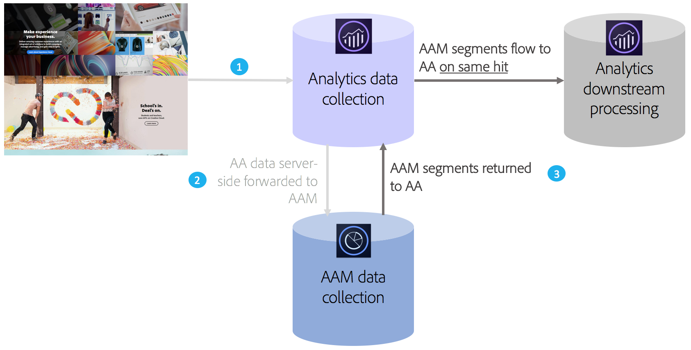

# Panoramica di Audience Analytics

Adobe Audience Manager (Adobe Audience Manager) è una potente piattaforma di gestione dei dati che consente di creare profili di pubblico univoci da integrazioni di dati di prime parti, seconde parti/partner e terze parti. Per gli inserzionisti, questi profili di pubblico aiutano a definire i segmenti più importanti da utilizzare su qualsiasi canale digitale.

Con l’integrazione di Audience Analytics, puoi incorporare in qualsiasi flusso di lavoro di Adobe Audience Manager dati sul pubblico, come informazioni demografiche (ad esempio, genere o fascia di reddito), informazioni psicografiche (ad esempio, interessi e hobby), dati CRM e dati di impressioni di annunci.

>[!BEGINSHADEBOX]

Consulta  [Audience Analytics](https://experienceleague.adobe.com/en/docs/analytics-learn/tutorials/integrations/audience-manager/audience-analytics-integrate-aam-segments-into-analytics){target="_blank"} per un video dimostrativo.

>[!ENDSHADEBOX]

## Vantaggi chiave {#benefits}

L’integrazione di Audience Analytics offre i seguenti vantaggi chiave:

* È la prima integrazione prodotta tra una piattaforma di gestione dati (DMP) e un motore di analisi sul mercato.
* I segmenti vengono condivisi da Adobe Audience Manager ad Analytics in tempo reale, per informare l’individuazione, la segmentazione e l’ottimizzazione del pubblico.
* Tutti i segmenti di Adobe Audience Manager sono condivisi per impostazione predefinita, arricchendo completamente i profili dei clienti in Analytics.
* Gli amministratori della soluzione possono abilitare l’integrazione tramite l’interfaccia utente, con la minima richiesta di modifiche al codice.
* Vengono condivisi solo i segmenti che aderiscono ai controlli di esportazione dei dati di Audience Manager.

## Come funziona Audience Analytics {#works}

1. Ogni volta che un visitatore accede alle tue proprietà digitali, gli hit vengono raccolti e inviati ad Analytics.
1. Con [inoltro lato server](/help/admin/tools/manage-rs/edit-settings/general/c-server-side-forwarding/ssf.md), ogni hit ricevuto da Analytics viene inviato automaticamente a Adobe Audience Manager in tempo reale.
1. Attraverso l’integrazione di Audience Analytics, per ogni hit, l’iscrizione del pubblico di un visitatore viene cercata in Adobe Audience Manager e un elenco di ID segmento viene restituito ad Analytics per l’elaborazione in tempo reale.

Poiché i segmenti di Adobe Audience Manager vengono inseriti con lo stesso hit, puoi essere sicuro che tutti i dati disponibili in Adobe Audience Manager relativi a un visitatore non verranno persi e saranno aggiornati per tale hit. Si tratta di un valore superiore a quello di un plug-in di AppMeasurement, poiché un plug-in può rendere questi segmenti disponibili solo all’hit successivo (anziché all’hit corrente).

Inoltre, classifichiamo automaticamente gli ID del segmento Adobe Audience Manager in base al loro nome descrittivo, in modo da non dover esaminare gli ID alfanumerici nei rapporti di Analytics.

## Prerequisiti {#prerequisites}

Verifica che siano presenti i seguenti prerequisiti:

* Sei un cliente sia di Audience Manager che di Adobe Analytics.
* Sei un amministratore di Audience Manager.
* Stai utilizzando il servizio Identity v1.5 o versione successiva.
* Le suite di rapporti di Adobe Audience Manager e Adobe Analytics sono mappate sulla stessa organizzazione Experience Cloud.
* Hai utilizzato [inoltro lato server](/help/admin/tools/manage-rs/edit-settings/general/c-server-side-forwarding/ssf.md) e hai implementato il [modulo Gestione dell&#39;audience](https://experienceleague.adobe.com/docs/audience-manager/user-guide/implementation-integration-guides/integration-other-solutions/audience-management-module.html?lang=it) (nessun codice DIL) - AppMeasurement 1.5 o versione successiva.

Questi prerequisiti sono descritti nel [flusso di lavoro Audience Analytics](/help/integrate/c-audience-analytics/c-workflow/audiences-workflow.md).
