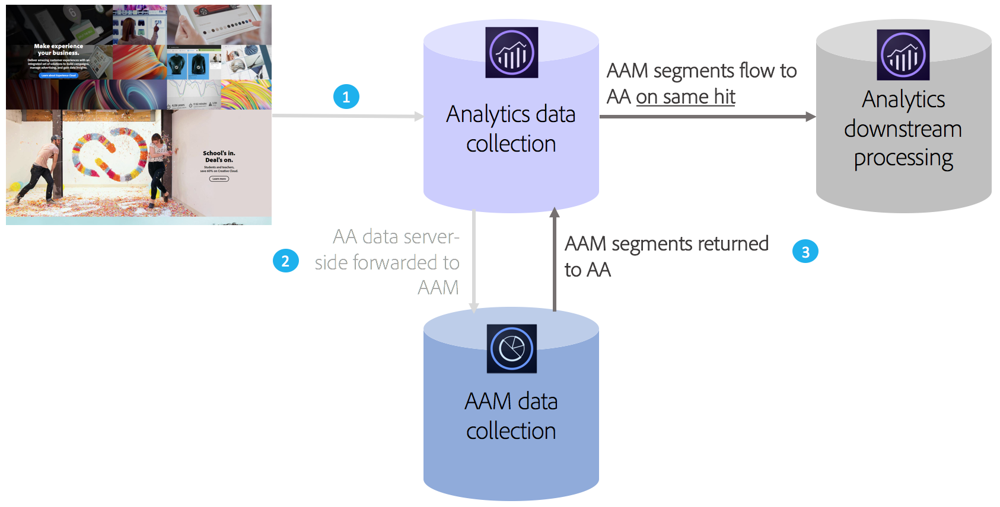

# Panoramica di Audience Analytics

Adobe Audience Manager (AAM) è una potente piattaforma di gestione dei dati che consente di creare profili di pubblico univoci da integrazioni di dati di prime, seconda e terze parti. Per gli inserzionisti, questi profili di pubblico consentono di definire i segmenti più importanti da usare tra i canali digitali.

Con l’integrazione Audience Analytics in atto, puoi incorporare dati AAM sul pubblico quali informazioni demografiche (ad esempio, genere o livello di reddito), informazioni psicografiche (ad esempio, interessi e hobby), dati CRM e dati di ad impression in qualsiasi flusso di lavoro di Analytics.

## Vantaggi chiave {#section_94816D17283349E0BA28521BE55BB868}

L’integrazione di Audience Analytics offre i seguenti vantaggi principali:

* Si tratta della prima integrazione prodotta tra una piattaforma di gestione dati (DMP) e un motore di analisi nel marketplace.
* I segmenti vengono condivisi da AAM ad Analytics in tempo reale per informare l’individuazione del pubblico, la segmentazione e l’ottimizzazione.
* Tutti i segmenti AAM sono condivisi per impostazione predefinita e arricchiscono completamente i profili dei clienti in Analytics.
* Gli amministratori della soluzione possono abilitare l&#39;integrazione tramite l&#39;interfaccia utente, con minime modifiche del codice richieste.
* Vengono condivisi solo i segmenti che aderiscono ai controlli di esportazione dei dati di Audience Manager.

## Come funziona {#section_CECDF5A0FEC64264B206EFEF54F19EF2}

1. Ogni volta che un visitatore accede alle tue proprietà digitali, gli hit vengono raccolti e inviati ad Analytics.
1. Con [inoltro lato server](/help/admin/admin/c-server-side-forwarding/ssf.md), ogni hit ricevuto da Analytics viene inviato automaticamente a AAM in tempo reale.
1. Tramite l’integrazione di Audience Analytics, per ogni hit, l’iscrizione al pubblico di un visitatore viene cercata in AAM e viene restituito un elenco di ID segmento ad Analytics per l’elaborazione in tempo reale.

Poiché AAM segmenti vengono inseriti sullo stesso hit, puoi essere sicuro che tutti i dati disponibili in AAM su un visitatore non verranno persi e che saranno aggiornati per quell’hit. Ciò è superiore a un plug-in AppMeasurement perché un plug-in può rendere tali segmenti disponibili solo sull&#39;hit successiva (e non sulla hit corrente).

Inoltre, classifichiamo automaticamente gli ID del segmento AAM in base ai loro nomi descrittivi, in modo da non dover cercare gli ID alfanumerici nei rapporti di Analytics.

## Prerequisiti {#section_A345DC31F7D44EAE9DC1AB53E824C0CC}

Assicurati che vi siano i seguenti prerequisiti:

* Sei cliente di Audience Manager e Adobe Analytics.
* Sei un amministratore di Audience Manager.
* Stai utilizzando il servizio Identity v1.5 o successivo.
* Le suite di rapporti AAM e Adobe Analytics sono [mappate nella stessa organizzazione di Experienci Cloud](https://experienceleague.adobe.com/docs/core-services/interface/about-core-services/report-suite-mapping.html).
* Utilizza [inoltro lato server](/help/admin/admin/c-server-side-forwarding/ssf.md) e hai implementato il modulo [Gestione dell&#39;audience](https://experienceleague.adobe.com/docs/audience-manager/user-guide/implementation-integration-guides/integration-other-solutions/audience-management-module.html) (nessun codice DIL) - AppMeasurement 1.5 o successivo.

Questi prerequisiti sono descritti nel [Flusso di lavoro di Audience Analytics](/help/integrate/c-audience-analytics/c-workflow/audiences-workflow.md).
