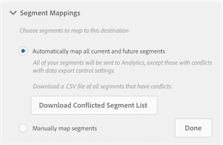

# Domande frequenti

Risposte alle domande che potresti avere durante l'implementazione di Audience Analytics.

## Domande frequenti legali {#section_B51CFC961C0B45A2BE5F4A4404620764}

<table id="table_22037CCB516C4231BF5820004FBB351A"> 
 <tbody> 
  <tr> 
   <td colname="col1"> <b>D: Come posso sapere se dispongo di dati personali (PII, Personally Identifiable Information) nei miei dati Analytics? E se sì, per cosa li uso?</b> </td> 
   <td colname="col2"> 
    <ul id="ul_71E0ECD5981D4B65BCDA065BE07A43AA"> 
     <li id="li_F8FF61A4D7B54BA39DAA6F28DB51D749">Se hai indirizzi e-mail e simili in un prop o eVar, può essere utile usare funzioni hash per dati durante la raccolta. </li> 
     <li id="li_57A8B4C7BB784FFCBC1DC363B35D9FF7">If your country considers IP address to be PII, <a href="https://marketing.adobe.com/resources/help/en_US/reference/exclude_IP.html" format="html" scope="external"> turn on IP obfuscation </a>. </li> 
     <li id="li_C7AA02B831AE47A59E783623126A7789">Parla con il tuo amministratore di Analytics per vedere quali dati stai raccogliendo. </li> 
     <li id="li_F6AAE868141E486AB8CAB291BD8EDB71">Parla con il tuo ufficio legale per capire che cosa è considerato PII. </li> 
    </ul> </td> 
  </tr> 
  <tr> 
   <td colname="col1"> <b>D: Come faccio a sapere se le mie suite di rapporti eseguono la personalizzazione in sito o targeting offsite/onsite?</b> </td> 
   <td colname="col2"> 
    <ul id="ul_F0984CEF80DB4B589716BC55549E32B8"> 
     <li id="li_9BC3819784A9408F846D60FF0F20AAF9">Ciò non si applica all'invio di dati di Adobe Analytics ad Adobe Audience Manager. </li> 
     <li id="li_050A1BF9978E436895B5C7E33A82527D">Chiedetevi: Condividi un segmento condiviso con Analytics con una dimensione MCA in Experience Cloud? </li> 
     <li id="li_C52D969681B94F4AAA18FDEB21EC5B49">Stai esportando (ad esempio tramite feed di dati) in un sistema di Business Intelligence (BI) usato a tale fine? </li> 
    </ul> </td> 
  </tr> 
 </tbody> 
</table>

## Domande frequenti specifiche per AAM {#section_6BDF746BA6464359A6A89A64EB025D12}

<table id="table_15B44592161240BDA79F3B020EA9CC9D"> 
 <tbody> 
  <tr> 
   <td colname="col1"> 
<b>D: Come si crea una destinazione Analytics in Audience Manager?</b> 
 </td> 
   <td colname="col2"> Consultate <a href="https://marketing.adobe.com/resources/help/en_US/aam/create-analytics-destination.html" format="html" scope="external"> Configurare una destinazione Analytics in AAM </a>. </td> 
  </tr> 
  <tr> 
   <td colname="col1"> 
<b>D: Dopo aver creato e salvato una destinazione Analytics, quanto tempo ci vorrà fino alla visualizzazione dei dati nelle suite di rapporti selezionate?</b> 
 </td> 
   <td colname="col2"> 
Potrebbero essere necessarie diverse ore per compilare le suite di rapporti con nuovi dati. 
 </td> 
  </tr> 
  <tr> 
   <td colname="col1"> 
<b>D: Ho creato una nuova destinazione Analytics, ma non la vedo nella sezione Mappature di destinazione dei segmenti disponibili. Dove è andata quella destinazione o come la trovo?</b> 
 </td> 
   <td colname="col2"> 
Una destinazione Analytics scompare dalla sezione Mappature di destinazione di un segmento quando selezionate l'opzione  Mappa automaticamente tutti i segmenti correnti e futuri  in Mappature  segmenti . 
 
 
 
Per evitare questa situazione, seleziona Mappatura  manuale dei segmenti  invece dell’opzione automatica. 
 </td> 
  </tr> 
  <tr> 
   <td colname="col1"> 
 <b>D: Questo mi darà tutte le informazioni da AAM, in Analytics?</b> 
 </td> 
   <td colname="col2"> 
No, solo i dati relativi alle persone che arrivano sul tuo sito durante o dopo l'abilitazione di Audience Manager Audiences e durante/dopo la qualifica del segmento. 
 </td> 
  </tr> 
  <tr> 
   <td colname="col1"> 
 <b>D: Mi darà un'audience per segmento totalmente indirizzabile?</b> 
 </td> 
   <td colname="col2"> 
Non esattamente. Ti dirà il numero di visitatori in quel segmento che sono arrivati al tuo sito durante o dopo la qualifica del segmento. 
 </td> 
  </tr> 
  <tr> 
   <td colname="col1"> 
 <b>D: In cosa si differenzia dalla destinazione del cookie legacy in Analytics?</b> 
 </td> 
   <td colname="col2"> 
I segmenti sono qualificati e restituiti in tempo reale, sullo stesso hit. 
 
I nomi descrittivi vengono visualizzati automaticamente. 
 </td> 
  </tr> 
  <tr> 
   <td colname="col1"> 
<b>D: E se alcune delle mie suite di rapporti avessero dati personali e altri no?</b> 
 </td> 
   <td colname="col2"> 
Suggerimento: Creare due destinazioni: aggiungere le suite di rapporti per i dati personali a una destinazione e le suite di rapporti per i dati non personali all'altra. 
 </td> 
  </tr> 
 </tbody> 
</table>

## Domande frequenti specifiche per Analytics {#section_67BFB1B1E48D4113A38B075C020931BA}

<table id="table_19AEAE0A3575423CB4F5F164DB5626D5"> 
 <tbody> 
  <tr> 
   <td colname="col1"> 
<b>D: Questa integrazione apparterrà come dimensione o segmento in Analytics?</b> 
 </td> 
   <td colname="col2"> 
Come dimensioni: ID audience e nome audience. 
 </td> 
  </tr> 
  <tr> 
   <td colname="col1"> 
<b>D: Dove posso usare queste dimensioni in Analytics?</b> 
 </td> 
   <td colname="col2"> 
Quasi ovunque; vengono trattati come qualsiasi altra dimensione raccolta in Analytics. Esistono due eccezioni: per il momento, i dati non sono disponibili in Workbench dati o Livestream. 
 </td> 
  </tr> 
  <tr> 
   <td colname="col1"> 
<b>D: Perché non visualizzo i dati provenienti da Analytics?</b> 
 </td> 
   <td colname="col2"> 
Probabilmente hai dei controlli di privacy AAM in conflitto tra l'origine dati e la destinazione. 
 </td> 
  </tr> 
  <tr> 
   <td colname="col1"> 
<b>D: Perché alcuni dei miei segmenti mancano in Analytics, anche se ho scelto di inviare tutti i segmenti?</b> 
 </td> 
   <td colname="col2"> 
    <ul id="ul_B8938FD08C6F4F2387EDADDEF8089319"> 
     <li id="li_50A9BDF612304062913370F16BC882EF">I controlli di esportazione dei dati AAM sulla destinazione e sulle origini dati dei segmenti potrebbero essere in conflitto, impedendo l'invio di alcuni segmenti. </li> 
     <li id="li_AF5D6F883D6F4D3192E0BF23CF12ADEA">Se utilizzi caratteristiche di dati di terze parti nei tuoi segmenti, questi segmenti non possono essere condivisi con destinazioni (una serie di suite di rapporti) contenenti dati personali. </li> 
    </ul> </td> 
  </tr> 
  <tr> 
   <td colname="col1"> 
<b>D: Perché nel mio rapporto di Analytics viene visualizzato il limite di pubblico raggiunto? (Nota: questo verrà anche rappresentato come ID pubblico = -1 e "::max_audiences_Exceder::" in Data Warehouse)</b> 
 </td> 
   <td colname="col2"> 
Per impostazione predefinita, l'integrazione di Audience Analytics per AAM invia ad Analytics tutti i segmenti per i quali un visitatore si qualifica, in base all'hit. Se un visitatore appartiene a più di 150 segmenti AAM su un singolo hit, i <b>150 segmenti</b> qualificati più di recente vengono inviati ad Analytics, mentre il resto dell'elenco viene troncato. 
 
Viene inviato un flag aggiuntivo ad Analytics per indicare che l’elenco dei segmenti è stato troncato e viene visualizzato come "Limite pubblico raggiunto" nella dimensione Nome pubblico e come "-1" nella dimensione ID pubblico. 
 
Anche se è improbabile che un visitatore sia idoneo per più di 150 segmenti su un particolare hit, potrebbe verificarsi una piccola percentuale del tempo. Se nei rapporti si verifica il "limite di audience raggiunto", avete due opzioni: 
 
    <ul id="ul_8E290B2E32DC49738F6FD00CB0CE2BBB"> 
     <li id="li_12F498981EA949B5BCBD40ECC954C339"><b>Opzione 1</b>: Continua a consentire il funzionamento dell’integrazione nello stato out-of-the-box, inviando i 150 segmenti qualificati più di recente per un particolare visitatore. </li> 
     <li id="li_CA4D5747AA4A4452929097807B604959"><b>Opzione 2</b>: In AAM, scegli i 150 segmenti più importanti per la tua attività per l'integrazione. AAM controlla quindi i visitatori rispetto ai soli 150 segmenti. Lo svantaggio di questo approccio è che ricevi solo quei 150 segmenti tra tutti i visitatori. D'altro canto, l'approccio Opzione 1 può offrire segmenti illimitati grazie alla natura per hit dell'integrazione. </li> 
    </ul> </td> 
  </tr> 
  <tr> 
   <td colname="col1"> 
<b>D: Verranno fatturate ad Analytics ulteriori chiamate server per questa integrazione?</b> 
 </td> 
   <td colname="col2"> 
No. AAM Audiences è integrato nel server di hit di Analytics. Ciò non comporta chiamate server aggiuntive ad Analytics (primario o secondario). 
 </td> 
  </tr> 
 </tbody> 
</table>

## Domande frequenti sull'inoltro lato server (SSF) {#section_ADDE84ABCA0D4906B6235E92D185E0C6}

<table id="table_B7067B70FF85498896801F58D716202F"> 
 <tbody> 
  <tr> 
   <td colname="col1"> 
<b>D: Se ho implementato SSF legacy, devo anche andare ad Analytics Admin e attivare la suite di rapporti SSF?</b> 
 </td> 
   <td colname="col2"> 
Sì. Nella configurazione di destinazione AAM, verranno visualizzate solo le suite di rapporti che hanno SSF attivato. 
 </td> 
  </tr> 
  <tr> 
   <td colname="col1"> 
<b>D: Perché non posso attivare determinate suite di rapporti per SSF in Analytics Admin?</b> 
 </td> 
   <td colname="col2"> 
È possibile abilitare solo le suite mappate all’organizzazione Experience Cloud. 
 </td> 
  </tr> 
 </tbody> 
</table>

Per ulteriori domande frequenti su questo argomento, consultate Domande frequenti sull'inoltro lato [server](/help/admin/admin/c-server-side-forwarding/ssf-faq.md).

## Domande frequenti generiche {#section_E55410BBFB624AAFB87ADCF7F036DDA3}

<table id="table_1F7C0C785F9C472286A96F8C25E8440B"> 
 <tbody> 
  <tr> 
   <td colname="col1"> 
 <b>D: Perché i conteggi dei visitatori del segmento sono diversi tra Audience Manager e Analytics?</b> 
 </td> 
   <td colname="col2"> 
See <a href="../../integrate/c-audience-analytics/visitor-count-reconciliation.md#concept_03DD2B594C2B4D23907D5272DDFADFA0" format="dita" scope="local"> Visitor Count Differences </a>. 
 </td> 
  </tr> 
  <tr> 
   <td colname="col1"> 
<b>D: Qual è la differenza tra "audience" in AAM e "segmenti" in Analytics?</b> 
 </td> 
   <td colname="col2"> 
See <a href="../../integrate/c-audience-analytics/aam-analytics-segments.md#concept_AB72F76AFAF14F82A5BB17809925813B" format="dita" scope="local"> Understand Segments in Analytics and Audience Manager </a>. 
 
I tipi di pubblico AAM vengono inviati e condivisi come componenti "dimensione" da utilizzare in Analytics. Ad esempio, non vengono visualizzati come segmenti nel Generatore di segmenti, ma come dimensioni con cui è possibile creare segmenti. 
 </td> 
  </tr> 
  <tr> 
   <td colname="col1"> 
<b>D: Qual è la differenza tra gli attributi cliente e i dati cliente integrati da AAM?</b> 
 </td> 
   <td colname="col2"> 
Gli attributi del cliente non sono basati sul tempo; si applicano retroattivamente e vanno avanti. I dati integrati di AAM sono basati sul tempo e proseguono solo. Inoltre, Attributi del cliente è una tabella di ricerca per gli ID visitatore di Experience Cloud, mentre l'integrazione di AAM è costituita da dati uniti in ciascun hit per un visitatore. 
 </td> 
  </tr> 
  <tr> 
   <td colname="col1"> 
<b>D: Quali sono gli approcci legacy a questo problema, ad esempio la vecchia versione beta o le destinazioni di cookie del plug-in Consulting?</b> 
 </td> 
   <td colname="col2"> 
È consigliabile implementare la nuova integrazione e rimuovere le vecchie destinazioni. 
 </td> 
  </tr> 
 </tbody> 
</table>

