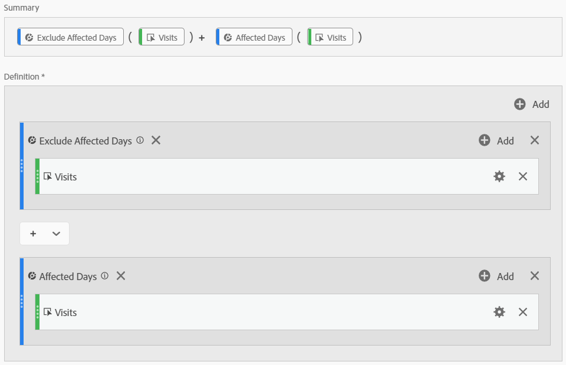
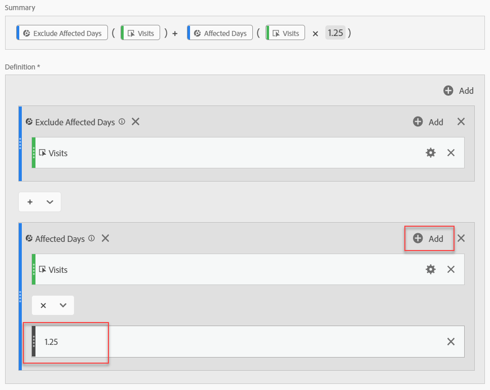
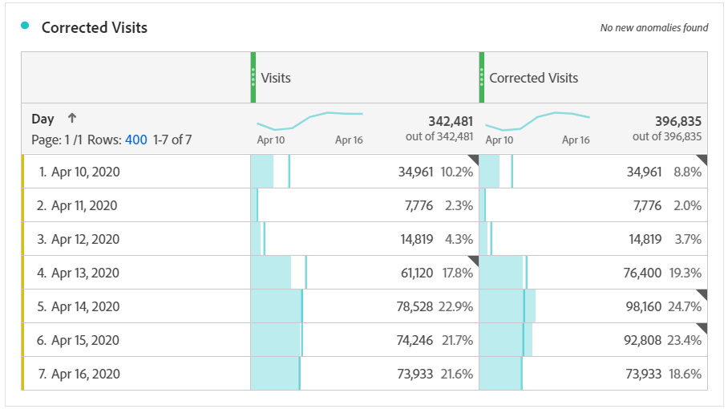
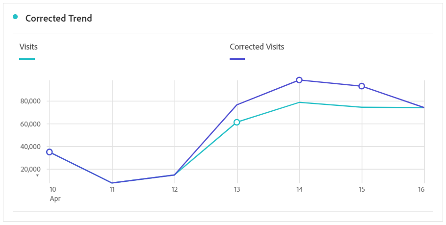

# Derivare i dati interessati dagli eventi

Se si dispone di dati [interessati da un evento](overview.md), è possibile utilizzare le metriche calcolate per derivare i valori stimati per la durata dell&#39;evento. Ad esempio, se si è verificato un evento che ha causato un calo del 25% dei dati, puoi utilizzarlo come moltiplicatore in una metrica calcolata.

Questi passaggi funzionano meglio quando comprendi l’impatto di un evento, sia dal punto di vista della segmentazione che del confronto delle date. Assicurati di seguire [Confrontare le date interessate da un evento con intervalli precedenti](compare-dates.md) e [Escludere date specifiche dall&#39;analisi](segments.md) prima di seguire questa pagina.

>[!NOTE]
>
>Questo approccio è una stima basata su una serie specifica di input e intervalli di date. Non sarà una soluzione completa per tutti i casi d’uso o per porzioni di dati. Inoltre, questo approccio richiede che l’intervallo di date interessato disponga di almeno 1 hit da cui calcolare.

Per creare una metrica calcolata stimata per il periodo di tempo interessato:

1. Creare due segmenti per &#39;Giorni interessati&#39; e &#39;Escludi giorni interessati&#39;, come descritto in [Escludere date specifiche nell&#39;analisi](segments.md).
2. Passa a **[!UICONTROL Components]** > **[!UICONTROL Calculated metrics]**.
3. Fai clic su **[!UICONTROL Add]**.
4. Trascina entrambi i segmenti sopra elencati nell’area di lavoro di definizione. Cambia l&#39;operatore tra di essi in un `+` per sommarli.
5. Aggiungi la metrica desiderata all’interno di entrambi i segmenti. Ad esempio, puoi utilizzare la metrica &quot;Visite&quot;.

   

6. Fare clic su **[!UICONTROL Add]** nell&#39;angolo superiore destro del contenitore &#39;Giorni interessati&#39;, quindi fare clic su **[!UICONTROL Static number]**. Impostare il numero statico sulla percentuale di offset dei dati, come indicato in [Confrontare le date interessate da un evento con intervalli precedenti](compare-dates.md). In questo esempio, l&#39;offset è 25% o 1,25.

   

7. Applica la metrica &quot;corretta&quot; una accanto all’altra in una tabella a forma libera con tendenze. Tutti i giorni al di fuori dell’evento riflettono il normale conteggio delle metriche, mentre tutti i giorni interessati utilizzano l’offset del moltiplicatore.

   

8. Visualizza i dati in una visualizzazione a linee per vedere l’effetto della metrica corretta.

   
