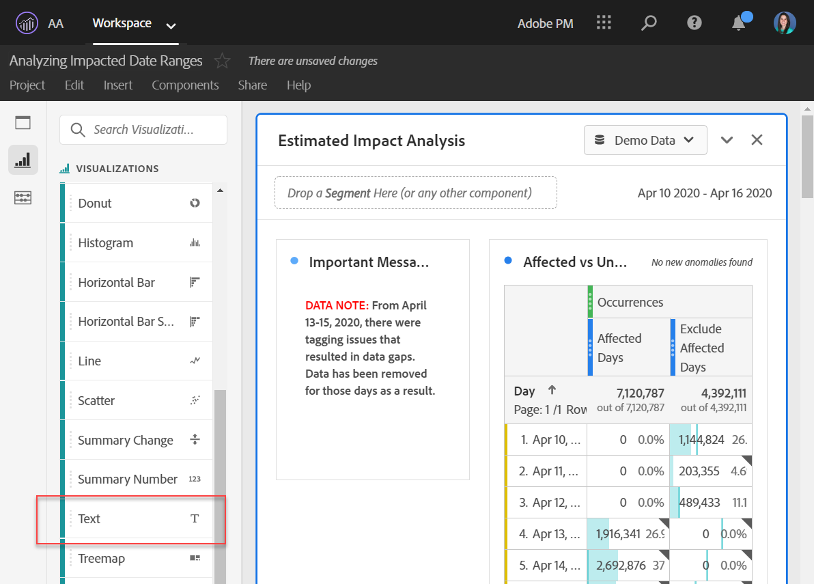

# Comunicazione dell’impatto dell’evento agli utenti

Se si dispone di dati [interessato da un evento](overview.md), è importante comunicare tale evento agli utenti dell’organizzazione.

* Sviluppa una liberatoria comune che puoi utilizzare nelle comunicazioni per coerenza
* Fornisci comunicazioni continue agli utenti di Analytics e alle principali parti interessate durante e dopo l’evento
* Posiziona un promemoria del calendario per le fasi cardine successive, ad esempio il mese o l’anno successivo. Questa comunicazione nel futuro consente di ricordare agli utenti che visualizzano i rapporti l’impatto nei rapporti mese-su-mese o anno-su-anno.

In Adobe Analytics, le sezioni seguenti mostrano diversi modi di comunicare con gli utenti dell’organizzazione. Per comunicare con gli utenti, puoi inoltre utilizzare altri metodi al di fuori di Adobe Analytics, ad esempio e-mail.

## Comunicazione attraverso descrizioni di pannelli o visualizzazioni

Se un progetto Workspace è condiviso tra gli utenti dell’organizzazione, puoi comunicare l’impatto di un evento tramite descrizioni di pannelli o visualizzazioni. Fai clic con il pulsante destro del mouse su un pannello o su un’intestazione di visualizzazione, quindi seleziona **[!UICONTROL Edit description]**.

## Comunicazione tramite visualizzazioni di testo

Puoi anche comunicare l’impatto di un evento tramite visualizzazioni di testo dedicate. Consulta [Visualizzazioni testo](/help/analyze/analysis-workspace/visualizations/text.md) nella guida utente Analizza.

## Aggiungere eventi di calendario personalizzati alle tendenze in Workspace

Per qualsiasi visualizzazione con tendenze in Workspace, puoi aggiungere una serie che rappresenta l’intervallo di date interessato.

1. Crea una metrica calcolata con il segmento &quot;Giorni interessati&quot; seguendo questa procedura [Escludere date specifiche nell’analisi](segments.md).
1. Aggiungi la metrica desiderata all’area di lavoro della metrica calcolata.

   

1. Aggiungi un titolo e una descrizione per informare gli utenti dell’impatto. Puoi anche assegnare a questa metrica un tag come annotazione del calendario, se lo desideri.

   

1. In una tabella a forma libera, aggiungi la dimensione &quot;Giorno&quot;. Aggiungi &quot;Visite&quot; e la metrica calcolata come colonne affiancate.

   

1. Fai clic sull’icona a forma di ingranaggio delle impostazioni di colonna per la metrica calcolata e abilita **[!UICONTROL Interpret zero as no value]**.

   

1. Aggiungi una visualizzazione Linee. I giorni interessati sono rappresentati con un colore diverso. Per ulteriori informazioni, gli utenti possono anche fare clic sull’icona &quot;Info&quot; nella metrica calcolata.

   

## Utilizzare un evento calendario in Reports &amp; Analytics

Se utilizzi Reports &amp; Analytics, puoi utilizzare un’ [evento calendario](/help/components/t-calendar-event.md) per evidenziare i giorni interessati in qualsiasi rapporto con tendenze. Questo metodo non si applica ad Analysis Workspace.

1. Passa a **[!UICONTROL Components]** > **[!UICONTROL All components]** > **[!UICONTROL Calendar events]**.
2. Inserisci il titolo, l’intervallo di date e il testo della nota desiderati.
3. Fai clic su **[!UICONTROL Save]** (Usa modello di attribuzione non predefinito).

