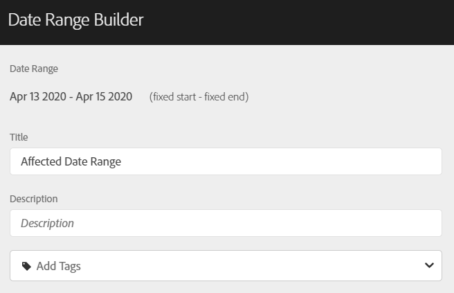
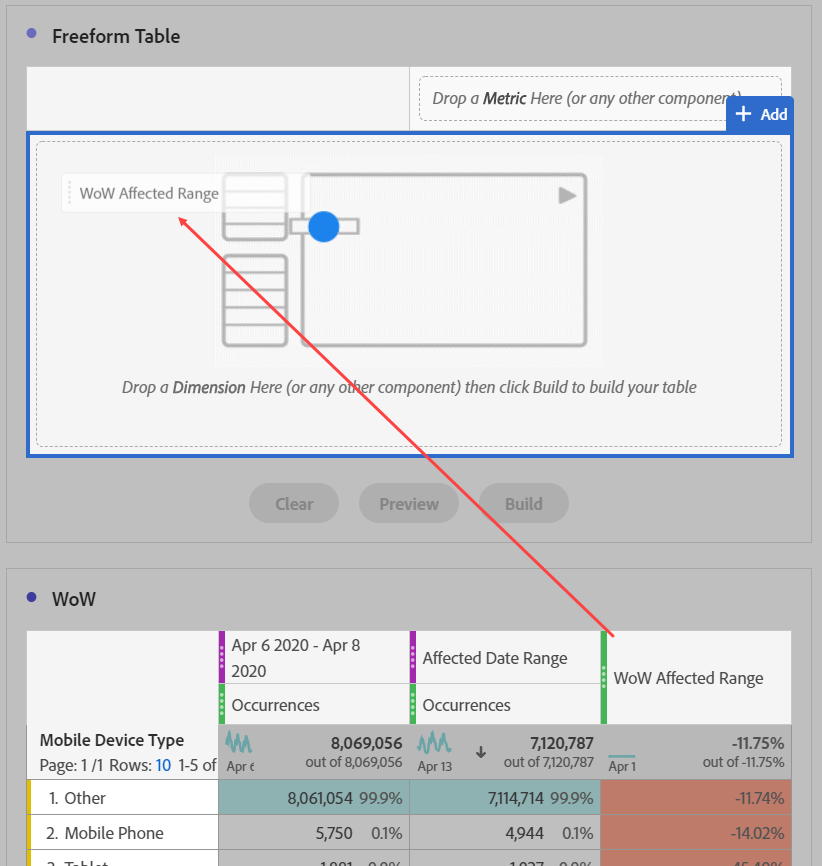

# Confrontare le date interessate da un evento con gli intervalli precedenti

Se i dati [sono influenzati da un evento](overview.md), è possibile osservare le tendenze storiche per misurarne l&#39;impatto. Questo confronto è utile per comprendere esattamente l’impatto di un evento sui dati, in modo da poter decidere se escludere i dati, aggiungere una nota ai rapporti o ignorarli.

## Creare un intervallo di date che includa l’evento

Create un intervallo di date che includa l&#39;evento per iniziare a esaminare l&#39;impatto di tale evento.

1. Passa a **[!UICONTROL Components]** > **[!UICONTROL Date ranges]**.
2. Fai clic su **[!UICONTROL Add]**.
3. Selezionate l’intervallo di date in cui si è verificato l’evento. Fai clic su **[!UICONTROL Save]**.

   

## Visualizzare le date dell&#39;evento e intervalli precedenti simili affiancati

È possibile confrontare qualsiasi metrica tra l&#39;intervallo di date dell&#39;evento e intervalli di date precedenti simili utilizzando una visualizzazione tabella a forma libera.

1. Apri un progetto Workspace e aggiungi la dimensione &quot;Giorno&quot; alla tabella a forma libera. Applica l’intervallo di date creato di recente impilato su una metrica, ad esempio &quot;Occorrenze&quot;.

   

2. Fare clic con il pulsante destro del mouse sull&#39;intervallo di date, quindi scegliere **[!UICONTROL Add time period column]** > **[!UICONTROL Custom date range to this date range]**.
   * Per un confronto settimana su settimana, selezionate l’intervallo dell’evento meno 7 giorni. Accertatevi che i giorni della settimana tra l’evento e questo intervallo di date siano allineati.
   * Per un confronto mese-su-mese, selezionate l&#39;intervallo dell&#39;evento dello scorso mese. Potete anche selezionare l&#39;intervallo dell&#39;evento meno 28 giorni se desiderate allineare i giorni della settimana.
   * Per un confronto su base annua, selezionate l’intervallo dell’evento dell’anno scorso.
3. Quando si seleziona l’intervallo di date desiderato, questi vengono aggiunti alla tabella a forma libera. Puoi fare clic con il pulsante destro del mouse e aggiungere tutti gli intervalli di date che desideri confrontare.

   

## Calcola le differenze di percentuale tra l&#39;evento e intervalli precedenti simili

Confronta gli elementi dimensionali tra l&#39;intervallo di date di un evento e intervalli di date precedenti simili utilizzando una visualizzazione tabella a forma libera. Questi passaggi illustrano un esempio di settimana su settimana che potete seguire.

1. Apri un progetto Workspace e aggiungi una dimensione **non temporale** alla tabella a forma libera. Ad esempio, puoi utilizzare la dimensione &#39;Tipo di dispositivo mobile&#39;. Applica l’intervallo di date creato di recente impilato su una metrica, ad esempio &quot;Occorrenze&quot;:

   

2. Fare clic con il pulsante destro del mouse sull&#39;intervallo di date, quindi scegliere **[!UICONTROL Compare time periods]** > **[!UICONTROL Custom date range to this date range]**. Selezionate l’intervallo dell’evento meno 7 giorni. Accertatevi che i giorni della settimana tra l’evento e questo intervallo di date siano allineati.

   

3. Rinominare la metrica risultante &quot;Percent Change&quot; in modo più specifico, ad esempio &quot;WoW Interesse Range&quot;. Fai clic sull&#39;icona info, quindi fai clic sulla matita di modifica per modificare il nome della metrica.

   

4. Ripetete i passaggi 3 e 4 per i confronti tra mese e anno su anno. È possibile eseguire questa azione nella stessa tabella o in tabelle separate.

## Analizzare gli intervalli di date di confronto affiancati come righe

Se desiderate analizzare ulteriormente le modifiche della percentuale di cui sopra, potete convertirle in righe.

1. Aggiungi una visualizzazione tabella a forma libera e abilita il generatore di tabelle. Questa azione consente di posizionare le metriche di modifica della percentuale nell&#39;ordine desiderato.
2. Tenete premuto `Ctrl` (Windows) o `Cmd` (Mac) e trascinate le metriche di modifica del 3% nelle righe della tabella, una alla volta.

   

3. Aggiungete il segmento &quot;Tutte le visite&quot; alla colonna della tabella ed eventuali altri segmenti desiderati.

   

4. Fai clic su **[!UICONTROL Build]**. Dalla tabella risultante, puoi visualizzare gli intervalli interessati rispetto alla settimana, al mese e all’anno precedenti per tutti i segmenti desiderati.

   
