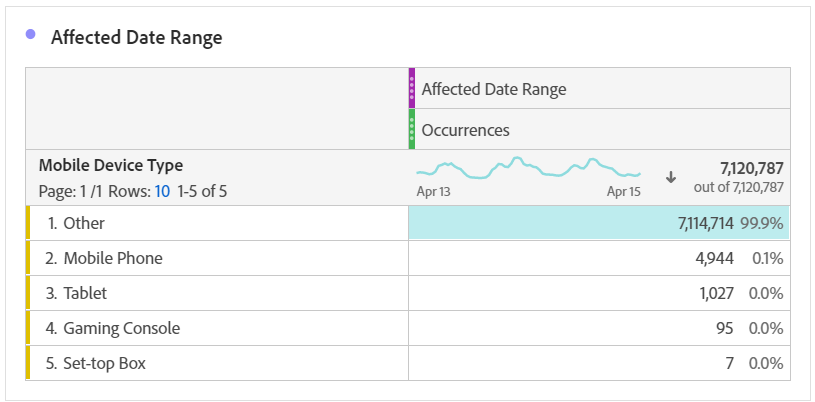

# Confrontare le date interessate da un evento con intervalli precedenti

Se i dati [sono interessati da un evento](overview.md), puoi esaminare le tendenze storiche per misurarne l&#39;impatto. Questo confronto è utile per comprendere l’impatto di un evento sui dati, in modo da poter decidere se escludere i dati, aggiungere una nota ai rapporti o ignorarli.

## Creare un intervallo di date che includa l’evento

Crea un intervallo di date che includa l’evento per iniziare a esplorarne l’impatto.

1. Passa a **[!UICONTROL Components]** > **[!UICONTROL Date ranges]**.
2. Fai clic su **[!UICONTROL Add]**.
3. Seleziona l’intervallo di date in cui si è verificato l’evento. Fai clic su **[!UICONTROL Save]**.

   

## Visualizza affiancati date evento e intervalli precedenti simili

Puoi confrontare qualsiasi metrica tra l’intervallo di date dell’evento e intervalli di date precedenti simili utilizzando una visualizzazione a forma libera.

1. Apri un progetto Workspace e aggiungi la dimensione &quot;Giorno&quot; alla tabella a forma libera. Applica l’intervallo di date creato di recente sovrapposto a una metrica, ad esempio &quot;Occorrenze&quot;.

   

2. Fare clic con il pulsante destro del mouse sull&#39;intervallo di date, quindi scegliere **[!UICONTROL Add time period column]** > **[!UICONTROL Custom date range to this date range]**.
   * Per un confronto settimana per settimana, seleziona l’intervallo dell’evento meno 7 giorni. Assicurati che i giorni della settimana tra l’evento e questo intervallo di date siano allineati.
   * Per un confronto mese-su-mese, seleziona l’intervallo dell’evento del mese scorso. Puoi anche selezionare l’intervallo dell’evento meno 28 giorni se desideri allineare i giorni della settimana.
   * Per un confronto su base annua, seleziona l’intervallo dell’evento dello scorso anno.
3. Quando selezioni l’intervallo di date desiderato, questo viene aggiunto alla tabella a forma libera. Puoi fare clic con il pulsante destro del mouse e aggiungere tutti gli intervalli di date che desideri confrontare.

   

## Calcola le differenze percentuali tra l’evento e intervalli precedenti simili

Confronta gli elementi dimensionali tra l’intervallo di date di un evento e intervalli di date precedenti simili utilizzando una visualizzazione a forma libera delle tabelle. Questi passaggi illustrano un esempio settimana su settimana che puoi seguire.

1. Apri un progetto Workspace e aggiungi una **dimensione non temporale** alla tabella a forma libera. Ad esempio, puoi utilizzare la dimensione &quot;Tipo di dispositivo mobile&quot;. Applica l’intervallo di date creato di recente sovrapposto a una metrica, ad esempio &quot;Occorrenze&quot;:

   

2. Fare clic con il pulsante destro del mouse sull&#39;intervallo di date, quindi scegliere **[!UICONTROL Compare time periods]** > **[!UICONTROL Custom date range to this date range]**. Seleziona l’intervallo dell’evento meno 7 giorni. Assicurati che i giorni della settimana tra l’evento e questo intervallo di date siano allineati.

   

3. Rinomina la metrica &quot;Percent Change&quot; risultante con un valore più specifico, ad esempio &quot;WoW Affected Range&quot;. Fai clic sull’icona delle informazioni, quindi fai clic sull’icona Modifica a forma di matita per modificare il nome della metrica.

   

4. Ripeti i passaggi 3 e 4 per confronti mese-su-mese e anno-su-anno. Puoi eseguire questa azione nella stessa tabella o in tabelle separate.

## Analizzare gli intervalli di date di confronto affiancati come righe

Se desideri analizzare ulteriormente le modifiche percentuali di cui sopra, puoi convertirle in righe.

1. Aggiungi una visualizzazione a forma libera e abilita il generatore di tabelle. Questa azione ti consente di inserire le metriche di variazione percentuale nell’ordine desiderato.
2. Tenere premuto `Ctrl` (Windows) o `Cmd` (Mac) e trascinare le metriche di modifica del 3% nelle righe della tabella, una alla volta.

   

3. Aggiungi il segmento &quot;Tutte le visite&quot; alla colonna della tabella ed eventuali altri segmenti desiderati.

   

4. Fai clic su **[!UICONTROL Build]**. Dalla tabella risultante, puoi visualizzare gli intervalli interessati rispetto alla settimana, al mese e all’anno precedenti per tutti i segmenti desiderati.

   
