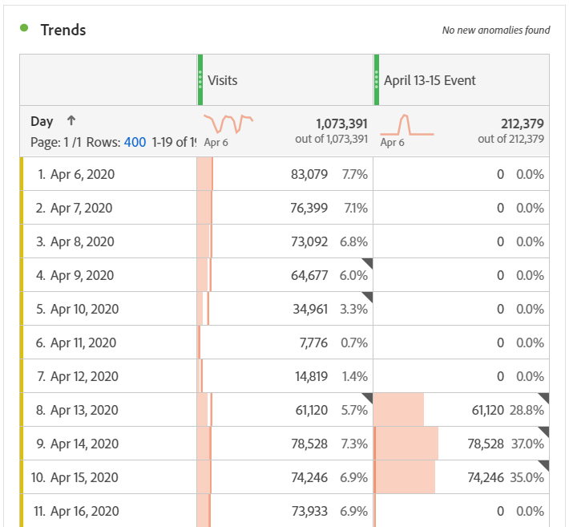
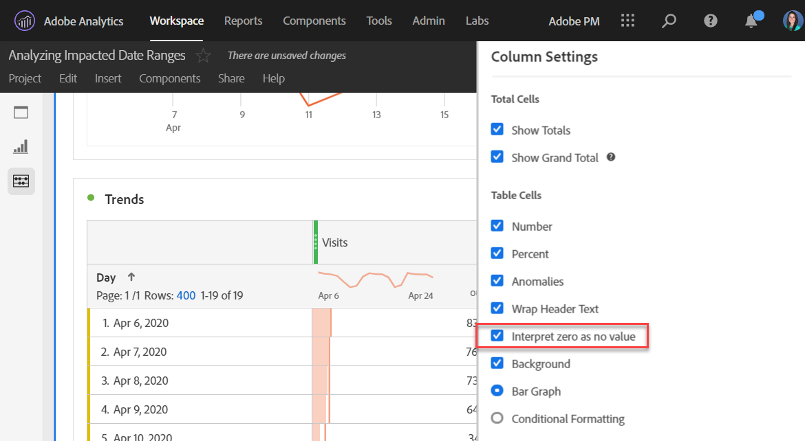

# Comunicare l’impatto agli utenti

Se i dati [sono influenzati da un evento](../event-impacted.md), è importante comunicare tale evento agli utenti nell&#39;organizzazione.

* Sviluppare una dichiarazione di non responsabilità comune da utilizzare nelle comunicazioni per garantire la coerenza
* Trasmissione in corso di comunicazioni agli utenti di Analytics e ai principali soggetti coinvolti durante e dopo l&#39;evento
* Inserite un promemoria del calendario per le tappe successive, ad esempio il mese o l&#39;anno successivo. Questa comunicazione in futuro aiuterà a ricordare agli utenti che visualizzano i rapporti l&#39;impatto dei rapporti su base mensile o annuale.

In Adobe Analytics, le sezioni seguenti mostrano diversi modi in cui puoi comunicare con gli utenti della tua organizzazione. Potete anche utilizzare altri metodi all&#39;esterno di Adobe Analytics, ad esempio e-mail, per comunicare con gli utenti.

## Comunicare attraverso le descrizioni dei pannelli o delle visualizzazioni

Se un progetto Workspace è condiviso tra gli utenti dell’organizzazione, è possibile comunicare l’impatto di un evento mediante le descrizioni dei pannelli o delle visualizzazioni. Fai clic con il pulsante destro del mouse su un pannello o un’intestazione di visualizzazione, quindi seleziona **[!UICONTROL Edit description]**.

## Comunicare attraverso le visualizzazioni di testo

Potete inoltre comunicare l&#39;impatto di un evento mediante visualizzazioni testuali dedicate. Consultate Visualizzazioni [di](/help/analyze/analysis-workspace/visualizations/text.md) testo nella guida utente Analisi.

## Aggiunta di eventi di calendario personalizzati alle tendenze in Workspace

Per qualsiasi visualizzazione con tendenze in Workspace, puoi aggiungere una serie che rappresenta l’intervallo di date interessato.

1. Crea una metrica calcolata con il segmento &quot;Giorni interessati&quot; seguendo [Escludi date specifiche nell&#39;analisi](/help/components/c-segmentation/use-cases/exclude-date-range.md).
1. Aggiungi la metrica desiderata al quadro della metrica calcolata.

   

1. Aggiungete un titolo e una descrizione per informare gli utenti dell’impatto. Se necessario, potete anche assegnare un tag a questa metrica come annotazione del calendario.

   

1. In una tabella a forma libera, aggiungi la dimensione &quot;Giorno&quot;. Aggiungi &quot;Visite&quot; e la metrica calcolata come colonne affiancate.

   

1. Fai clic sull’icona a forma di ingranaggio delle impostazioni della colonna per la metrica calcolata e abilita **[!UICONTROL Interpret zero as no value]**.

   

1. Aggiungere una visualizzazione Linea. I giorni interessati sono rappresentati con un colore diverso. Per ulteriori informazioni, gli utenti possono anche fare clic sull&#39;icona &quot;Informazioni&quot; nella metrica calcolata.

   

## Utilizzo di un evento del calendario in Reporting e analisi

Se utilizzate Reporting e analisi, potete utilizzare un evento [del](/help/components/t-calendar-event.md) calendario per evidenziare i giorni interessati in qualsiasi rapporto con tendenze. Questo metodo non si applica ad Analysis Workspace.

1. Passa a **[!UICONTROL Components]** > **[!UICONTROL Calendar events]**.
2. Inserite il titolo, l’intervallo di date e il testo della nota desiderati.
3. Fai clic su **[!UICONTROL Save]**.

