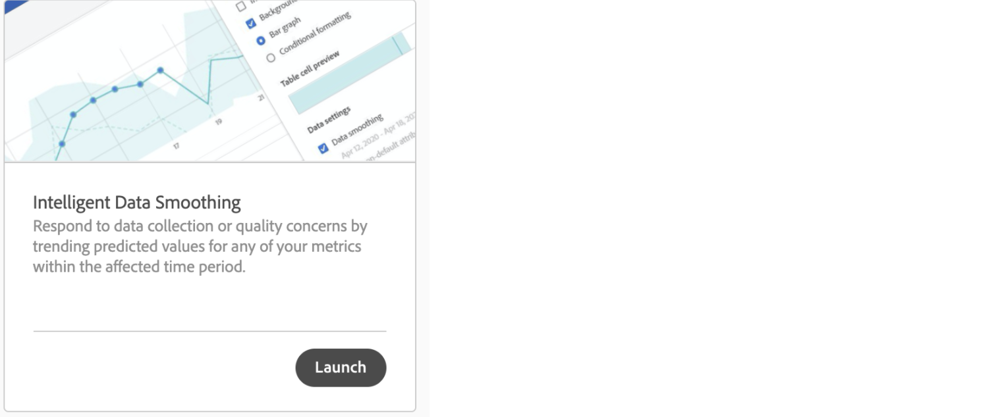

# Uniformità dei dati intelligente

In rare occasioni, alcuni fattori possono influire sulla qualità dei dati. Il traffico dei bot, le modifiche di implementazione o le interruzioni del servizio possono influire sull’integrità dei dati raccolti. Inoltre, complicano l’analisi su come l’evento possa aver influenzato la completezza dei dati.

Intelligent Data Smoothing è un prototipo in [Analytics Labs](/help/analyze/tech-previews/overview.md) che può aiutare a completare questa visualizzazione analizzando le tendenze della cronologia per prevedere il valore di qualsiasi metrica nel periodo di tempo interessato. Il prototipo applica algoritmi avanzati di apprendimento automatico per tracciare i valori previsti per le metriche nel periodo di tempo analizzato.

## Ottimizzazione intelligente dei dati

1. Passa a Adobe Analytics Labs:
   
1. Lanciare il prototipo Intelligent Data Smoothing.
   
1. Aggiungi la metrica da analizzare alla tabella a forma libera. Il prototipo funziona solo con una granularità giornaliera, quindi accertati che la dimensione nella tabella sia Day (Giorno).
   
1. Scegli un intervallo di date più ampio della finestra dell’evento, ma accertati che includa l’evento.
   
1. Fai clic sull’icona a forma di ingranaggio per la metrica nella tabella a forma libera.
   
1. In [!UICONTROL Data Settings], seleziona l’opzione [!UICONTROL Data smoothing].
   
1. Seleziona l’intervallo di date/date corrispondente all’evento e fai clic su [!UICONTROL Apply].
Assicurati che l’intervallo di dati per l’uniformità dei dati sia un sottoinsieme dell’intervallo di date selezionato per il pannello. La metrica nella tabella e nel grafico viene sostituita dai valori previsti.
   