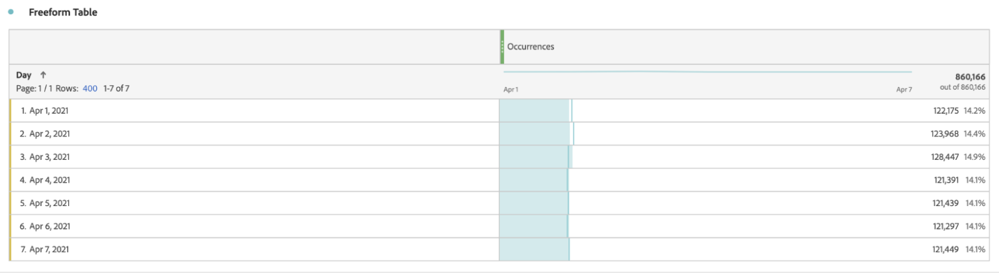
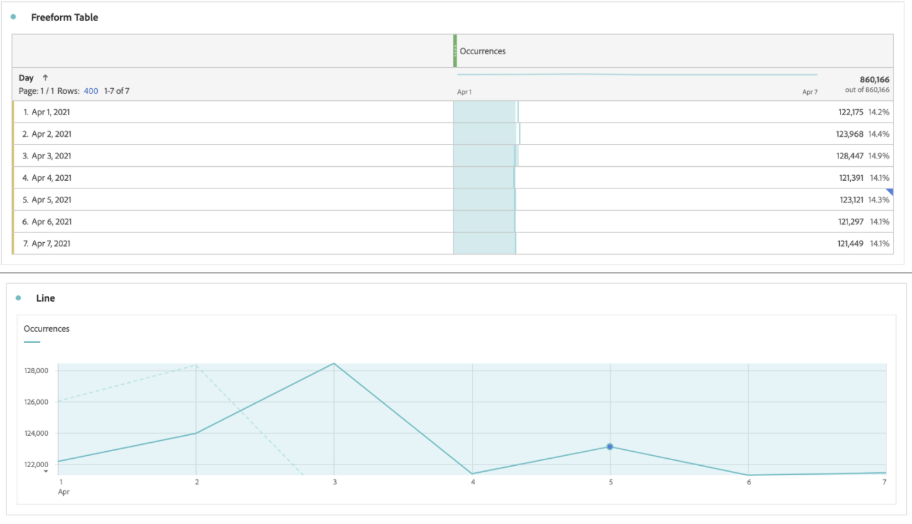

# Uniformità intelligente dei dati

In rare occasioni, alcuni fattori possono influire sulla qualità dei dati. Il traffico dei bot, le modifiche di implementazione o le interruzioni del servizio possono influire sull’integrità dei dati raccolti. Complicano inoltre l’analisi di come l’evento possa aver influenzato la completezza dei dati.

L&#39;uniformità intelligente dei dati è un prototipo in [Analytics Labs](/help/analyze/labs.md) che può aiutare a completare questa visualizzazione analizzando le tendenze della cronologia per prevedere il valore di qualsiasi metrica entro il periodo di tempo interessato. Il prototipo applica algoritmi avanzati di apprendimento automatico per tracciare i valori previsti per le metriche nel periodo di tempo analizzato.

## Eseguire l’uniformità intelligente dei dati

1. Passa ad Adobe Analytics Labs:
   
1. Avvia il prototipo di uniformità intelligente dei dati.
   
1. Aggiungi la metrica da analizzare alla tabella a forma libera. Il prototipo funziona solo con granularità giornaliera, quindi assicurati che la dimensione nella tabella sia Giorno.
   
1. Scegli un intervallo di date più ampio della finestra dell’evento, ma assicurati che includa l’evento.
   
1. Fai clic sull’icona a forma di ingranaggio per la metrica nella tabella a forma libera.
   
1. In [!UICONTROL Data Settings], selezionare l&#39;opzione [!UICONTROL Data smoothing].
   
1. Selezionare la data/intervallo di date corrispondente all&#39;evento e fare clic su [!UICONTROL Apply].
Assicurati che l’intervallo di dati per l’uniformità dei dati sia un sottoinsieme dell’intervallo di date selezionato per il pannello. La metrica nella tabella e nel grafico viene sostituita dai valori previsti.
   
