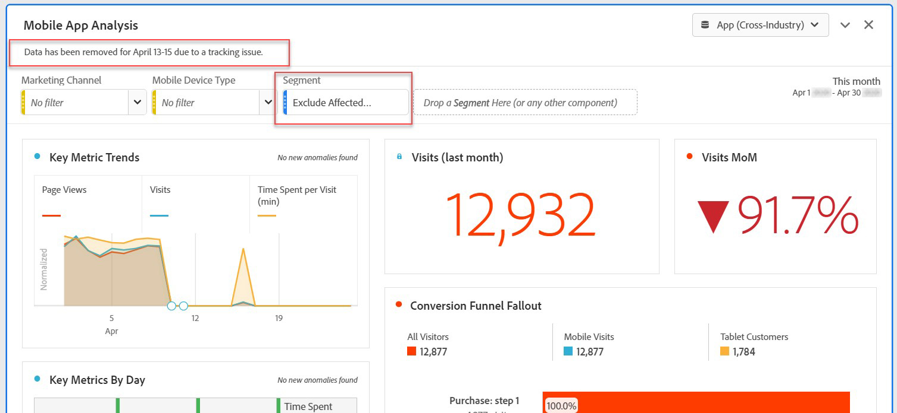

# Esclusione di date specifiche nell’analisi

Se un evento [ha un impatto](overview.md)sui dati, puoi utilizzare un segmento per escludere qualsiasi intervallo di date che non desideri includere nei rapporti. La segmentazione delle date interessate dall&#39;evento può aiutare a impedire all&#39;organizzazione di prendere decisioni sui dati parziali.

## Isolare i giorni interessati

Crea un segmento che isola l’intervallo di giorni o date interessato. Questo segmento è utile se desiderate concentrarvi solo sui giorni problematici per visualizzare ulteriori informazioni sul suo impatto.

1. Aprite il generatore di segmenti scegliendo **[!UICONTROL Components]** > **[!UICONTROL Segments]**, quindi fate clic su **[!UICONTROL Add]**.
2. Trascina la dimensione &quot;Giorno&quot; nell’area di lavoro della definizione e impostala come giorno da isolare.
3. Ripetete il passaggio riportato sopra ogni giorno che desiderate isolare nel rapporto.

Adobe consiglia di utilizzare i componenti dimensione arancione e non i componenti intervallo date viola. Se utilizzi componenti intervallo date viola, sostituiscono l’intervallo di calendario del progetto:

## Escludi giorni interessati

Crea un segmento che esclude il giorno o l&#39;intervallo di date interessati. Questo segmento è utile se desiderate escludere i giorni in cui si sono verificati problemi per ridurre al minimo l&#39;impatto sul reporting complessivo.

1. Aprite il generatore di segmenti scegliendo **[!UICONTROL Components]** > **[!UICONTROL Segments]**, quindi fate clic su **[!UICONTROL Add]**.
2. Nella parte superiore destra del quadro di definizione del segmento, fai clic su **[!UICONTROL Options]** > **[!UICONTROL Exclude]**.
3. Trascina la dimensione &quot;Giorno&quot; nell’area di lavoro della definizione e impostala come giorno da rimuovere.
4. Ripetete il passaggio riportato sopra ogni giorno che desiderate rimuovere nel rapporto.

## Utilizzare questi segmenti nei report

Dopo aver creato il segmento di esclusione, puoi utilizzarlo esattamente come faresti con gli altri segmenti.

### Confronto di segmenti in un report con tendenze

Puoi applicare sia il segmento &quot;Giorni interessati&quot; che il segmento &quot;Escludi giorni interessati&quot; in un rapporto per confrontarli affiancati. Trascina entrambi i segmenti sopra o sotto una metrica per confrontarli:

Se non si desidera visualizzare zeri nella tabella o nelle visualizzazioni (con conseguente diminuzione), attivare **[!UICONTROL Interpret zero as no value]** le impostazioni delle colonne.

Se non si desidera visualizzare zeri nella tabella o nelle visualizzazioni (con conseguente diminuzione), attivare **[!UICONTROL Interpret zero as no value]** le impostazioni delle colonne.

### Applicazione del segmento di esclusione a un progetto

Puoi applicare il segmento &quot;Escludi giorni interessati&quot; a un progetto Workspace. Trascina il segmento di esclusione nella sezione Area di lavoro, con l’etichetta *Rilascia qui* un segmento.

>[!TIP]
>
>Includi una nota intorno ai dati esclusi nella descrizione del pannello per aiutare gli utenti che visualizzano il rapporto. Fate clic con il pulsante destro del mouse sul titolo di un pannello, quindi fate clic **[!UICONTROL Edit description]**.

### Utilizzare il segmento di esclusione in una suite di rapporti virtuale

Puoi utilizzare il segmento in una suite [di rapporti](/help/components/vrs/vrs-about.md) virtuale per escludere i dati in modo più conveniente. Questa opzione è ideale in quanto non è necessario ricordare di applicare il segmento per ogni rapporto che include l&#39;intervallo di date interessato. Se già usi suite di rapporti virtuali come origine principale di dati, puoi aggiungere il segmento a una VRS esistente.

1. Passa a **[!UICONTROL Components]** > **[!UICONTROL Virtual report suites]**.
2. Fai clic su **[!UICONTROL Add]**.
3. Inserite il nome e la descrizione desiderati per la suite di rapporti virtuali.
4. Trascina il segmento di esclusione nell’area etichettata **[!UICONTROL Add segment]**.
5. Fate clic **[!UICONTROL Continue]** in alto a destra, quindi fate clic su **[!UICONTROL Save]**.

