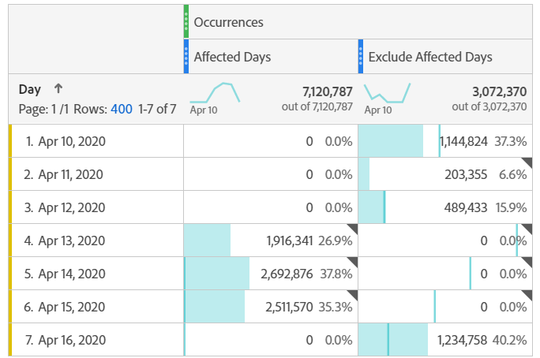

# Esclusione di date specifiche nell’analisi

Se si dispone di dati [interessati da un evento](overview.md), è possibile utilizzare un segmento per escludere qualsiasi intervallo di date che non si desidera includere nei report. La segmentazione delle date interessate dagli eventi può aiutare a evitare che l’organizzazione prenda decisioni su dati parziali.

## Isolare giorni interessati {#isolate}

Crea un segmento che isola il giorno o l’intervallo di date interessato. Questo segmento è utile se desideri concentrarti solo sui giorni problematici per visualizzare ulteriori informazioni sul suo impatto.

1. Apri il Generatore di segmenti da **[!UICONTROL Components]** > **[!UICONTROL Segments]**, quindi fai clic su **[!UICONTROL Add]**.
2. Trascina la dimensione &quot;Giorno&quot; nell’area di lavoro delle definizioni e impostala in modo che corrisponda al giorno da isolare.
3. Ripeti il passaggio precedente per ogni giorno che desideri isolare nel rapporto.

>[!TIP]
>
>Per modificare l&#39;istruzione OR in un&#39;istruzione AND, fare clic sulla freccia in giù accanto a OR e selezionare AND.

L’Adobe consiglia di utilizzare i componenti dimensione arancione e non i componenti intervallo date viola. Se utilizzi componenti di intervallo date viola, questi sovrascrivono l’intervallo di calendario del progetto:

## Escludi giorni interessati {#exclude}

Crea un segmento che escluda il giorno o l’intervallo di date interessato. Questo segmento è utile se desideri escludere i giorni in cui si sono verificati problemi al fine di ridurre al minimo l’impatto sul reporting complessivo.

1. Apri il Generatore di segmenti da **[!UICONTROL Components]** > **[!UICONTROL Segments]**, quindi fai clic su **[!UICONTROL Add]**.
2. Nell&#39;angolo superiore destro dell&#39;area di lavoro di definizione del segmento fare clic su **[!UICONTROL Options]** > **[!UICONTROL Exclude]**.
3. Trascina la dimensione &quot;Giorno&quot; nell’area di lavoro delle definizioni e impostala in modo che corrisponda al giorno da rimuovere.
4. Ripeti il passaggio precedente per ogni giorno che desideri rimuovere nel rapporto.

## Utilizzare questi segmenti nei rapporti

Una volta creato il segmento di esclusione, puoi utilizzarlo esattamente come si farebbe con altri segmenti.

### Confrontare segmenti in un rapporto con tendenze {#compare}

Puoi applicare in un rapporto sia il segmento &quot;Giorni interessati&quot; che il segmento &quot;Escludi giorni interessati&quot; per confrontarli uno accanto all’altro. Trascina entrambi i segmenti sopra o sotto una metrica per confrontarli:

Se non desideri visualizzare gli zeri nella tabella o nelle visualizzazioni (causando un calo), abilita **[!UICONTROL Interpret zero as no value]** nelle impostazioni della colonna.

Se non desideri visualizzare gli zeri nella tabella o nelle visualizzazioni (causando un calo), abilita **[!UICONTROL Interpret zero as no value]** nelle impostazioni della colonna.

### Applicare il segmento di esclusione a un progetto {#apply}

Puoi applicare il segmento &quot;Escludi giorni interessati&quot; a un progetto Workspace. Trascina il segmento da escludere nella sezione dell&#39;area di lavoro di Workspace con l&#39;etichetta *Rilascia qui un segmento*.

>[!TIP]
>
>Includi una nota sui dati esclusi nella descrizione del pannello per facilitare la visualizzazione del rapporto. Fare clic con il pulsante destro del mouse sul titolo di un pannello, quindi scegliere **[!UICONTROL Edit description]**.

### Utilizzare il segmento di esclusione in una suite di rapporti virtuale {#use-vrs}

Puoi utilizzare il segmento in una [suite di rapporti virtuale](/help/components/vrs/vrs-about.md) per escludere i dati in modo più comodo. Questa opzione è ideale in quanto non è necessario ricordarsi di applicare il segmento per ogni rapporto che include l’intervallo di date interessato. Se utilizzi già suite di rapporti virtuali come origine di dati principale, puoi aggiungere il segmento a una suite di rapporti virtuale esistente.

1. Passa a **[!UICONTROL Components]** > **[!UICONTROL Virtual report suites]**.
2. Fai clic su **[!UICONTROL Add]**.
3. Immetti il nome e la descrizione desiderati per la suite di rapporti virtuali.
4. Trascinare il segmento di esclusione nell&#39;area con etichetta **[!UICONTROL Add segment]**.
5. Fai clic su **[!UICONTROL Continue]** in alto a destra, quindi fai clic su **[!UICONTROL Save]**.

