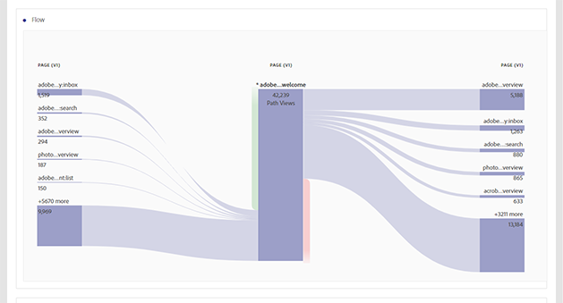

# Rapporti sui comportamenti

I rapporti sul comportamento mostrano informazioni su come gli utenti interagiscono con il tuo sito.

Questa pagina presuppone che l'utente abbia una conoscenza di base sull'utilizzo di Analysis Workspace. See [Create a basic report in Analysis Workspace for Google Analytics users](create-report.md) if you are not yet familiar with the tool in Adobe Analytics.

## Flusso di comportamento

Il rapporto di flusso dei comportamenti può essere ricreato utilizzando la visualizzazione Flusso.

1. Fai clic sull'icona visualizzazioni a sinistra, quindi trascina una visualizzazione Flusso sull'area di lavoro sopra la tabella a forma libera.
2. Locate the **Page** dimension, then click the Arrow icon to reveal page values. I valori dimensione sono colorati.
3. Individuate il valore della pagina da iniziare e trascinatelo nello spazio «Dimensione o elemento» al centro
4. Questo rapporto di flusso è interattivo. Fare clic su uno qualsiasi dei valori per espandere i flussi nelle pagine successive o precedenti. Usate il menu di scelta rapida per espandere o comprimere le colonne. Dimensioni diverse possono essere utilizzate anche nello stesso rapporto sul flusso.

## Contenuto del sito - Tutte le pagine

Il rapporto Pagine mostra le prestazioni delle singole pagine sul sito.

1. In the Components menu, locate the **Pages** dimension and drag it onto the large freeform table area labeled 'Drop a Dimension here'.
2. Drag the desired metrics onto the workspace alongside the automatically created **Occurrences** metric. See the [Metric translation guide](common-metrics.md) for details on how to obtain each respective metric.

In alternativa, Adobe offre diverse aree di lavoro pre-create, denominate modelli. Il modello Consumo contenuto (Web) fornisce un valore simile a quello delle pagine.

1. Click *[!UICONTROL Project]&gt;[!UICONTROL New]*, which opens a modal window with project options.
2. Fate clic sul modello Consumo contenuto (Web), quindi fate clic su Crea.

## Contenuto del sito - Drilldown contenuto

Il rapporto sulla funzione di drilldown del contenuto permette di esaminare il traffico delle pagine in base alla struttura URL. È necessaria un'implementazione aggiuntiva per l'utilizzo in Analysis Workspace. Adobe consiglia di lavorare con un consulente di implementazione per garantire la raccolta accurata di questi dati.

## Contenuto del sito - Pagine di destinazione

Il rapporto sulle pagine di destinazione mostra le pagine di destinazione più importanti sul sito. Landing pages are available in Analysis Workspace as the **Entry Page** dimension.

1. In the Components menu, locate the **Entry Page** dimension and drag it onto the large freeform table area labeled 'Drop a Dimension here'.
2. Drag the desired metrics onto the workspace alongside the automatically created **Occurrences** metric. See the [Metric translation guide](common-metrics.md) for details on how to obtain each respective metric.

Adobe recommends using the **Visits** metric for this dimension.

## Contenuto del sito - Esci da pagine

Il rapporto sulle pagine di uscita mostra le pagine principali che sono diventate l'ultima pagina della visita di un singolo utente. È disponibile in Analysis Workspace con lo stesso nome.

1. In the Components menu, locate the **Exit Page** dimension and drag it onto the large freeform table area labeled 'Drop a Dimension here'.
2. Drag the desired metrics onto the workspace alongside the automatically created **Occurrences** metric. See the [Metric translation guide](common-metrics.md) for details on how to obtain each respective metric.

Adobe recommends using the **Visits** metric for this dimension.

## Report Velocità sito

I rapporti sulla velocità del sito mostrano il caricamento rapido delle pagine, con possibilità di aumentare i tempi di caricamento delle pagine.

Questa funzione richiede un'implementazione aggiuntiva su entrambe le piattaforme; Adobe consiglia di lavorare con un consulente di implementazione per garantire che questi dati siano correttamente configurati per Analysis Workspace. The [Performance Timing plugin](../../../implement/js-implementation/plugins/performancetiming.md) is typically assigned to an eVar to obtain performance data in Adobe Analytics.

## Rapporti sul sito Web

I rapporti di ricerca sul sito forniscono informazioni su come i visitatori utilizzano le funzionalità di ricerca interne del sito.

Questa funzione richiede un'implementazione aggiuntiva su entrambe le piattaforme; Adobe consiglia di lavorare con un consulente di implementazione per garantire che questi dati siano correttamente configurati per Analysis Workspace. Generalmente, un termine di ricerca interno viene prelevato da un parametro della stringa query e inserito in un'evar per la generazione di rapporti.

## Rapporti sugli eventi

Gli eventi hanno alcune importanti differenze strutturali tra Google e Adobe Analytics. Entrambi richiedono che le modifiche di implementazione aggiuntive funzionino correttamente nella rispettiva piattaforma.

* In Google Analytics, gli eventi sono definiti nella tua implementazione come testo. Gli eventi hanno categorie, azioni ed etichette.
* In Adobe Analytics, gli eventi sono configurati per la prima volta in Admin Console, dove gli viene assegnato un identificatore. Tale identificatore viene utilizzato nel codice di implementazione. Ad esempio:
   1. È possibile impostare l'evento 1 nell'Admin Console come "Registrazioni".
   2. Nella vostra implementazione, includete event 1 nella variabile degli eventi nella pagina di conferma della registrazione. Ogni volta che viene visualizzata la pagina di conferma della registrazione, l'evento 1 aumenta.
   3. In Analysis Workspace, le registrazioni vengono visualizzate come metriche da utilizzare in qualsiasi rapporto.

Poiché questa funzione richiede modifiche implementazione, Adobe consiglia di lavorare con un consulente di implementazione per garantire che i dati siano correttamente configurati per Analysis Workspace.

## Report Editore

Simile a come Google richiede una connessione con Google Ad Manager, Adobe offre un prodotto dedicato per fornire approfondimenti denominati Adobe Advertising Cloud. Se la vostra organizzazione è interessata all'utilizzo di questo prodotto, contattate l'Account Manager della vostra organizzazione.
