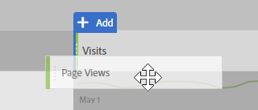
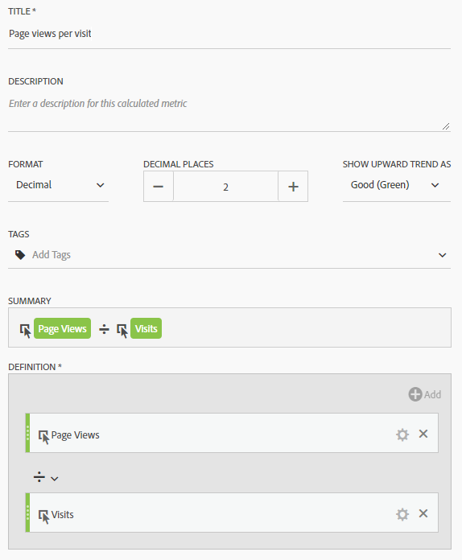
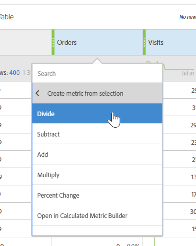

# Metriche utilizzate comunemente su altre guide di traduzione piattaforme

Su altre piattaforme come Google Analytics, molti rapporti condividono un numero comune di metriche. Utilizza questa pagina per comprendere come ricreare le metriche utilizzate in molti rapporti.

Per aggiungere più metriche a una tabella freeform dell&#39;area di lavoro, trascina la metrica dall&#39;area dei componenti accanto all&#39;intestazione della metrica nell&#39;area di lavoro:

## Metriche di acquisizione

**Gli utenti** sono circa uguali a Visitatori **unici** in Workspace. See the [Unique Visitors](../../../components/c-variables/c-metrics/metrics-unique-visitors.md) metric in the Components user guide for additional details.

**I nuovi utenti** possono essere ottenuti da:

1. Drag the **Unique Visitors** metric onto the workspace.
2. Drag the **First Time Visits** segment above the Unique Visitors metric headers:

   

**Le sessioni** sono circa uguali **a Visite** in Analysis Workspace. See the [Visits](../../../components/c-variables/c-metrics/metrics-visit.md) metric in the Components user guide for additional details.

## Metriche di comportamento

**Bounce Rate** è subito disponibile in Analysis Workspace come metrica. See the [Bounce Rate](../../../components/c-variables/c-metrics/metrics-bounce-rate.md) metric in the Components user guide for additional information.

**Pagine/Sessione** è una metrica calcolata. È possibile ottenere quanto segue:

1. Se hai già creato questa metrica calcolata, puoi individuarla in Metriche e trascinarla nell&#39;area di lavoro.
2. If you have not yet created this calculated metric, click the **+** icon near the metric list to open the Calculated Metric Builder.
3. Assegnategli il titolo «Visualizzazioni pagina per visita» e una descrizione, se lo desiderate.
4. Impostare il formato su Decimale e impostare il numero di posizioni decimali su 2.
5. Drag the **Page views** metric and **Visits** metric into the definition area.
6. Arrange the definition so the formula is **Page Views divided by Visits**.

   

7. Fai clic su Salva per tornare alla tua area di lavoro.
8. Trascinate la metrica calcolata appena definita nell&#39;area di lavoro.

   Learn more about [Calculated Metrics](../../../components/c-variables/c-metrics/calculated-metric.md) in the Components user guide.

**Avg. Session Duration** is approximately equal to **Time Spent per Visit (seconds)**. Learn more about [Time Spent](../../../components/c-variables/c-metrics/metrics-time-spent.md) metrics in the Components user guide.

## Metriche di conversione

**Tasso di conversione obiettivo**, **Completamenti** obiettivi e **Valore obiettivo** richiedono l&#39;implementazione aggiuntiva su entrambe le piattaforme. Se la tua implementazione soddisfa già la dimensione dei prodotti e l&#39;evento di acquisto, prendi in considerazione i passaggi seguenti:

1. Drag the **Orders** metric, **Revenue** metric, and **Visits** metric onto the workspace.
1. Create a calculated metric of **Orders per Visit**. Per evidenziare, usate Ctrl + clic (Windows) o Comando + clic (Mac) su entrambe le intestazioni delle metriche. Right-click one of the headers, select **Create Metric From Selection**, then click **Divide**. Questa nuova metrica è simile a un tasso di conversione obiettivo.
1. Se sono necessarie posizioni decimali, modificate la metrica calcolata. Fai clic sul pulsante Info nell&#39;intestazione della metrica, quindi sull&#39;icona matita. Aggiungi 1 o 2 posizioni decimali nella finestra Calculated Metric Builder, quindi fai clic su Save (Salva).

   

Se l&#39;implementazione non copre ancora i dati di prodotto o conversione, Adobe consiglia di lavorare con un consulente di implementazione per garantire la qualità e l&#39;integrità dei dati.
