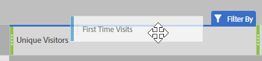
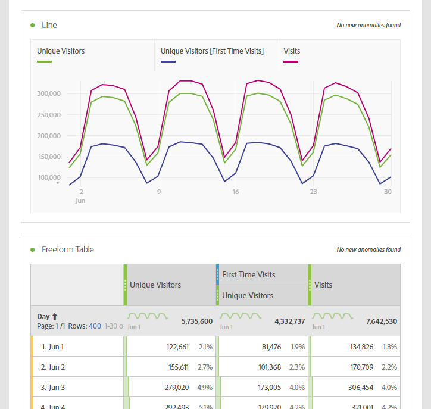

# Metriche comunemente utilizzate su altre piattaforme guida alla traduzione

Su altre piattaforme, come le Google Analytics, molti rapporti condividono un numero comune di metriche. Utilizzare questa pagina per capire come ricreare le metriche utilizzate in molti rapporti.

Per aggiungere più metriche a una tabella a forma libera dell’area di lavoro, trascina la metrica dall’area dei componenti accanto all’intestazione della metrica nell’area di lavoro:

## Metriche di acquisizione

**Utenti** è approssimativamente uguale a **Visitatori univoci** in Workspace. Per ulteriori dettagli, consulta la metrica [Visitatori univoci](/help/components/metrics/unique-visitors.md) nella guida utente dei Componenti.

**I nuovi utenti** possono essere ottenuti dai seguenti:

1. Trascina la metrica **Visitatori univoci** nell&#39;area di lavoro.
2. Trascina il segmento **Nuovo visitatore** sopra le intestazioni della metrica Visitatori univoci:

   

**Sessioni** equivale approssimativamente a **Visite** in Analysis Workspace. Per ulteriori dettagli, consulta la metrica [Visite](/help/components/metrics/visits.md) nella guida utente dei Componenti.

## Metriche del comportamento

**Percentuale non recapitate** è prontamente disponibile in Analysis Workspace come metrica. Per ulteriori informazioni, consulta la metrica [Percentuale non recapitate](/help/components/metrics/bounce-rate.md) nella guida utente dei Componenti.

**Pages/Session** è una metrica calcolata. Esso può essere ottenuto:

1. Se hai già creato questa metrica calcolata, individuala in Metriche e trascinala nell’area di lavoro.
2. Se non hai ancora creato questa metrica calcolata, fai clic sull&#39;icona **+** accanto all&#39;elenco delle metriche per aprire il Generatore della metrica calcolata.
3. Assegna al sito il titolo &quot;Visualizzazioni pagina per visita&quot; e, se necessario, una descrizione.
4. Impostate il formato su Decimale (Decimal) e impostate il numero di cifre decimali su 2.
5. Trascina la metrica **Visualizzazioni pagina** e la metrica **Visite** nell&#39;area di definizione.
6. Disporre la definizione in modo che la formula sia **Visualizzazioni pagina divise per Visite**.

   

7. Fai clic su Salva per tornare all’area di lavoro.
8. Trascina la metrica calcolata appena definita nell’area di lavoro.

   Ulteriori informazioni su [Metriche calcolate](/help/components/c-calcmetrics/cm-overview.md) nella guida utente Componenti.

**Media La durata della sessione** è approssimativamente uguale a **Tempo trascorso per visita (secondi)**. Ulteriori informazioni sulle metriche [Tempo trascorso per visita](/help/components/metrics/time-spent-per-visit.md) nella guida utente dei Componenti.

## Metriche delle conversioni

**Tasso di conversione obiettivo**, **Completamenti obiettivo** e **Valore obiettivo** richiedono un&#39;implementazione aggiuntiva su entrambe le piattaforme. Se l’implementazione già supporta la dimensione dei prodotti e l’evento di acquisto, considera i seguenti passaggi:

1. Trascina nell&#39;area di lavoro la metrica **Ordini**, la metrica **Ricavi** e la metrica **Visite**.
1. Crea una metrica calcolata di **Ordini per visita**. Utilizza i comandi Ctrl-clic (Windows) o Comando-clic (Mac) su entrambe le intestazioni di metrica per evidenziarle. Fai clic con il pulsante destro del mouse su una delle intestazioni, seleziona **Crea metrica da selezione**, quindi fai clic su **Dividi**. Questa nuova metrica è simile a un Tasso di conversione obiettivo.
1. Se sono necessarie cifre decimali, modifica la metrica calcolata. Fai clic sul pulsante Info nell’intestazione della metrica, quindi sull’icona della matita. Aggiungi 1 o 2 cifre decimali nella finestra del Generatore di metriche calcolate, quindi fai clic su Salva.

   

Se l’implementazione non supporta ancora i dati di prodotto o conversione, Adobe consiglia di collaborare con un consulente per l’implementazione per garantire la qualità e l’integrità dei dati.
