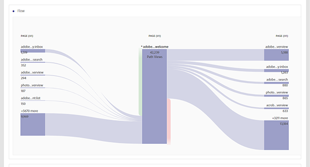

# Rapporti sulle conversioni

Una «conversione» è un&#39;azione eseguita da un visitatore sul sito che trasmette direttamente agli indicatori chiave della tua organizzazione. I rapporti sulle conversioni mostrano dettagli sulle modalità di conversione dei visitatori.

Questa pagina presuppone che l&#39;utente abbia una conoscenza di base sull&#39;utilizzo di Analysis Workspace. See [Create a basic report in Analysis Workspace for Google Analytics users](create-report.md) if you are not yet familiar with the tool in Adobe Analytics.

## Report sugli obiettivi

Gli obiettivi forniscono agli utenti Google Analytics un modo per definire la conversione di un sito Web. Rappresentano il modo predefinito per creare funnel, flusso comportamentale inverso, funnel multicanale e attribuzione. Gli obiettivi in Google Analytics non sono retroattivi e possono essere configurati solo nella pagina dell&#39;amministratore. Inoltre, si basano su una pagina, un evento, un tempo trascorso o un numero medio di pagine.

In Adobe Analytics, il concetto di obiettivo non è richiesto perché le metriche possono essere applicate in qualsiasi contesto. Fintanto che l&#39;implementazione soddisfa gli eventi da tracciare, potete modificare qualsiasi rapporto di conversione e ottenere immediatamente risultati per i dati storici.

### Visualizzazione funnel

Il rapporto sulla visualizzazione funnel aiuta gli analisti a concentrarsi su una serie particolare di passaggi necessari per la conversione. Ad esempio, prima di effettuare un acquisto, un visitatore su un sito di ecommerce deve accedere al carrello, alla pagina di fatturazione e alla pagina di spedizione, alla pagina di pagamento e alla pagina di revisione degli ordini.

In Analysis Workspace, questi dati possono essere visualizzati utilizzando la visualizzazione Abbandono.

1. Fate clic sull&#39;icona visualizzazioni a sinistra e trascinate una visualizzazione Abbandono sull&#39;area di lavoro sopra la tabella a forma libera
2. Click the components icon on the left, then locate the **Pages** dimension.
3. Fai clic sull&#39;icona freccia accanto alla dimensione Pagine per visualizzare i valori delle pagine. I valori dimensione sono colorati.
4. Individua la pagina desiderata da usare come primo punto di contatto, quindi trascinala nello spazio «Aggiungi punto di contatto» nella visualizzazione.
5. Continua ad aggiungere punti di contatto desiderati trascinando i valori delle pagine sulla visualizzazione.

La visualizzazione Abbandono non è limitata alla dimensione Pagine. Qualsiasi dimensione, metrica o segmento può essere utilizzata per adattare il rapporto di abbandono in base alle esigenze dell&#39;organizzazione.

## Rapporti sull&#39;ecommerce

I rapporti sull&#39;ecommerce vengono generalmente utilizzati dai siti che vendono prodotti o servizi per misurare ordini e entrate sugli articoli acquistati. Questa funzione è disponibile in Adobe Analytics ed è denominata report Prodotti.

Entrambi i rapporti sull&#39;ecommerce in Google Analytics e nei rapporti sui prodotti in Adobe Analytics richiedono modifiche di implementazione personalizzate da utilizzare. See the [Products](../../../components/c-variables/dimensionslist/reports-products.md) dimension in the Components user guide for more information.

## Report funnel multicanale

I rapporti funnel multicanale forniscono dati aggiuntivi sul canale di marketing oltre i report di acquisizione. Questi report riguardano il modo in cui i visitatori vengono convertiti, anziché il modo in cui i visitatori arrivano sul sito.

> [!NOTE]
>
> L&#39;utilizzo di report multi-canale in Adobe Analytics richiede sia la configurazione dei canali di marketing che un&#39;implementazione personalizzata per includere la variabile &quot;products&quot; e l&#39;evento di acquisto. Adobe consiglia di lavorare con un consulente di implementazione se queste funzioni non sono ancora state configurate per la suite di rapporti.

### Multi-canale - Conversioni supportate

Le conversioni supportate mostrano quante volte ogni canale è assistito da una conversione. In Analysis Workspace, the **Order Assists** metric can be used.

1. In the Components menu, locate the **Marketing Channel** dimension and drag it onto the large freeform table area labeled &#39;Drop a Dimension here&#39;.
2. Drag the **Order Assists** metric on top of the automatically created **Occurrences** metric header to replace it. Se necessario, potete trascinare ulteriori metriche sull&#39;area di lavoro.

### Multi-canale - Percorsi di conversione principali

Il rapporto percorsi di conversione principali mostra i percorsi dei canali principali seguiti dall&#39;utente prima della conversione. Analysis Workspace usa un rapporto di flusso per visualizzare i percorsi di conversione principali.

1. Fai clic sull&#39;icona Pannelli a sinistra, quindi trascina un pannello Attribuzione sopra la tabella a forma libera.
2. Click the Components icon on the left, locate the **Marketing Channel** dimension, and drag it to the box labeled &#39;Add Dimension&#39;.
3. Individuate l&#39;evento di conversione desiderato in Metriche (ad es. Ordini) e trascinatelo nella casella «Add Metric» (Aggiungi metrica). Le metriche calcolate non sono supportate per il pannello Attribuzione.
4. Fai clic su Genera.
5. Nel rapporto risultante, individua la visualizzazione Flusso canale. Questo flusso mostra i percorsi principali che un visitatore ha toccato prima di un acquisto.

Questa visualizzazione di flusso è interattiva. Fai clic su ciascun canale per espandere il flusso in una direzione.

### Multi-canale - Ritardo tempo

Il rapporto su lag ora mostra il tempo necessario per la conversione del visitatore sul sito. In Analysis Workspace, this data is available using the **Days Before First Purchase** dimension. È disponibile solo nel contesto di un evento di acquisto correttamente implementato.

1. In the Components menu, locate the **Days Before First Purchase** dimension and drag it onto the large freeform table area labeled &#39;Drop a Dimension here&#39;.
2. Drag the desired metrics onto the workspace alongside the automatically created **Occurrences** metric. See the [Metric translation guide](common-metrics.md) for details on how to obtain each respective metric.

Adobe recommends using the **Orders**, **Units**, or **Revenue** metrics with this dimension.

For other types of conversions, including custom events, the **Time Prior to Event** dimension is available. Mostra il tempo, in minuti, necessario a un visitatore per attivare l&#39;evento all&#39;interno della visita.

1. In the Components menu, locate the **Time Prior to Event** dimension and drag it onto the large freeform table area labeled &#39;Drop a Dimension here&#39;.
2. Drag the desired metrics onto the workspace alongside the automatically created **Occurrences** metric. See the [Metric translation guide](common-metrics.md) for details on how to obtain each respective metric.

Adobe consiglia di utilizzare questa dimensione con eventi personalizzati o eventi di acquisto.

### Multi-canale - Lunghezza percorso

Il rapporto sulla lunghezza del percorso mostra il numero di canali toccato prima di un evento di conversione. In Analysis Workspace, il pannello Attribuzione contiene questi dati in una delle visualizzazioni.

1. Fate clic sull&#39;icona Pannelli a sinistra e trascinate un pannello Attribuzione sopra la tabella a forma libera
2. Click the Components icon on the left, locate the **Marketing Channel** dimension, and drag it to the box labeled &#39;Add Dimension&#39;.
3. Individuate l&#39;evento di conversione desiderato in Metriche (ad es. Ordini) e trascinatelo nella casella «Add Metric» (Aggiungi metrica). Le metriche calcolate non sono supportate per il pannello Attribuzione.
4. Fai clic su Genera.
5. Nel rapporto risultante, individua la visualizzazione «Punti di contatto per viaggio». Questo istogramma mostra il numero di canali toccati prima di un acquisto.
